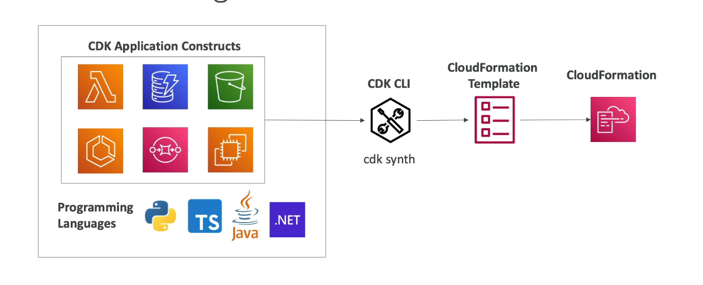

#aws #cloud 
# Overview
+ SDK for IaC.
	+ Uses [AWS CloudFormation](AWS%20CloudFormation.md), under the hood to define and provision cloud infrastructure.
	+ Code is compiled into a CloudFormation template.

# Constructs
+ Represents one or more AWS resources and their configuration that is converted into a CloudFormation stack.
+ AWS Construct Library:
	+ __L1__ Constructs:
		+ Direct mapping to a single CloudFormation resource.
		+ Need to manually configure every property i.e. more granular control.
	+ __L2__ Constructs:
		+ Higher-level abstractions for single AWS resources.
		+ Comes with default config and boilerplate code.
		+ Provides methods that make it simpler to work with the resource.
	+ __L3__ Constructs:
		+ Multiple L1/L2 constructs in a single component.
		+ Helps to complete common tasks.
			+ Ex: _aws-apigateway-LambdaRestApi_ represents a API gateway + Lambda function.
```ts
// L1: Direct mapping to AWS::S3::Bucket
new s3.CfnBucket(this, 'MyL1Bucket', {
    bucketName: 'manual-bucket-2025',
    versioningConfiguration: {
        status: 'Enabled'
    }
});	 

// L2: High-level abstraction with sensible defaults
const bucket = new s3.Bucket(this, 'MyL2Bucket', {
    versioned: true,
    // Encryption is managed automatically by CDK defaults
    blockPublicAccess: s3.BlockPublicAccess.BLOCK_ALL
});

// Provides helper methods for security
bucket.grantRead(myLambdaRole); 

// L3 Pattern: Deploys an S3 bucket and a CloudFront Distribution together
// (Example using a common pattern style)
const website = new Distribution(this, 'MyWebsite', {
    defaultBehavior: { origin: new cloudfront_patterns.S3Origin(bucket) },
});
```

# CDK Bootstrapping
It is the process of provisioning resources for CDK before deploying CDK apps into AWS env (AWS account + region).

Running `cdk bootstrap` creates a CloudFormation stack named `CDKToolkit` containing several standard resources:
- **Amazon S3 Bucket**: Acts as a staging area for file assets (e.g., Lambda code) and CloudFormation templates.
- **Amazon ECR Repository**: Used to store Docker container images.
- **IAM Roles**: Predefined roles for deployment.
Must run `cdk bootstrap aws://<account>/<aws_region>` for each new env.
# CDK CLI
`cdk init app` : Create a new CDK project from specified template
`cdk synth`: Convert to CloudFormation template.
`cdk bootstrap` : Deploys CDK Toolkit staging stack
`cdk deploy`: Deploy the stacks
`cdk diff`: View diff b/w local and deployed stacks
`cdk destroy`: Destroy stacks.
+ Can use [AWS SAM](AWS%20SAM.md) CLI to locally test CDK apps.
	+ `cdk synth` : to generate CloudFormation template.
	+ `sam local invoke -t <TemplateName> <function>` : To locally test a lambda function..png)
# Testing
+ Use CDK Assertions + popular test frameworks (JUnit, Pytest) to verify specify resources, properties, rules, conditions etc..
	+ __Fine-grained assertions__: test specific aspects of CloudFormation template. (Ex: does resource have _x_ property?)
	+ __Snapshot tests__: test CloudFormation template against a previously stored baseline template.
```java
import software.amazon.awscdk.App;
import software.amazon.awscdk.assertions.Template;
import software.amazon.awscdk.assertions.Match;
import org.junit.jupiter.api.Test;
import java.util.Map;

public class MyStackTest {
    @Test
    public void testStackHasSqsQueue() {
        // GIVEN
        App app = new App();
        MyStack stack = new MyStack(app, "TestStack");

        // WHEN
        // Synthesize the stack into a CloudFormation template
        Template template = Template.fromStack(stack);

        // THEN
        // Verify that an SQS queue exists with specific properties
        template.hasResourceProperties("AWS::SQS::Queue", Map.of(
            "VisibilityTimeout", 300
        ));

        // Verify the number of resources created
        template.resourceCountIs("AWS::SQS::Queue", 1);
    }
}
```