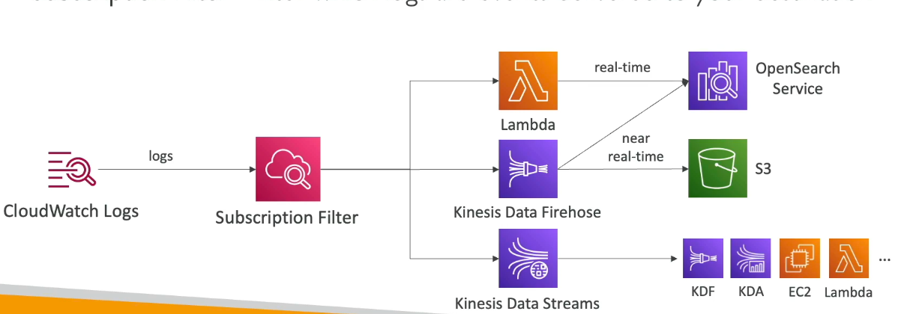
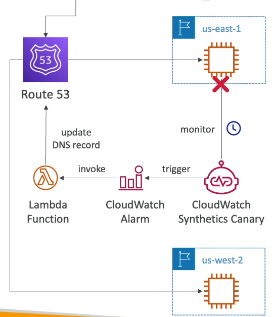
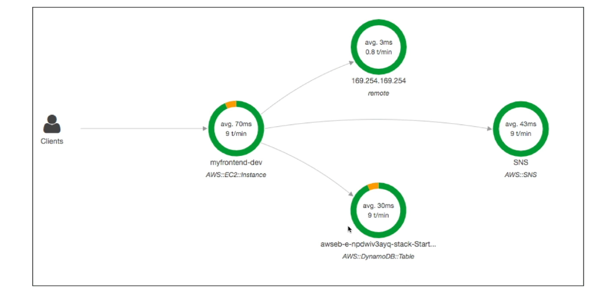
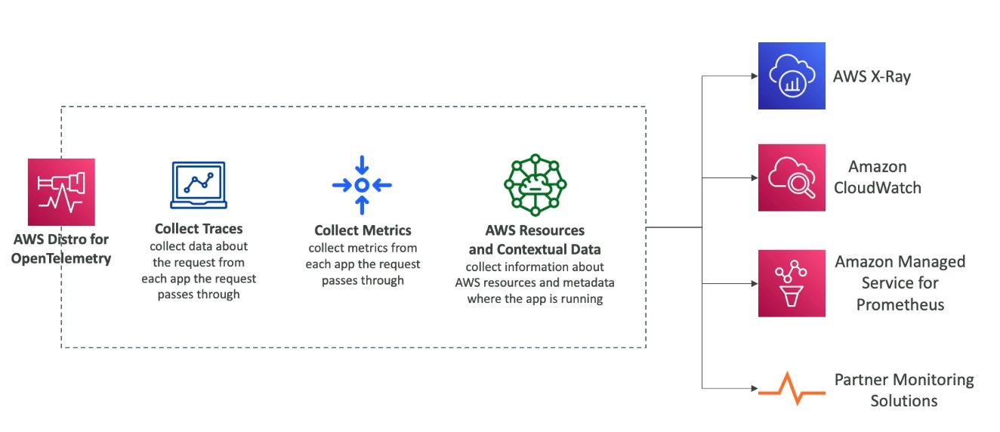
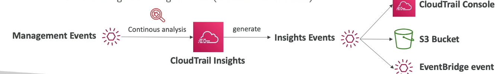

#aws #cloud 
```table-of-contents
title: Index
style: nestedList # TOC style (nestedList|nestedOrderedList|inlineFirstLevel)
minLevel: 0 # Include headings from the specified level
maxLevel: 0 # Include headings up to the specified level
include: 
exclude: 
includeLinks: true # Make headings clickable
hideWhenEmpty: false # Hide TOC if no headings are found
debugInConsole: false # Print debug info in Obsidian console
```
# Overview
+ __Real time__ monitoring of AWS resources, (performance, health and utilization).
+ Most AWS services provide basic metrics free of charge. Detailed monitoring can be enabled for a charge.
# Terminology
## Metric
+ It is a variable to monitor (Ex: CPU usage of a EC2 instance).
	+ The data points that represent value of variable changing over time can come from any application being monitored.
+ Exists only in the region in which they are created.
+ Cannot be deleted
+ All metric data points have a timestamp associated with it. (Recommended UTC)
	+ Timestamp can be anywhere between 2 weeks in the past to 2 weeks in the future.
+ Uniquely defined by a name, namespace and dimensions.
	+ A dimension is a key/value pair that is an attribute of a metric. (Ex: InstanceId, Environment)
	+ Can assign up to 30 dimensions to a metric
### __Custom metrics__
+ Ex: RAM usage, no of logged in users etc..
+ Use API _PutMetricData_ (CLI _put-metric-data_)
	+ _StorageResolution_ param: how often to push metric data to CloudWatch
		+ Standard: 1 minute
		+ High Resolution: 1/5/10/30 s (Higher cost)
## Namespace
+ Container for CloudWatch metrics.
+ Metrics in different namespaces are isolated from each other so that they are not aggregated into the same statistic.
+ Specified when publishing a data point to CloudWatch.
## Statistic
+ Metric data aggregation over a period of time, provided by custom metrics or AWS services.
+ Uniquely defined by a namespace, metric name, dimensions and unit of measure.
	+ Unit of measure: Bytes, Seconds, Count, Percent etc..
# EC2 Detailed Monitoring
+ Basic monitoring: data points for a metric received once every 5 minutes, and for detailed monitoring: data points for a metric received every 1 minute.
	+ Use detailed monitoring if you want ASG to scale faster
+ Free tier allows 10 detailed monitoring metrics

> [!note]
 EC2 Memory usage is not pushed as a metric by default. It must be pushed to CloudWatch as a custom metric, from inside the instance.

# CloudWatch Logs
+ Log expiration policy: never, 1-10 years
+ Logs are encrypted by default
	+ Can setup KMS encryption with own keys too.
## CloudWatch logs for EC2 or on-premises server
+ Need to install CloudWatch Agent onto EC2 instance / on-premise server to push log files
	+ CloudWatch Log Agent: old version, can only send CloudWatch logs
	+ CloudWatch Unified Agent: logs + additional system level metrics such as RAM, processes, disk metrics etc..
+ IAM permissions needed for EC2 instance / on-premise server to push logs to CloudWatch

## Sources
+ [](Interacting%20with%20AWS%20Services.md#AWS%20SDK|SDK), CloudWatch Unified Agent, CloudWatch Log Agent
+ [Elastic Beanstalk](Elastic%20Beanstalk.md): Collection of logs from application
+ [Amazon ECS](Amazon%20ECS.md): Logs from containers
+ [AWS Lambda](AWS%20Lambda.md): Logs from functions
+ [](Amazon%20VPC.md#VPC%20Flow%20logs|VPC%20Flow%20Logs)
+ CloudTrail based on filter
+ [Amazon Route 53](Amazon%20Route%2053.md): Log DNS queries
## Destinations
+ [Amazon S3](Amazon%20S3.md)
+ [](Other%20AWS%20Services.md#Amazon%20Kinesis%20Data%20Streams|Kinesis%20Data%20Stream)
+ [](Other%20AWS%20Services.md#Amazon%20Data%20Firehose|Amazon%20Data%20Firehose)
+ [AWS Lambda](AWS%20Lambda.md)
+ AWS OpenSearch
## Log Stream
Sequence of log events that share the same source.
## Log Group
Collection of log streams with the same retention, monitoring or access settings.
## Log Insights
+ Search and analyze historical log data stored in CloudWatch
	+ Ex: find a given IP in a log, count occurrences of ERROR in your logs
+ Provides a query language
	+ Filter based on fields/conditions, aggregate statistics, sort, limit
	+ Metric filters only publish data points for events that happen after filter was created. (Specify up to 3 dimensions for the metric filter)
	+ Save queries and add to CloudWatch Dashboards
+ Can query multiple log groups in different AWS accounts
## S3 Export
+ Batch export logs into S3 (_CreateExportTask_)
	+ Log data can be exported after up to 12 hours since arrival
## Log Subscriptions
+ Real time data streaming of logs
+ Send data stream to Kinesis Data Streams, Data Firehose or Lambda
+ Filter which log events to send using subscription filter
### __Cross Account / Cross Region Log Subscription__
+ Send log events to resources in different AWS accounts
	+ The access policy of destination resource must allow log transfer from source account.
+ Create an IAM role in destination account that allows writing into destination resource.
	+ Ensure this role can be assumed by source account.
	.png)
# Alarms
+ Trigger notification/changes to resources for any metric (Ex: CPU usage > 70%)
	+ Can also watch metrics in other AWS accounts
+ Alarm states:
	+ OK: Metric within threshold
	+ INSUFFICIENT_DATA: Not enough data available to calculate metric
	+ ALARM: Metric out of threshold
+ Alarm targets:
	+ Stop, Terminate, Reboot or recover an EC2 instance
	+ Trigger Auto-Scaling action
	+ Send notification to SNS
## Alarm types
1. Metric alarm: Based on some metric
2. Composite alarm: Alarm that monitors other alarms (metric or composite) through a rule expression. All expressions in rule must be true for alarm to go off.
## Evaluating an Alarm
+ __Period__: Amount of time it takes to evaluate a metric or expression.
+ __Evaluation period__: No of most recent periods to consider when evaluating an alarm.
+ __Datapoints to alarm__: No of data points within a evaluation period that must be breaching the metric to result in an evaluation of ALARM.
# CloudWatch Synthetics Canary
+ Configurable script to monitor API's, URL's, Websites etc..
	+ Can check latency and availability of endpoints
	+ Can store screenshots of UI and latency data
	+ Can Reproduce actual user actions programmatically (Kinda like LogRocket)
+ Integrates with CloudWatch alarms
+ Scripts in Node.js or Python
+ Can run once or on a fixed schedule
## Use case
+ CloudWatch Synthetics Canary is monitoring application in an EC2 instance in _us-east-1_.
+ If application fails, it triggers a CloudWatch Alarm which in turn invokes a lambda function that changes Amazon Route 53 DNS record to point to application deployed in _us-west-2_.
# Amazon EventBridge 
+ __Serverless event bus__ that facilitates event-driven architecture, by allowing different applications to communicate using events.
+ Autoscales to process large number of events.
+ Supports __real-time__ processing of events, so that applications can instantly react to changes.
+ __Pay as you go__ service. Only pay for the events that you publish and process.
## Key Components

### __Event__
+ Any change in a system, data or environment (ex: upload in a s3 bucket, new user signup in an application)
### __Event Sources__
+ Publisher of events. Can be a AWS service, your custom application or partnered third-party apps.
### __Targets__
+ The resource or endpoint that processes events delivered by EventBridge.
+ Can be AWS service, your custom application or partnered third-party apps.
### __Event Bus__
+ Primary router for events. Receives events from all sources sending events and delivers them to targets.
	+ Default bus: Receives events from all AWS services in your account.
	+ Partner event bus: Receives event from integrated third party apps like ZenDesk, DataDog,
+ Which event goes where is determined by __rules__, which filter events based on defined criteria or schedule.
+ Event buses can be accessed by other AWS accounts by using a [](IAM.md#Policy|resource-based%20policy).
+ Can archive and replay events
### __Pipe__
+ Router for events between a __single source and single target__.
+ Can optionally filter, transform or enrich events before delivering to target.
### __Schema Registry__
+ Schema is JSON object defining event fields and structure.
+ Schema Registry automatically discovers and stores all event schemas.
	+ Generate code bindings in different programming languages to ensure consistency.
	+  Validation for schemas.
### __Scheduler__
+ Automate triggering of events at scheduled times or intervals using cron expressions. (Ex: backup, cleanups).
# AWS X-Ray
## Need
In a distributed/microservices architecture, different apps might have different log formats.
	Centralizing insights from all the different logs (format) of different services is hard.
	To analyze logs effectively, we must also keep the flow of data or communication in mind.
This makes __debugging harder__.
## What it does
+ Provides a visual analysis of your architecture by displaying all the components and their connections to each other.
+ It does so by tracking all the internal calls made by applications (such as calls to other services, SNS, DynamoDB etc..) when a user request comes in and showing how many requests succeeded and how many failed.
+ Makes root cause analysis easier by highlighting parts of an application/service that are problematic through details like latency, no of errors etc..
Here, DynamoDB table is causing problems for overall application (denoted by orange error).
## Workflow
1. Your application must be _instrumented_ a.k.a integrated with X-Ray, either through X-Ray SDK or AWS Distro for OpenTelemetry (recommended).
2. X-Ray collects data from all the services in an application, by adding a HTTP header to all incoming and outgoing requests and other events.
3. Services send data in _segments_, which contains information about host, errors, request, response etc..
	1. A _segment_ can be subdivided into _subsegments_, for more granular tracking such as DB calls, calls to other services
4. All information collected from different services for a request (_segments_), is compiled into a _trace_.
5. X-Ray processes the traces to generate a visual representation of your application workflow (_service map_) that shows all the connections between services, along with other useful information like latency, error rates etc..
___Note___: 
+ By default, X-Ray records first request __each second__ and samples 5% of  all additional requests in the same second. 
	First request each second -> _reservoir_
	5% sampling -> _rate_
	Custom sampling rules with custom _reservoir_ and _rate_ + additional filter criteria (HTTP method, URL path etc..)
	Set up sampling rules in CloudWatch > Settings > Traces > Sampling Rules (no code change needed)
## AWS Distro for OpenTelemetry vs X-Ray SDK
+ Use AWS Distro for OpenTelemetry if you want to standardize with open-source APIs or send traces to multiple destinations simultaneously.
+ Use X-Ray SDK if you only want to send trace data to X-Ray service.
Here, agent -> CloudWatch agent and AWS Backend -> Traces are sent to X-Ray service.
## Security
+ [IAM](IAM.md) for authorization.
	+ All services sending traces to X-Ray must have appropriate permissions to write to X-Ray.
	+ X-Ray daemon must have permissions to access correct API calls
+ Data is encrypted at rest
### __Important API's used by X-Ray daemon__
1. ___PutTraceSegments___: Uploads segments to X-Ray 
2. ___PutTelemetryRecords___: Upload telemetry data (_SegmentsReceivedCount, SegmentsRejectedCount, BackendConnectionErrors_, ...)
3. ___GetSamplingRules___: Retrieve all sampling rules (to know what/when to send)
4. ___GetServiceGraph___: Retrieve the service map
5. ___BatchGetTraces___: Retrieve a list of traces by specified ID
6. ___GetTraceSummaries___: Retrieves IDs and annotations for traces in a specific time frame + optional filter
7. ___GetTraceGraph___: Retrieve service map for one or more specific trace IDs
## X-Ray Compatibility
+ [AWS Lambda](AWS%20Lambda.md)
+ [Elastic Beanstalk](Elastic%20Beanstalk.md)
+ [Amazon ECS](Amazon%20ECS.md)
+ [Amazon ELB](Amazon%20ELB.md)
+ [API Gateway](API%20Gateway)
+ [](Amazon%20Elastic%20Compute%20Cloud%20(AWS%20EC2).md#EC2%20Instance|EC2%20Instance)
## Advantages
- **Performance Analysis**: Identify performance bottlenecks and latency spikes within your application architecture.
- **Troubleshooting and Debugging**: Drill down into individual request traces to find the root cause of errors, faults, and exceptions with detailed stack traces and metadata.
- **Service Map Visualization**: Gain an immediate, visual understanding of your application's architecture and inter-service dependencies in real-time.
- **Cross-Service Integration**: Seamlessly trace requests across various AWS services like Amazon EC2, AWS Lambda, Amazon ECS, and integrate with third-party applications or on-premises servers.
- **Custom Insights**: Add custom annotations (indexed key-value pairs) and metadata to traces for filtering and analysis based on business-specific criteria (e.g., user ID, transaction type)
## Disadvantages
+ __Limited Cross Platform support__: Tracing applications that are on-premises, in other cloud providers or integrate with third party apps is complex and inaccurate.
+ __Maintenance burden__: Auto / library instrumentation is best for simple use cases, but if more granularity is needed, manual instrumentation must be used. This involves inserting instrumentation code at each location where traces should be sent, which increases maintenance burden.
+ __Incomplete Tracing__: It is not possible to trace over the API gateway or track asynchronous invocations such as SNS on Kinesis.
# AWS CloudTrail
+ Get __history of all events/API calls made__ within a AWS account by:
	+ SDK
	+ Console
	+ CLI
	+ AWS services
+ __Enabled by default__
+ Can send CloudTrail logs to CloudWatch or S3
+ Can be applied to all regions or a single region
## Events
### __Management Events
+ Logged by default
+ Management operations performed on resources (CRUD)
	+ Ex: ___CreateTrail___, ___AttachRolePolicy___, ___TerminateInstances___
+ Can separate Read events from Write Events
### __Data Events__
+ Not logged by default
+ Resource specific operations
	+ Ex: ___GetObject___, ___PutObject___ (S3),  ___Invoke___ (Lambda)
### __CloudTrail Insights Events__
+ Not enabled by default
+ CloudTrail generates events that show unusual activity in your account
	+ Ex: Hitting service limits, Inaccurate resource provisioning, bursts in IAM actions
	+ Analyzes Management events to determine baseline and then continuously analyze __write events__ to detect unusual activity
+ CloudTrail Events can be sent to:
	+ CloudTrail console
	+ S3 bucket
	+ EventBridge event
	
+ Stored for __90 days__
	+ To keep for longer, send to S3 bucket and analyze using Amazon Athena