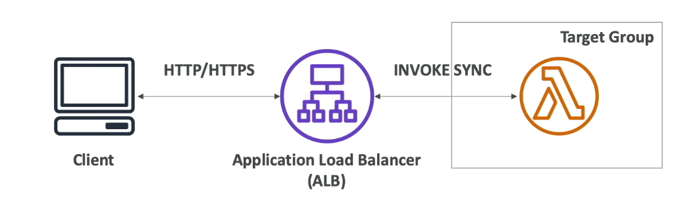
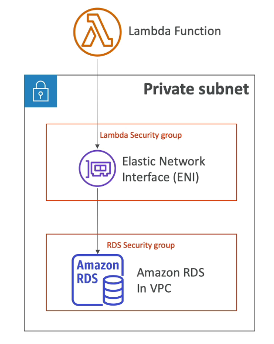
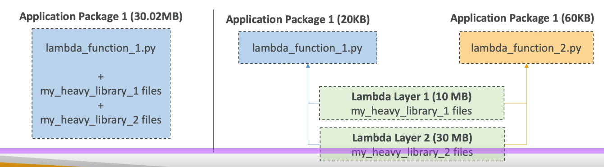

#aws #cloud 
# Overview
+ Event driven, serverless compute service
	+ Executes code in response to events
	+ Automatically provisions and manages infrastructure needed to run the code.
>[!note] 
>Serverless : User does not need to manage or provision infrastructure 

# Components
## __Function__
+ Resource that runs in response to a event such as clicking a button on a website, upload to [Amazon S3](Amazon%20S3.md)
+ Contains code, config, runtime settings and permissions
## __Function Handler__
+ When function runs in response to an event, it calls the function handler method, which is part of the code
+ Code can contain multiple methods but only one function handler
~~~tabs
tab: Java
```java
package example;

import com.amazonaws.services.lambda.runtime.Context;
import com.amazonaws.services.lambda.runtime.LambdaLogger;
import com.amazonaws.services.lambda.runtime.RequestHandler;
import java.util.List;

public class Handler implements RequestHandler<List<Integer>, Integer>{

  @Override
  /*
   * Takes a list of Integers and returns its sum.
   */
  public Integer handleRequest(List<Integer> event, Context context)
  {
    LambdaLogger logger = context.getLogger();
    logger.log("EVENT TYPE: " + event.getClass().toString());
    return event.stream().mapToInt(Integer::intValue).sum();
  }
}
```
tab: Python
```python

def lambda_handler(event: list[int], context):
	"""
	Takes a list of integers and returns its sum
	"""
	
	total_sum = sum(event) 
	return total_sum
```
~~~
+ A handler function always takes two parameters _event_ and _context_.
	+ _Event_
		+ JSON doc containing data for the function to process
		+ Also contains information about invoking service
		+ Lambda runtime converts it into an object
	+ _Context_
		+ Contains methods and properties of the execution environment, invocation and the lambda function
		+ Passed to the function handler by Lambda at runtime.
		+ Ex: aws_request_id, function_name, memory_limit_in_mb, etc..
## __Execution Environment__
+ Secure, isolated environment in which lambda function runs
+ Manages all processes and resources needed to run the lambda function
+ It is created once when function is invoked for the first time and reused every time function is invoked thereafter.
+ To handle increasing demand, lambda service may create additional execution environments and stop them when demand drops.
+ Includes the _/tmp_ directory
	+ This space can be used by the lambda function as disk space to perform operations or to store a large file etc..
	+ Max size 10GB (512MB-10GB)
	+ To encrypt data in /tmp, use KMS keys and do it yourself.
## __Environment Variables__
+ Adjust function behavior without changing code
+ Key-value pairs, part of lambda function's configuration.
+ Lambda service has its own reserved environment variables.
+ Helpful to store secrets (encrypted by KMS). Secrets can be encrypted by Lambda service key or your own CMK.
```python
import os

def lambda_handler(event, context):
	return os.getenv("ENVIRONMENT_NAME")
	
# where ENVIRONMENT_NAME is a env variable
```
## __Trigger__
+ Connects event to function i.e. ensures function is triggered when event occurs.
+ Part of a lambda function's configuration.
### ___Push based triggers___
+ Lambda console ___Test___ Feature
+ [](Interacting%20with%20AWS%20Services.md#AWS%20CLI|AWS%20CLI) command 
~~~tabs
tab: Synchronous invocation
```bash
# payload -> input to lambda function 
# response.json -> write output to this file
aws lambda invoke \
    --function-name YourFunctionName \
    --payload '{"key1": "value1", "key2": "value2"}' \
    response.json
```
tab: Asynchronous invocation
```bash
# payload -> input to lambda function 
# response.json -> write output to this file
aws lambda invoke \
    --function-name YourFunctionName \
    --invocation-type Event \
    --payload '{"key1": "value1", "key2": "value2"}' \
    response.json
```
~~~
+ [](Interacting%20with%20AWS%20Services.md#AWS%20SDK|AWS%20SDK) in application code
+ [#Function URL](#Function%20URL) A dedicated HTTPS endpoint to invoke function (curl, postman, browser)
+ Many AWS services trigger lambda function synchronously ([Amazon API Gateway](Amazon%20API%20Gateway.md), [Amazon ELB](Amazon%20ELB.md)) or asynchronously (S3, [](AWS%20CloudWatch.md#Amazon%20EventBridge|EventBridge), [Amazon SNS](Amazon%20SNS.md))
___Note___: For asynchronous invocations, events are put into a internal queue and pulled/pushed to lambda function. On failure of processing, lambda service attempts to retry (max 3 times) with exponential backoff (1 min after 1st, 2 min after 2nd). After retries are over, can send to DLQ (DLQ setup is not done by Lambda, it must be setup manually)
### ___Pull based triggers/Event Source Mappings___ 
For queue and stream based services ([Amazon SQS](Amazon%20SQS.md), [](Other%20AWS%20Services.md#Amazon%20Kinesis%20Data%20Streams|Kinesis%20Data%20streams), [](Other%20AWS%20Services.md#Amazon%20Data%20Firehose|Data%20Firehose), [Amazon DynamoDB](Amazon%20DynamoDB.md)), lambda service itself polls the source, retrieves records in batches and processes them.
	Batched records are passed as payload to the lambda function
	A batch is ready to be processed by the lambda function if:
		_Batching window_ .i.e. max time to wait for records to gather is completed.
		_Batch size_ .i.e. max no of records in a batch is completed
		Payload size is 6 MB
	_Batching Window_ and _Batch size_ can be changed.
	Invocation is synchronous
__For streams__ (Kinesis, DynamoDB)
<u>Context</u>:  In Kinesis, each shard is partitioned and order of processing is guaranteed by partition id.
+ For each data stream, _pollers_ (part of Lambda service) read records and batch them by partition id to guarantee order of processing.
+ By default, one lambda invoker per shard.
	+ Can be increased to parallelly process multiple batched records. (Upto 10 batches per shard)
+ Processed items are __not removed__ from the stream.

+ By default, if function returns an error, entire batch is reprocessed until function succeeds or records in the batch expire.
	+ To ensure in order processing, processing is paused until error is resolved.
+ Event source mapping can be configured to:
	+ discard old events (discarded events go to [#destinations](#destinations))
	+ limit no of retries
	+ split batch on error
__For SQS__
+ Lambda will poll the queue (long polling) and wait for batch to be completed before function is invoked.
+ Recommended to set queue visibility timeout to 6x timeout of Lambda function
+ To use DLQ, setup manually (used only for async invocations)
+ In order processing (by message group id) if queue is SQS FIFO.
	+ Scaling depends on no of active message group ids
	+ Scaling for SQS Standard: +60 instances/min and up to 1000 batches processed simultaneously
+ If error occurs, batch records are returned to the queue as individual records and maybe processed in different batches in the future.
+ Records are __deleted__ after processing.
## __Permissions__
### ___Permissions lambda function needs to access other services___
+ To give lambda functions permissions to access other services, we use a _execution role_ , which is a special type of [](IAM.md#Roles|role) with a associated policy that defines what actions are allowed.
+ Every Lambda function __must__ have a execution role and a given execution role can be used by many lambda functions.
+ Default execution role gives lambda function permission to write logs to [](AWS%20CloudWatch.md#CloudWatch%20Logs|CloudWatch).
### ___Permissions for users and services to access lambda function___
+ [](IAM.md#Permission%20Policies|Resource%20based%20policy) (attached to resource, here lambda function) defines which users and services are allowed/denied which actions.
+ Identity based policy (for users) or trust policy (for roles) can also be used to specify actions allowed/denied for the lambda service.
+ To invoke lambda function, other users/services must be granted the `lambda:InvokeFunction` action, through resource/identity/trust policy.
# Function URL
+ Dedicated HTTPS endpoint to invoke lambda function via curl, postman, browser.
+ Can attach resource based policy to determine who can access the URL.
	+ Principal must have __lambda:invokeFunctionUrl__ permissions.
+ Can be accessed only over the public internet.
	+ CORS configurations for function URL (control which origins(external websites) can access the lambda function via the URL):
+ Authentication (which AWS services can access function URL):
	+ __None__: Public and unauthenticated access to the lambda function as long as resource based policy allows it.
	+  __AWS_IAM__: IAM authentication required to access lambda function. Access depends on either resource or identity-based policy containing a _ALLOW_.
		+ For cross account access, both identity (of principal resource) and resource based policy (of lambda function) must contain a _ALLOW_.
+ Can be applied to [$LATEST](#^3a4ce8) or any [function aliases](#^1f49c4), but ___NOT___ to function versions.
# Lambda Limits
+ __RAM__
	+ 128 MB - 10 GB in 1MB increments
	+ 1792 MB corresponds to one vCPU (abstraction of a single CPU core's processing power).
	+  > 1792 MB, code must use multithreading to benefit from extra RAM.
+ __Timeout__: default 3s, max 900s (15 min)
+ Environment variables: max 4 KB
+ Disk capacity in _/tmp_ : 512 MB-10GB
+ Concurrent executions: 1000
+ Lambda function compressed (.zip) size : max 50 MB
+ Lambda function uncompressed size: 250 MB
# Integration with ALB
+ ALB receives client request, converts HTTP request to JSON and invokes lambda function using its _function url_(HTTPS endpoint).
+ The lambda function __must__ be registered as a __target__ in a target group of the ALB.
+ The lambda function receives the request JSON as payload and returns a JSON response to the ALB, which converts it into a HTTP response and returns it to the client.  
~~~tabs
tab: Request JSON
```json
{
    "requestContext": {
        "elb": {
            "targetGroupArn": "arn:aws:elasticloadbalancing:us-east-1:123456789012:targetgroup/lambda-279XGJDqGZ5rsrHC2Fjr/49e9d65c45c6791a"
        }
    },
    "httpMethod": "GET",
    "path": "/lambda",
    "queryStringParameters": {
        "query": "1234ABCD"
    },
    "headers": {
        "accept": "text/html,application/xhtml+xml,application/xml;q=0.9,image/webp,image/apng,*/*;q=0.8",
        "accept-encoding": "gzip",
        "accept-language": "en-US,en;q=0.9",
        "connection": "keep-alive",
        "host": "lambda-alb-123578498.us-east-1.elb.amazonaws.com",
        "upgrade-insecure-requests": "1",
        "user-agent": "Mozilla/5.0 (Windows NT 10.0; Win64; x64) AppleWebKit/537.36 (KHTML, like Gecko) Chrome/71.0.3578.98 Safari/537.36",
        "x-amzn-trace-id": "Root=1-5c536348-3d683b8b04734faae651f476",
        "x-forwarded-for": "72.12.164.125",
        "x-forwarded-port": "80",
        "x-forwarded-proto": "http",
        "x-imforwards": "20"
    },
    "body": "",
    "isBase64Encoded": False
}
```
tab: Response JSON
```json
{
    "statusCode": 200,
    "statusDescription": "200 OK",
    "isBase64Encoded": False,
    "headers": {
        "Content-Type": "text/html"
    },
    "body": "<h1>Hello from Lambda!</h1>"
}
```
~~~
___Note___: If multi-value headers is enabled in ALB, then all HTTP headers/query string params containing multiple values are converted into an array before sending request to lambda function.
`https://example.com/path?name=foo&name=bar` is converted into `"queryStringParameters": {"name" : ["foo", "bar"]}`

# Destinations
+ Previously for async invocations, Lambda returned a 2xx status code to confirm the event was received by the internal queue. It did not confirm if event was processed successfully.
+ Now, with destinations, we can send the results of a async invocation to specified destination with no code changes.
	+ Amazon SNS
	+ Amazon SQS
	+ AWS Lambda
	+ Amazon EventBridge
+ Destination can be configured for both successful processing and failed processing
	+ For failed processing, it passes on additional information such as stack traces
	+ Recommended over DLQ but both can be used together.
+ For discarded events:
	+ Amazon SNS
	+ Amazon SQS


# Lambda in VPC
+ By default, a lambda function runs in a AWS owned VPC therefore it cannot access any resources in your public or private VPCs without proper permissions.
+ To give a lambda function access to a resource in your VPC, during its creation we must specify VPC ID, Subnet and security group of the lambda function. 
	+ Internally, the lambda service creates a [](Amazon%20VPC#VPC%20Endpoints#VPC%20Endpoints#**Interface**|ENI) in the specified VPC. To do so, the lambda function must have an ___AWSLambdaVPCAccessExecutionRole___ role. (AWS managed IAM policy that grants access to resources within a VPC)
	+ The lambda function's security group must have __outbound__ rules that allow traffic on the specific ports and protocols required to reach your target resource.
	+ The resource's security group must have an __inbound__ rule that allows traffic from the Lambda function's security group.
+ A lambda function:
	+ has internet access if deployed in a private subnet with a NAT gateway.
	+ does not have internet access if deployed in a public subnet.
	+ can access other AWS services privately via a VPC endpoint
## File system mounting
+ If deployed in a VPC, lambda functions can access EFS file systems using [](Amazon%20EFS.md#Mount%20target%20vs%20Access%20point|EFS%20Access%20points)
# Lambda Layers
+ A mechanism to share dependencies, supplementary code, libraries or custom runtimes amongst multiple lambda functions.
+ Up to 5 layers can be attached per function (max 250 MB).
+ Can upload custom dependencies as a _zip_ file if less than 50 MB, else upload to S3 and specify in layer config.
	+ AWS SDK available by default with every lambda function

## Benefits:
+ __Share common libraries or utility code__ across numerous functions within your account or even across different AWS accounts, avoiding code duplication.
+ By separating heavy dependencies from core business logic, we make __deployment package smaller__, which means quicker uploads.
+ Promotes a cleaner architecture by __separating your core business logic from third-party dependencies__ or monitoring tools.
+ __Simplifies dependency management__, since updating a dependency, updates it for all functions using it.
# Concurrency
+ Max 1000 concurrent executions of a lambda function.
	+ Can set a _reserved concurrency_ limit at the function level, above which _throttling_ occurs.
		+ For synchronous invocations -> returns _ThrottleError_ (429)
		+ For asynchronous invocations -> retry automatically (up to 6 hrs with exponential backoff from 1s to every 5 mins) and go to DLQ
>[!warning]
>Concurrency limits applies __across ALL__ lambda functions in your account.
>Ex: If one lambda function suddenly scales to 1000 concurrent invocations, other lambda functions will be throttled.
+ Can increase limit to > 1000, by raising a support ticket
## Cold starts & Provisioned Concurrency
+ When lambda function is run for the first time, code has to be loaded into memory and it needs to run all the code outside of the lambda function handler.
+ This initialization can take time, thus the first request served by a lambda function has __higher latency__ than the rest.
+ __Provisioned concurrency__ keeps a specified number of execution environments initialized and ready before the first invocation to avoid the _cold start_ issue .
+ Can be used with AWS Application Auto scaling to dynamically increase/decrease the amount of provisioned concurrency on a schedule or real-time utilization metrics.
+ Provisioned concurrency comes out of the total max (1000) concurrent executions allowed.
# Lambda and [CloudFormation](AWS%20CloudFormation.md)
## Uploading Lambda functions with CloudFormation
### __Inline Function__
+ Function specified in `Code.ZipFile` property
+ __Cannot__ include function dependencies
```yaml
AWSTemplateFormatVersion: '2010-09-09'

Resources:
  # The Lambda Function with inline code
  MyInlineLambdaFunction:
    Type: AWS::Lambda::Function
    Properties:
      FunctionName: MyInlineHelloFunction
      Runtime: python3.12
      Handler: index.lambda_handler # Refers to the handler function in the "index.py" file created by CloudFormation
      Role: !GetAtt LambdaExecutionRole.Arn # References the ARN of the role
      Timeout: 30
      # The inline source code
      Code:
        ZipFile: |
          import json
          import sys
          
          def lambda_handler(event, context):
              print("Hello from the inline Lambda function!")
              print(f"Python version: {sys.version}")
              return {
                  'statusCode': 200,
                  'body': json.dumps('Execution successful')
```
### __Through S3__
+ Store Lambda zip (function + dependencies) in S3 and refer to the S3 location in CloudFormation template (`Code.S3Key`)

>[!note]
>If you update the code in S3, but don't update `Code.S3Bucket`, `Code.S3Key` and `Code.S3ObjectVersion`, CloudFormation won't update the function.

```yaml
AWSTemplateFormatVersion: '2010-09-09'

Resources:
  # The Lambda Function with inline code
  MyInlineLambdaFunction:
    Type: AWS::Lambda::Function
    Properties:
      FunctionName: MyInlineHelloFunction
      Runtime: python3.12
      Handler: index.lambda_handler # Refers to the handler function in the "index.py" file created by CloudFormation
      Role: !GetAtt LambdaExecutionRole.Arn # References the ARN of the role 
      Timeout: 30
      # The inline source code
      Code:
        S3Bucket: my-bucket
        S3Key: function.zip
        S3ObjectVersion: String
```
# Lambda Container Images
+ Deploy lambda function as a [ECS container](Amazon%20ECS.md) image (size upto 10GB)
	+ Package complex, heavy dependencies in a container
+ Base image must implement __Lambda Runtime API__, and available for multiple languages like Java, Python Node.js, .NET, Go, Ruby
	+ Custom images can be published to ECR
+ Test container locally using Lambda Runtime Interface Emulator.
```Dockerfile
FROM amazon/aws-lambda-nodejs:12
COPY app.js package*.json ./
RUN npm install
CMD ["app.lambdaHandler"]
```
# Lambda Versions and Aliases
+ `$LATEST` is the latest dev environment where all the console edits and deployed changes go. ^3a4ce8
+ When you _publish_ a lambda function,  a new, __immutable__ version is created from `$LATEST`.
+ Each version has a __unique ARN__ with the version number as suffix. A specific version of a lambda function can be invoked via its ARN.
	+ Version numbers are increasing by nature
+ Aliases (ex: dev, test, prod) are _pointers_ to specific lambda function versions. ^1f49c4
	+ Mutable, have their own ARN's
	+ Cannot reference other aliases
# Advantages
+ __No server management__: AWS manages all the underlying infrastructure, operating system patching, and maintenance, which dramatically reduces operational overhead.
+ __Auto scaling__: Auto-scales based on number of requests
+ __Pay-per-use__: Pay per request and compute time.
+ __High availability__: Runs across multiple AZ's in a region, by default.
+ **Seamless Integration**: Integrates with over 200 AWS services
+ **Built-in Monitoring and Logging**: through [AWS CloudWatch](AWS%20CloudWatch.md)
# Best Practices
+ Perform heavy duty work outside the function handler
	+ Ex: Connect to database, initialize AWS SDK, Pull dependencies / datasets
+ Use env variables for sensitive information ex: db connection url, secrets
+ Minimize deployment package size by putting heavy dependencies in layers.
+ ___NEVER___ let a lambda function call itself.
# [EC2](Amazon%20Elastic%20Compute%20Cloud%20(AWS%20EC2).md) vs Lambda
| Feature               | AWS Lambda                                                                 | Amazon EC2                                                                                        |
| --------------------- | -------------------------------------------------------------------------- | ------------------------------------------------------------------------------------------------- |
| **Operational Model** | Serverless (Managed by AWS)                                                | Infrastructure as a Service (IaaS) (Managed by User)                                              |
| **Server Management** | None. AWS manages all infrastructure, OS, patching.                        | User is responsible for OS installation, patching, security, and scaling.                         |
| **Scaling**           | Automatic and instantaneous based on incoming traffic/events.              | Manual (or via Auto Scaling Group) configuration required; takes time to provision new instances. |
| **Pricing**           | Per millisecond of execution time and per request (pay-per-use).           | Per second/hour the instance is running, even if idle.                                            |
| **Execution Time**    | Stateless. Maximum execution duration is 15 minutes per request.           | Can run indefinitely, support long-running processes, and maintain state.                         |
| **Use Cases**         | Event-driven processing, short tasks, APIs, automation.                    | Long-running applications, traditional databases, steady workloads, specific OS needs.            |
| **Customization**     | Limited to supported runtimes/languages; specific environment constraints. | Full control over the server environment, OS, software stack, and resources.                      |
