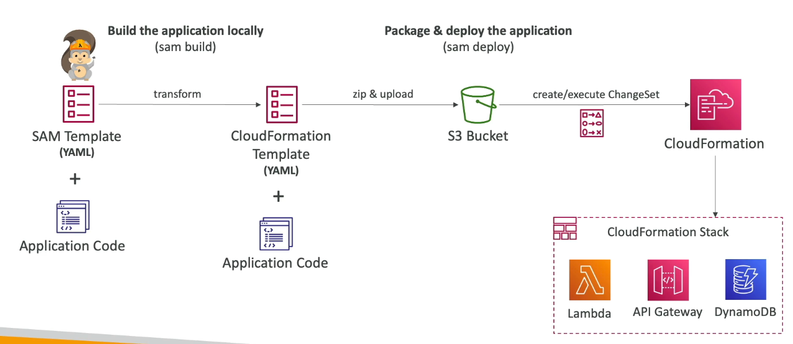

#aws #cloud 
# Overview
+ SAM = Serverless Application Model
+ Framework for developing and deploying serverless applications
	+ Can use [](CICD%20in%20AWS.md#AWS%20CodeDeploy|AWS%20CodeDeploy) to deploy [Lambda](AWS%20Lambda.md) functions
	+ Can run Lambda, [Amazon API Gateway](Amazon%20API%20Gateway.md), [Amazon DynamoDB](Amazon%20DynamoDB.md) locally.

# SAM Template Specification
+ Defined using syntax that extends [AWS CloudFormation](AWS%20CloudFormation.md) syntax for serverless development.
	+ Note: We can directly define provision of serverless services in CloudFormation but the SAM template syntax is less complex to define.
+ Under the hood, the SAM template (.yaml file) is converted into CloudFormation syntax.
+ Every SAM template contains :
	+ `Transform: 'AWS::Serverless-2016-10-31'` header that indicates it is a SAM template and needs to be converted into CloudFormation syntax.
	+ `Resources` section that contains the application components (serverless + non-serverless).
		+ `AWS::Serverless::Function` - Lambda function
		+ `AWS::Serverless::Api` - API gateway
		+ `AWS::Serverless::SimpleTable` - DynamoDB
		+ `AWS::Serverless::StateMachine` - AWS Step Function
## SAM Policy Templates
+ Predefined IAM policies that allow you to grant common permissions to AWS Lambda and AWS Step functions.
+ Provides least privilege necessary.
+ Defined in the `Policies` section of a SAM template
	+ `S3ReadPolicy` : Read only permissions to objects in S3
	+ `SQSPollerPolicy`: Allows you to poll a [Amazon SQS](Amazon%20SQS.md) queue.
	+ `DynamoDBCrudPolicy`: Allows CRUD operations on a DynamoDB table.
## CodeDeploy Integration
+ To enable, we use 2 properties within `AWS::Serverless::Function`:
	+ `AutoPublishAlias`: Specifies alias name. Every time SAM publishes a new version of a Lambda function, it creates the alias and points it to the newly created version.
	+ `DeploymentPreference` : Specifies how traffic is shifted to new version.
		+ `Canary`: Shifts traffic in 2 increments. (Ex: _Canary10Percent5Minutes_ shifts 10% of traffic immediately and the remaining 90% after five minutes.)
		+ `Linear`: Shifts traffic in equal increments at regular intervals until 100% is reached. Ex: _Linear10PercentEvery1Minute_ shifts an additional 10% every minute for ten minutes.
		+ `AllAtOnce`: Shifts all the traffic to the new version.
+ Hooks can be used to test function deployment.
	+ They are also Lambda functions.
	+ __Pre-traffic__: Runs before any traffic shifts. If this function fails, the deployment aborts.
	+ __Post-traffic__: Runs after all traffic has shifted. Failure triggers a rollback.
+ CloudWatch alarms can be specified to to trigger during deployment, and rollback to previous version.
```yaml
MyFunction:
  Type: AWS::Serverless::Function
  Properties:
    Handler: index.handler
    Runtime: python3.12
    AutoPublishAlias: live
    DeploymentPreference:
      Type: Linear10PercentEvery1Minute
      Alarms:
        - !Ref MyErrorAlarm
      Hooks:
        PreTraffic: !Ref MyPreTrafficLambda
```
## Example
```yaml
AWSTemplateFormatVersion: '2010-09-09'
Transform: AWS::Serverless-2016-10-31  # Required for SAM

# Globals define common properties for all functions
Globals:
  Function:
    Timeout: 5
    MemorySize: 128
    Runtime: python3.12  # Current standard for 2025
Resources:
  # A serverless function resource
  MyLambdaFunction:
    Type: AWS::Serverless::Function
    Properties:
      CodeUri: hello_world/
      Handler: app.lambda_handler
      # SAM Policy templates for scoped access
      Policies:
        - DynamoDBCrudPolicy:
            TableName: !Ref MyDatabaseTable
      # Event source triggering the function
      Events:
        ApiTrigger:
          Type: Api
          Properties:
            Path: /hello
            Method: get

 # A simplified DynamoDB table
  MyDatabaseTable:
    Type: AWS::Serverless::SimpleTable
    Properties:
      PrimaryKey:
        Name: id
        Type: String

Outputs:
  # Returns the generated API endpoint URL
  ApiEndpoint:
    Description: "API Gateway endpoint URL"
    Value: !Sub "https://${ServerlessRestApi}.execute-api.${AWS::Region}"
```
# SAM CLI
+ Start a new project: `sam init`
+ Package and deploy: `sam deploy` 
	+ To choose a specific env: `sam deploy --config-env dev`
+ Sync local changes to Lambda (SAM Accelerate) : `sam sync --watch`
+ Emulate the env defined in SAM template locally: `sam local`
# SAM Accelerate
Set of features to reduce latency while deploying resources to AWS.

`sam sync` 
+ Synchronizes changes to SAM template to AWS services by using CloudFormation APIs.
`sam sync --code`
+ Synchronizes changes to SAM template to AWS services by __bypassing CloudFormation__. i.e. it uses service specific APIs to update instead of using CloudFormation APIs.
`sam sync --code --resource AWS::Serverless::Function` 
+ Synchronize changes to SAM template directly, but only for Lambda functions defined in the template.
`sam sync --code --resource-id HelloWorldLambdaFunction` 
+ Synchronize changes to SAM template directly, but only for `HelloWorldLambdaFunction`.
`sam sync --watch` 
+ Monitor for file changes and synchronize changes to SAM template automatically.
# SAM Local
`sam local start-lambda` : Start local lambda endpoint.
`sam local invoke`: Invoke lambda function with payload once and quit after invocation completes.
`sam local start-api`: 
+ Starts local HTTP server that hosts all your functions.
+ All changes are automatically reloaded.
`sam local generate-event`: Generate sample payloads for event sources.(S3, DynamoDb, Kinesis etc..)
# Multiple env
+ Can specify multiple environment configs in `samconfig.toml`.
+  Organized by _profiles_ (for env) and _commands_.
	+ The default profile is usually `default`. You can create others like `[dev]`, `[prod]`, or `[staging]` to store different configurations for different AWS accounts or environments.
	+ Under a profile, you define parameters for specific SAM CLI commands (e.g., `[default.deploy.parameters]`).
```toml
version = 0.1

[default.deploy.parameters]
stack_name = "my-serverless-app-2025"
s3_bucket = "aws-sam-cli-managed-default-samclisourcebucket-abc123"
region = "us-east-1"
confirm_changeset = true
capabilities = "CAPABILITY_IAM"
image_repositories = []

[default.build.parameters]
cached = true
parallel = true

[prod.deploy.parameters]
stack_name = "my-serverless-app-production"
region = "us-west-2"

```