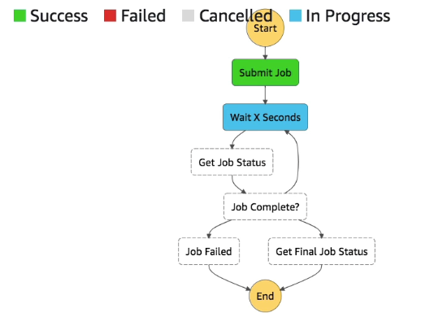
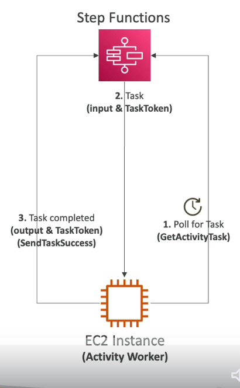
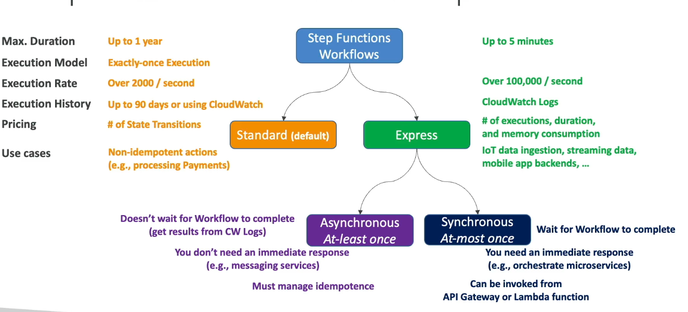

#aws  #cloud 
# Overview
+ **Serverless orchestration service** used to build and manage multi-step application workflows as **state machines**.
+ Visualize workflow, its execution and history.

+ Start workflow with SDK call, [Amazon API Gateway](Amazon%20API%20Gateway.md), [](AWS%20CloudWatch.md#Amazon%20EventBridge|EventBridge) 
# Amazon States Language (ASL)
+ Step Functions use ASL to define different states in the state machine. (JSON doc)
## Task State
+ Represents a unit of work.
	+ Invoke AWS Services
	+ Call External APIs (Ex: Stripe/Salesforce)
	+ Call code running on your own servers that "polls" Step Functions for work. (Activity tasks)

```json
"InvokeLambdaTask": {
  "Type": "Task",
  "Resource": "arn:aws:lambda:us-east-1:123456789012:function:ProcessOrder",
  "Parameters": {
    "Payload": {
      "orderId.$": "$.orderId",
      "status": "pending"
    }
  },	
  "Next": "SucceedState", // Name of next state in state machine
  "TimeoutSeconds": 300
}
```
## Choice State
+ Test for a condition to send to a branch.
## Succeed / Fail State
+ Terminal State that marks the workflow as success/failure
## Pass State
+ Pass input as is to next stage.
+ Can be used to inject some fixed data into workflow.
## Wait State
+ Delay for a certain amount of time or until specified date/time.
## Map State
+ Dynamically iterate over a list of items and run a set of steps for each.
## Parallel State
+ Parallelly execute multiple branches of work. 
+ Waits until all branches finish executing.
## Error Handling with Retry and Catch
```json
"InvokeLambdaTask": {
  "Type": "Task",
  "Resource": "arn:aws:lambda:us-east-1:123456789012:function:ProcessOrder",
  "Parameters": {
    "Payload": {
      "orderId.$": "$.orderId",
      "status": "pending"
    }
  },
  "Retry": [
    {
      "ErrorEquals": ["Lambda.ServiceException", "Lambda.TooManyRequestsException"],
      "IntervalSeconds": 2,
      "MaxAttempts": 3,
      "BackoffRate": 2.0
    }
  ],
  "Catch": [
    {
      "ErrorEquals": ["States.ALL"],
      "Next": "HandleErrorState",
      "ResultPath:" "$.error" // Include error in output
    }
  ],
  "HandleErrorState": {
	  "Type": "Pass",
	  "Result": "Fallback from lambda function exception",
	  "End": true
  },
  "Next": "SucceedState"
}

```
## Activity Tasks
+ ==Allows you to integrate a workflow step with a worker that runs **outside of AWS Step Functions**==, such as on an Amazon EC2 instance, on-premises server, or even a mobile device.
	+ create an Activity in Step Functions, which generates a unique **Amazon Resource Name (ARN)**.
	+ Reference this ARN in a Task state within your state machine
	+ An external "worker" (your custom code) constantly polls Step Functions for work using the `GetActivityTask` API and the activity ARN.
	+ When the workflow reaches the activity state, Step Functions provides the worker with a **task token** and the input data.
	+ Once the work is done, the worker sends back the result along with the task token using `SendTaskSuccess` or `SendTaskFailure` to advance the workflow
+ To keep task active:
	+ Configure how long the task can run using `TimeoutSeconds` parameter. 
	+ Periodically send a heartbeat from your worker using `SendTaskHeartBeat` within the time specified in `HeartBeatSeconds` parameter.
+ Activity tasks can wait for up to **one year** for a response.
+ Alternatively, Step Function can push work to a queue and custom code can poll from that queue.
# Standard vs Express Workflows
| Feature               | Standard Workflows                                    | Express Workflows                                    |
| --------------------- | ----------------------------------------------------- | ---------------------------------------------------- |
| **Max Duration**      | **1 year**                                            | **5 minutes**                                        |
| **Execution Model**   | **Exactly-once**                                      | **At-least-once** (Async) or **At-most-once** (Sync) |
| **Throughput**        | Up to 2,000 starts per second                         | **Over 100,000** starts per second                   |
| **Execution History** | **Full history** available in console/API for 90 days | Sent to **CloudWatch Logs** (requires configuration) |
| **Pricing**           | **$0.025 per 1,000 state transitions**                | **$1.00 per 1M requests** + duration/memory costs    |
| **Best For**          | Long-running, durable, auditable tasks                | High-volume, short-duration event processing         |

## Standard Workflows
- **Best Use Cases**: Orchestrating non-idempotent actions like processing payments or starting EMR clusters.
- **Reliability**: Provides an **exactly-once** execution guarantee, ensuring steps do not run more than once unless you define retry logic.
## Express Workflow
- **Best Use Cases**: High-event-rate workloads such as IoT data ingestion, streaming data processing, and mobile backends.
- **Execution Types**:
    - **Synchronous**: Starts a workflow and waits for completion to return the result immediately; ideal for microservice orchestration.
    - **Asynchronous**: Returns confirmation that the workflow started without waiting for completion.
- **Idempotency Required**: Because they use an "at-least-once" model, your logic must be **idempotent** to handle potential duplicate executions of a step.