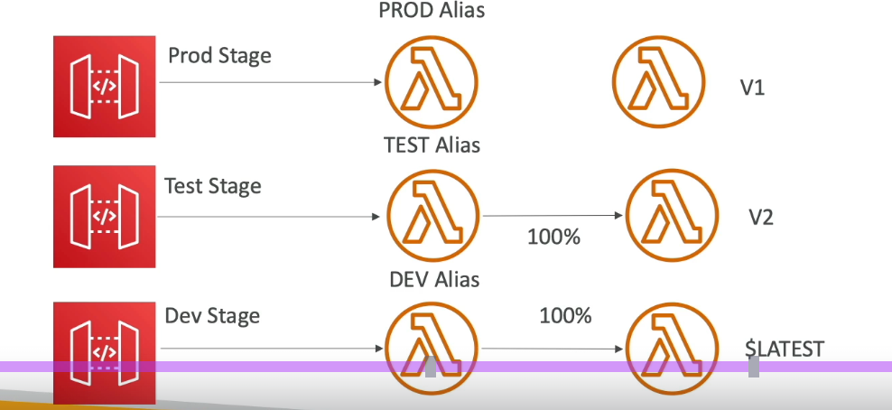
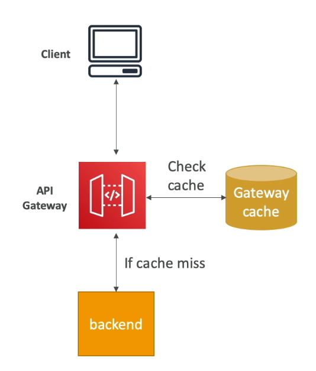
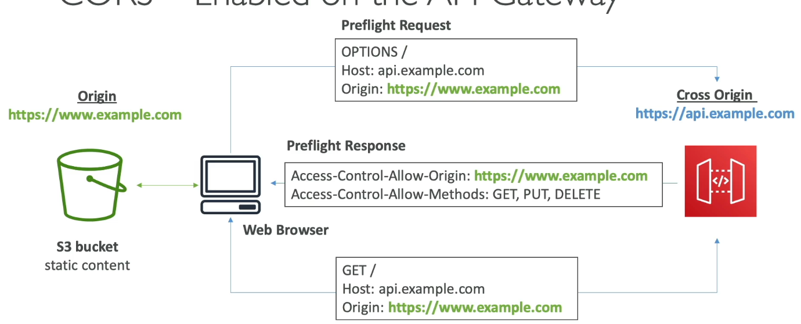
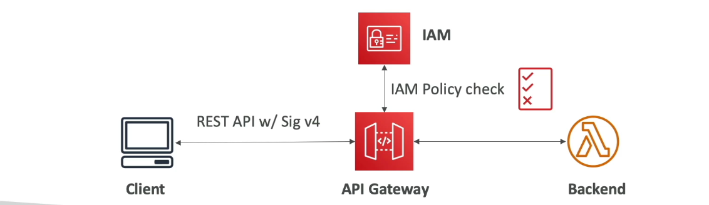

#aws #cloud 
# Overview
+ Serverless service to manage HTTP, REST or WebSocket APIs at scale.
	+ HTTP APIs are cheapest, lowest latency.
	+ REST APIs support resource policies, HTTP APIs don't
	+ HTTP APIs suport OIDC/OAuth 2.0, REST doesn't
+ For example, you can create an HTTP API that integrates with a Lambda function on the backend. When a client calls your API, API Gateway sends the request to the Lambda function and returns the function's response to the client.
+ Default timeout 29s.
+ Throttles requests at 10,000 requests/s across __all APIs__.
	+ Can be increased upon request.
 
# API Endpoint Types
## Edge Optimized
+ Uses [Amazon CloudFront](Amazon%20CloudFront.md) POPs to provide client access across AWS Regions.
## Private
+ Exposed through [](Amazon%20VPC#VPC%20Endpoint%20Types#VPC%20Endpoint%20Types#**Interface**|VPC%20ENI), to allow secure, private access to API resources in a VPC.
## Regional 
+ Deployed in a AWS region, and serves clients in the same region.
# API Integration Types
Integration $\rightarrow$ service to which API gateway passes request to.
## [AWS Lambda](AWS%20Lambda.md)
### ___Lambda Proxy Integration___ (Recommended)
API Gateway passes the entire request as a JSON object directly to the Lambda function and expects a specific JSON format back for the response
### ___Lambda Custom Integration___
Requires you to define a mapping template to transform the request data into the specific input format the Lambda function expects and to convert received response to what client expects.
## Mock
Used for testing APIs during development, allowing you to return a static response directly from the API Gateway without reaching any back-end endpoint.
## HTTP Endpoint
Forwards requests to any external HTTP/HTTPS endpoint hosted outside of AWS.
### ___HTTP Proxy Integration___
Passes the request headers, parameters, and body directly to the specified URL.

___Custom HTTP Integration___
Requires defining mapping templates to control how the request is sent to the backend and how the response is mapped back to the client.
## AWS Service
Directly invoke various AWS services (like Amazon S3, Kinesis, DynamoDB, or SNS) from the API Gateway without passing through an intermediate Lambda function.
+ Requires defining specific IAM roles and using mapping templates to format the request into the target service's expected API call structure. 
+ It is powerful for direct, low-latency access to services.
## VPC Link
+ Secure, private access to private resources within a VPC using API Gateway.
# Deployment & Stages
___Deployment___: Immutable snapshot of the API at a point in time.
+ When any change is made to your API's config (methods, integrations, resources), for the changes to be available, a deployment must be created.
___Stage___: A deployment is associated with a stage, which makes it callable from a unique __stage__ URL of the format `https://{api_id}.execute-api.{region}.amazonaws.com/{stage_name}/)`.
+ You can view deployment history of your stage and revert to a previous deployment.
+ You can have multiple, parallel environments (e.g., a `dev` stage for active development and a `prod` stage for stable customer use) running different versions of the API simultaneously.
+ You can configure a stage to use a canary release, directing a small percentage of traffic (e.g., 10%) to a new, updated deployment, while the remaining traffic goes to the stable production deployment.
+ You can enable detailed [AWS CloudWatch](AWS%20CloudWatch.md) logs or [](AWS%20CloudWatch.md#AWS%20X-Ray|X-ray) tracing.
+ You can configure cache settings and throttling (rate limits + quotas) for optimized performance.
___Stage variables___: Act like env variables, allowing dynamic config for an API stage.
Ex: `dev` stage variable points to a `dev` lambda function alias while `test` stage variable points to a `test` function alias.

# Caching API Responses
+ Caching is configured at __stage__ level.
+ Can provision cache capacity (cluster) between 0.5 GB to 237 GB.
+ Default Cache TTL is 5 min. Max 1 hr.
	+ TTL=0 $\rightarrow$ caching is disabled
+ Can be enabled/disabled for specific methods.
+ Can encrypt data in cache
+ Clients can bypass the cache and fetch a fresh response from the backend by sending the `Cache-Control: max-age=0` header in their request.
	+ Can configure it so that client needs `execute-api:InvalidateCache` permission to perform cache invalidation.

# OpenAPI Specification Compatibility
+ API Gateway supports importing and exporting APIs using OpenAPI spec files (JSON/YAML).
+ OpenAPI Spec is vendor neutral, so to specify AWS services, we must AWS extensions:
	+ `x-amazon-apigateway-authorizer` & `x-amazon-apigateway-authtype` is used to configure AWS specific auth methods like Lambda authorizers or Cognito User Pools.
	+ `x-amazon-apigateway-integration` is used to specify [#API Integration Types](#API%20Integration%20Types) 
	+ `x-amazon-apigateway-request-validator` is used to specify request validator to enforce schema for incoming request payload, header and params.
```yaml
openapi: 3.0.1
info:
  title: SimpleLambdaAPI
  description: An API that integrates with a Lambda function.
  version: "1.0"
paths:
  /hello:
    get:
      summary: Greet the user
      operationId: getHello
      responses:
        '200':
          description: A successful response
      # The key AWS-specific integration part
      x-amazon-apigateway-integration:
        type: "AWS_PROXY"
        httpMethod: "POST"
        uri: "arn:aws:apigateway:{region}:lambda:path/2015-03-31/functions/{lambda_function_arn}/invocations"
        passthroughBehavior: "when_no_match"
        # The integration needs permissions to invoke the specified Lambda ARN
        credentials: "arn:aws:iam::{account_id}:role/{api_gateway_execution_role_name}"
```
# API Usage Plan
To implement usage plans:
1. **Create a Usage Plan**: Define the desired throttling rate, burst capacity, and quota limits in the AWS console or using infrastructure-as-code tools.
2. **Associate API Stages**: Specify which API stages (e.g., `prod`, `dev`) are covered by the plan.
3. **Require API Keys**: Configure specific API methods to require an API key in their `x-api-key`  header.
4. **Create and Link API Keys**: Generate API keys for your clients and associate each key with the appropriate usage plan.

 ___Throttling limit___ :  controls the _rate_ at which an individual client can call the API to prevent sudden traffic spikes.
 ___Rate limit___: control the steady-state number of requests per second (RPS) that the API can handle.
 ___Burst limit___: control the maximum number of concurrent requests the API can handle in a short spike.
 ___Quota limit___: control the _total number_ of requests a client can make within a specific time interval (day, week, or month). Once the quota is exceeded, API Gateway returns a `429 Too Many Requests` error until the next period begins.
# CloudWatch metrics
Metrics are by stage.
+ `CacheHitCount` & `CacheMissCount` : efficiency of cache
+ `Count` : Total no of API requests/s
+ `IntegrationLatency`: Time taken since gateway relayed request to backend till it receives response.
+ `Latency`: Time taken since receiving request from client till response is returned.
# Commonly returned Errors
+ 400: Bad Request
+ 403: Access denied
+ 429: Quota exceeded
+ 502: Bad Gateway (incompatible o/p returned from lambda proxy or out of order invocation)
+ 503: Service unavailable
+ 504: Integration failure (Request time out default 29s)
# CORS Integration
+ CORS enabled through console.
+ `Options` pre-flight request must contain headers:
	+ `Access-Control-Allow-Headers`
	+ `Access-Control-Allow-Methods`
	+ `Access-Control-Allow-Origin`

# Security
## IAM Security
1. **Define Access with IAM Policies**: You write standard IAM policies that explicitly grant or deny the `execute-api:Invoke` action for specific API Gateway resources (identified by their Amazon Resource Name, or ARN).
2. **Assign to Invoker**: These policies are attached to the IAM users, roles, or groups that need access to the API.
3. **Authentication via SigV4**: When an authorized client makes a request to the API Gateway, they must use their AWS credentials to sign the request using the **Signature Version 4 (SigV4)** signing process. This cryptographic signature authenticates the sender and prevents tampering.
4. **Verification**: API Gateway verifies the SigV4 signature and checks the associated IAM policy. If the user/role has permission to `Invoke` the requested method, the request is allowed through; otherwise, it is denied.
## Cognito User Pools
Cognito fully manages user lifecycle, expires token automatically
1. **User Authentication**: A user signs up and signs in to your mobile or web application using Amazon Cognito User Pools.
2. **Token Generation**: Upon successful authentication, Cognito issues JSON Web Tokens (JWTs), specifically an **Identity Token** and an **Access Token**.
3. **API Request**: Your application includes this token in the header of its request to the API Gateway endpoint (usually in the `Authorization` header).
4. **API Gateway Authorizer**: The API Gateway method is configured with a `COGNITO_USER_POOLS` authorizer. This authorizer intercepts the request, extracts the token, and validates it with the associated Cognito User Pool.
5. **Access Control**:
    - If the token is valid and unexpired, API Gateway allows the request to proceed to the backend (e.g., a Lambda function or HTTP endpoint).
    - If the token is invalid or missing, API Gateway rejects the request and returns a `401 Unauthorized` response without reaching the backend.
6. **Backend Access to User Data**: The validated token's claims (user ID, email, custom attributes) are automatically passed to the backend integration, allowing the backend logic to operate in the context of the specific authenticated user.
.png)
## Lambda Authorizer (for 3<sup>rd</sup> party authentication system)
1. **Client Request**: A client sends a request to an API Gateway method, including a token in a specified header (e.g., `Authorization`).
2. **Authorizer Invocation**: API Gateway invokes your designated Lambda authorizer function, passing the token and other request context information (e.g., HTTP method, path).
3. **Custom Validation Logic**: Inside your Lambda function, you write the logic to inspect the token. This might involve:
    - Calling a third-party authentication service.
    - Validating a JWT signature or expiration time.
    - Checking a database for an active API key or session.
4. **IAM Policy Generation**: If the validation is successful, the authorizer function returns an IAM Policy document (JSON format) that explicitly grants (`Allow`) or denies (`Deny`) access to specific API resources (ARNs).
5. **Access Control and Caching**:
    - If the policy allows access, API Gateway executes the original requested backend integration (e.g., another Lambda function).
    - If the policy denies access or an error occurs, API Gateway immediately stops the request and returns a `401 Unauthorized` or `403 Forbidden` response.
6. **Caching**: API Gateway can cache the generated IAM policy for a configurable Time-to-Live (TTL). Subsequent requests with the same token reuse the cached policy, improving performance and reducing the load on your authorizer function.
.png)