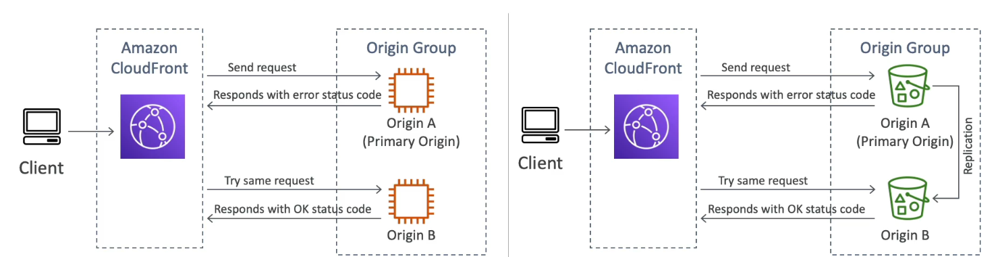
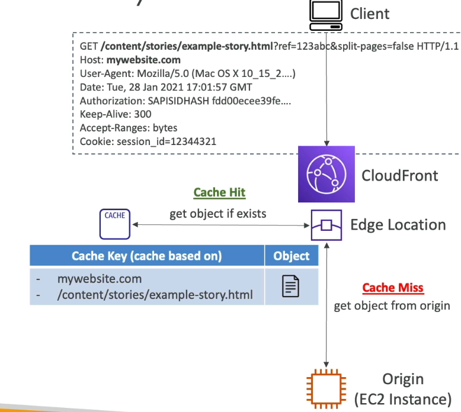
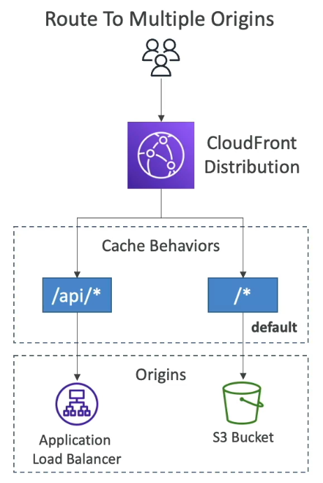
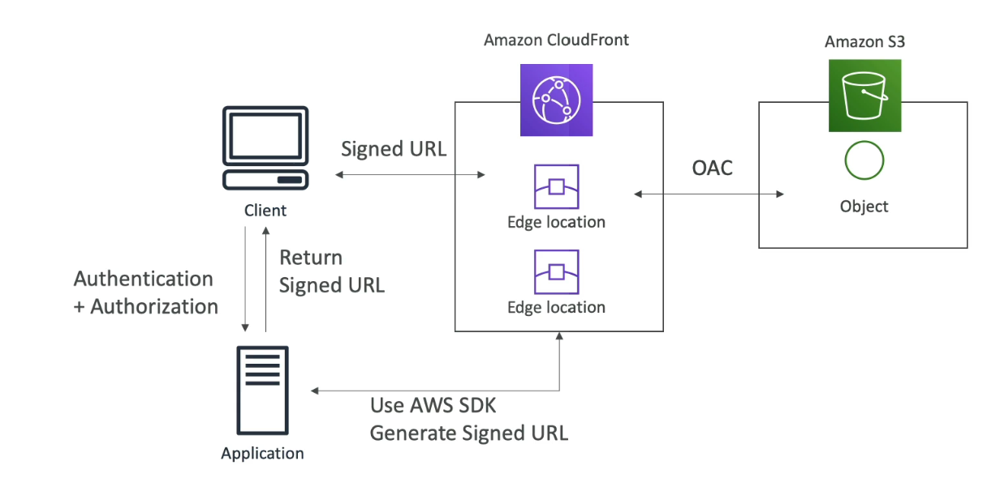

#aws #cloud 
# Prerequisite
+ [CDN](CDN%20(Content%20Delivery%20Network).md) service
# Regional caches
+ CloudFront delivers **popular** content to users through _point of presence_ (POP) locations / .
+ Regional caches holds data  that has become less popular over time, to reduce latency if such content is requested.
+ They lie between the _origin server_ and _edge location_, and have a larger cache than _edge locations_, so objects remain in cache longer.
# How content is distributed
+ When user requests some content, DNS routes to the closest POP.
+ If POP doesn't have the content cached, it attempts to fetch from nearest regional cache.
+ If regional cache also doesn't hold the data, CloudFront forwards request to origin server.
+ The requested data is cached by both the regional cache and the POP, and returned to the user.
+ CloudFront keeps persistent connections with origin servers so objects are fetched asap.
# Directing requests to private origin servers
+ CloudFront provides a managed prefix list which contains IP address ranges of all of CloudFront's globally distributed origin-facing servers.
+ If origin server is hosted in AWS, can use the managed prefix list to restrict inbound traffic to CloudFront servers through a  rule.
# Origin Server Types
+ 
	+ Objects stored in bucket are delivered by CloudFront.
	+ Secured using origin access control that requires viewer access content using CloudFront URLs instead of S3 URLs.
	+ Bucket name is used as origin for CloudFront.
	+ Bucket can be public or private.
+ 
	+ Alias of Object Lambda's access point is used as origin for CloudFront.
+ 
	+ Alias of S3 access point is used as origin for CloudFront.
+ VPC Origin
	+ For applications hosted in VPC private subnets.
	+ Create a VPC origin and connect to a   /  / .md#EC2%20Instance|EC2%20instance) as backend.
+ Custom Origin (HTTP)
	+ .
	+ Any publicly [routable](Amazon%20Route%2053.md) HTTP backend (non-AWS/EC2 hosted)
# Customize CDN content
## CloudFront functions
+ Lightweight JS functions attached to a CloudFront distribution for **high-scale, latency-sensitive** CDN customizations. (Millions of requests/s, executes in < 1ms)
+ The function runs at the edge location and minimizes latency (unlike Object Lambda origin server).
+ Used to change user request / response
	+ Runs __after__ CloudFront receives user request
	+ Runs __before__ sending CloudFront response
+ Use cases:
	+ [#Cache key](#Cache%20key) normalization: Transform request attributes (headers, cookies, query strings, URL) to create a cache key
	+ Insert/modify/delete HTTP headers in request/response
	+ URL rewrites or redirects
	+ Create or validate user-generated tokens (eg: JWT) to allow or deny requests
## Lambda@Edge
+ Lambda functions written in NodeJS or Python, attached to a CloudFront distribution for CDN customizations. (1000s of requests/s, executes in 5-10 s)
+ The function runs at the edge location and minimizes latency (unlike Object Lambda origin server).
+ Used to change user request/response or origin request/response
	+ Runs __after__ CloudFront receives user request
	+ Runs __before__ sending CloudFront response
	+ Runs __before__ CloudFront sends request to origin
	+ Runs __after__ CloudFront receives response from origin.
+ Lambda function to use is written in one region (say us-east-1) and CloudFront replicates it to its edge locations.
+ Use cases:
	+ Any use case that requires using 3rd party libraries (ex: access other AWS services using AWS SDK)
	+ Any use case that requires network access for external services to do processing.
	+ Any use case that requires file system access or access to body of HTTP requests
# Default root object
+ Configure at CloudFront distribution level.
+ Return default object when user requests root URL of CloudFront distribution.
# Origin group
+ Provides origin failover for high redundancy and availability.
+ Two origins - primary and secondary. 
	+ If request to primary fails (5xx) or request times out, request is redirected to secondary origin.
	+ Failover is **stateless**. Next request first tries to request from primary again.
+ Supports `GET`, `HEAD` and. `OPTIONS` only.
+ Use cases:
	+ During a migration, you can use your on-premises web server as the primary origin and a new cloud-based environment as the secondary, or vice versa.
	+ A dynamic web application (e.g., an Application Load Balancer) can be the primary origin, with an Amazon S3 bucket containing a static "maintenance" or "unavailable" page as the secondary.

# Cache key
+ Unique id for every object in cache.
	+ (default) domain name of CloudFront distribution + resource path of URL
+ Can add HTTP headers, cookies, query strings to cache key using [cache policy](#Cache%20policy).
	+ Use case: Application serves content based on location, device, language etc..
+ When user request generates a cache key present in edge location => cache hit.
	+ Lesser info in cache key => higher hit ratio

# Cache policy
+ Improve cache hit ratio by controlling the values (URL query strings, HTTP headers, and cookies) that are included in the [cache key](#Cache%20key).
+ Use predefined _managed_ policies or custom policies.
## TTL settings
+ Work together with `Cache-Control` and `Expires` HTTP headers to determine how long objects stay valid in the cache.
+ _Minimum TTL_: min time in seconds that objects should stay in cache before CloudFront checks with origin if object is updated.
+ _Maximum TTL_: max time in seconds that objects should stay in cache before CloudFront checks with origin if object is updated.
	+ Used only when origin **sends** `Cache-Control` or `Expires` HTTP headers with the object.
+ _Default TTL_: default time in seconds that objects should stay in cache before CloudFront checks with origin if object is updated.
	+ Used only when origin **does not send** `Cache-Control` or `Expires` HTTP headers with the object

>[!warning]
>If _Minimum TTL_, _Maximum TTL_ and _Default TTL_ are all set to 0, caching is disabled.
# Cache key settings
+ Specify values to be included in viewer requests (HTTP headers, cookies or query strings), that become part of cache key and origin requests.
+ __Headers__: ___None___, ___Include the following headers___ (header + value)
+ __Cookies__: ___None___, ___All___, ***Include specified cookies***, ***Include all cookies except*** (cookie name only)
+ __Query Strings__: ___None___, ___All___, ***Include specified query strings***, ***Include all query strings except*** 
# Origin request policy
+ Specify values (HTTP headers, cookies or query strings) that should be included in origin requests but **not** cache key.
+ Use predefined _managed_ policies or custom policies.
+ __Headers__: (header + value)
	+ ___None___
	+ ___All HTTP headers___
	+ ___All HTTP headers and following CloudFront headers___
	+ ___Include following HTTP headers___
	+ ___Include all HTTP headers except___
+ __Cookies__: ___None___, ___All___, ***Include specified cookies***, ***Include all cookies except***  (cookie name only)
+ __Query Strings__: ___None___, ___All___, ***Include specified query strings***, ***Include all query strings except*** 
# Cache Invalidation
+ CloudFront distribution -> Invalidations
+ Invalidate files by specifying path like `/images/*` (all files in images dir), `*` (all files), `/images/file.png` (file1.png) .
	+ Path is relative to CloudFront distribution (DNS hostname).
	+ Path is case sensitive
+ All cached versions of a file are invalidated.
# Cache behavior
+ Specify different origin/ [origin groups](#Origin%20group) based on resource path url.
	+ Ex: Redirect to an ALB if path is `/api/*` and to a S3 bucket otherwise.
+ When a CloudFront distribution is created, a **default** cache behavior is also created, which directs requests to specified origin at the time of creation. 
	+ Processed as `/*`

# Geo-restriction
+ Distribution -> Security
+ Can restrict access to content for users in certain countries through __blocklist__.
+ Can allow access to content for users in certain countries through __allowlist__.
+ _country_ is determined by 3rd party Geo-IP database.
# Signed URLs and signed cookies
+ Want to distribute paid content to premium users around the world.
	+ Require users to access content through signed URLs or signed cookies.
		+ Signed URL = access to one file
		+ Signed cookies = access to multiple files
+ Need to specify
	+ URL expiration
	+ IP ranges to access data from (user side)
	+ Trusted signers (which AWS accounts can create signed URLs)
+ Two signer types:
	+ Account wide key-pair (managed by root user) is used to sign url/cookie. (not recommended)
	+ Trusted key group (recommended)
		+ Includes public keys for signing (from multiple origins). Private key kept by origin server.
+ Signed url ex: 
# Pricing
+ Cost of data transfer out of edge location varies by region.
	+ More data transferred out => less the cost / GB
## Price classes
+ Reduce costs by limiting number of edge locations used worldwide.
+ __Price class All__:  All regions. High performance, highest cost
+ __Price class 200__: Includes most regions but excludes the most expensive ones.
+ __Price class 100__: Includes only the least expensive regions.
# Field-Level Encryption
+ Protect user sensitive information by encrypting specific fields in `POST` requests. (up to 10).
	+ Also need to specify public key in request.
	+ Edge location encrypts data using provided public key.
	+ Origin server has private key to decrypt fields.
+ Additional security with HTTPS (SSL/TLS encryption).
.png)
# Real time logging
+ Get real time requests received by CloudFront sent to Kinesis Data Streams.
	+ Sampling rate: (optional) specify % of requests to receive
	+ Receive all requests from specific fields or path patterns. (optional)
+ Monitor, analyze and take action based on content delivery performance.
+ Real time processing: Use lambda function on Kinesis data stream
+ Near real time processing: Use Kinesis Data Firehose on Kinesis data stream
