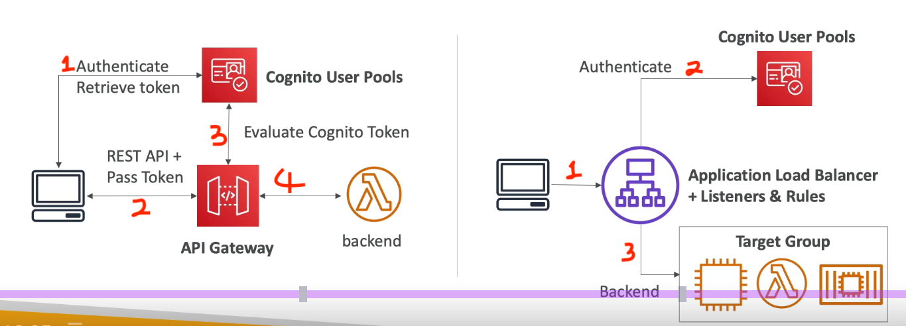
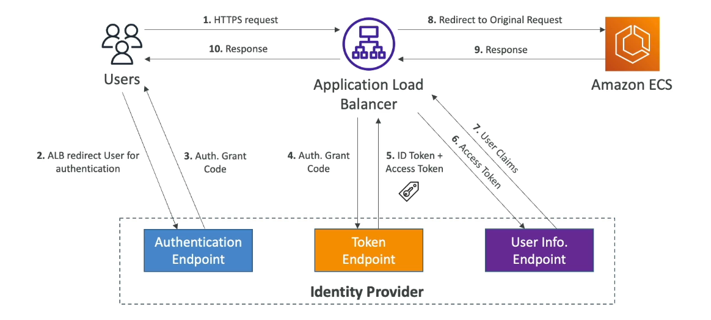
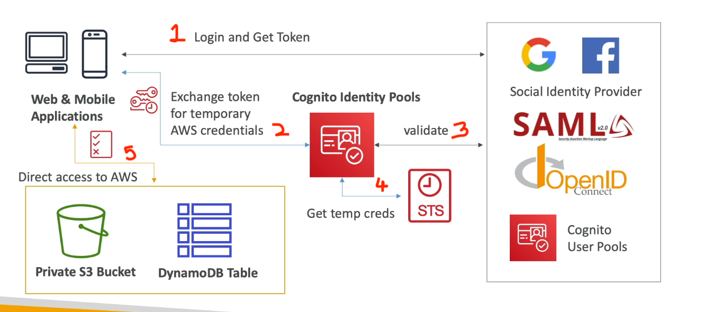

#aws #cloud 
# Overview
+ Serverless user directory that manages sign-up and sign-in for web and mobile applications.
+ Supports direct sign-in via username/password and federated sign-in through social providers (Apple, Google, Facebook, Amazon) or enterprise directories (SAML 2.0, OIDC).
# Cognito Vs IAM
| Feature              | Amazon Cognito                                                                        | AWS IAM (Identity and Access Management)                                  |
| -------------------- | ------------------------------------------------------------------------------------- | ------------------------------------------------------------------------- |
| **Primary Audience** | **External Users** (App customers, consumers, B2C/B2B users).                         | **Internal Workforce** (Employees, admins, server-side systems).          |
| **Main Goal**        | **CIAM** (Customer Identity & Access Management): Sign-up, sign-in, and guest access. | **EIAM** (Enterprise IAM): Managing access to AWS accounts and resources. |
| **Scalability**      | Designed for millions of public users.                                                | Optimized for centralized organizational control.                         |
| **Identity Types**   | Social IDs (Google, Apple), OIDC/SAML, guest users.                                   | IAM Users, IAM Roles, IAM Groups.                                         |
| **Output**           | JWTs (ID/Access tokens) for application-level auth.                                   | Temporary or long-term AWS credentials for AWS service access.            |
# User Pools
+ Identity provider and user directory for web and mobile applications.
+ Username/password login, Federated identity providers or user directory in Cognito.
	+ Password reset
	+ Email and Mobile verification
	+ Passkeys, Email/SMS OTP
	+ MFA
+ Block users if credentials compromised.
+ Login returns a JWT token:
	+ **ID Token**: Authenticates the user with claims like name and email.
	- **Access Token**: Grants access to authorized API operations and scopes.
	- **Refresh Token**: Used to retrieve new ID and access tokens when they expire.
- Pricing based on Monthly Active Users.
## [AWS Lambda](AWS%20Lambda.md) Triggers
+ Hooks that allow developers to run custom code at various lifecycle stages:

| User Pool Flow | Trigger Operation                                                                                                            | Purpose in 2025                                                           |
| -------------- | ---------------------------------------------------------------------------------------------------------------------------- | ------------------------------------------------------------------------- |
| **Sign-Up**    | [Pre sign-up](https://docs.aws.amazon.com/cognito/latest/developerguide/user-pool-lambda-pre-sign-up.html)                   | Validate sign-up data or auto-confirm trusted users.                      |
|                | [Post confirmation](https://docs.aws.amazon.com/cognito/latest/developerguide/user-pool-lambda-post-confirmation.html)       | Send welcome messages or trigger external system provisioning.            |
| **Auth**       | [Pre authentication](https://docs.aws.amazon.com/cognito/latest/developerguide/user-pool-lambda-pre-authentication.html)     | Block login attempts from specific IPs or log session data.               |
|                | Post authentication                                                                                                          | Perform custom analytics or update user attributes after sign-in.         |
| **Tokens**     | [Pre token generation](https://docs.aws.amazon.com/cognito/latest/developerguide/user-pool-lambda-pre-token-generation.html) | Add, modify, or suppress claims and scopes in ID and access tokens.       |
| **Messages**   | [Custom message](https://docs.aws.amazon.com/cognito/latest/developerguide/user-pool-lambda-custom-message.html)             | Dynamically localize or brand verification emails/SMS.                    |
|                | [Custom sender](https://docs.aws.amazon.com/cognito/latest/developerguide/user-pool-lambda-custom-sender-triggers.html)      | Route emails/SMS through third-party providers (e.g., SendGrid, Twilio).  |
| **Migration**  | [Migrate user](https://docs.aws.amazon.com/cognito/latest/developerguide/cognito-user-pools-import-using-lambda.html)        | Move users from a legacy directory to Cognito during their first sign-in. |
+ Triggers are synchronous i.e. Cognito waits for Lambda function to finish.
	+ 5-s timeout + 3 retries
+ You must grant the `cognito-idp.amazonaws.com` service principal permission to invoke your Lambda function.
## Security
+ Flags risks when a user signs in from two locations that are geographically too far apart for travel within the time elapsed.
+ Checks passwords at sign-up, sign-in, or password reset against databases of leaked credentials from public data breaches.
+ Evaluates risk scores for every sign-in based on device fingerprints, IP reputation, and geolocation. It can automatically block suspicious sessions or force a second MFA check.
+ All sign in and sign up attempts are logged to [AWS CloudWatch](AWS%20CloudWatch.md) logs
+ Integrate with **AWS WAF Web ACLs** directly with user pool app clients to protect against volumetric attacks, SQL injection, and unauthorized bot activity.
+ Enforce password complexity rules (length, symbols, numbers) and **password history** (preventing reuse of up to 24 previous passwords.
+ Data is encrypted at rest by default.
+ Cognito provides __managed auth UI__ which can be customized with own logo and CSS to handle sign in and sign ups.
	+ Can customize domain, but no matter where domain exists, must create a ACM certificate in us-east-1.
# [Amazon ELB](Amazon%20ELB.md) Integration
+ Can offload authentication responsibility to Load Balancer (ALB).
+ Must use __HTTPS__ listener to set _authenticate-oidc_ and _authenticate-cognito_ rules
# Identity Pools
+ Grant users temporary AWS credentials to access AWS resources from a client application.( Ex: uploading a file to S3 or reading from a DynamoDB table).
+ They take a identity token and return a temporary IAM role.
	+ User signs in via Cognito User Pools/Social IDPs/SAML/OIDC/Custom login server.
	+ Client sends Identity Pool user identity token.
	+ Identity pool verifies the token and returns temporary credentials via AWS STS (Access key, Secret Key, Session Token)
+ Limited access to services can be granted to __unauthenticated guests__.

+ For an IAM role to work with an Identity Pool, it must have a **Trust Policy** that allows the Cognito Identity service to assume the role.
	+ Default IAM roles for Authenticated and Unauthenticated users.
	+ Can partition user access through policy variables.

Policy that allows access to S3 resource for unathenticated users:
```json
{
	"Version": "2012-10-17",
	"Statement": [
		{
			"Action": ["s3:GetObject"],
			"Effect": "Allow",
			"Resource": [
				"arn:aws:s3::myBucket/assets/my_picture.jpg"
			]
		}
	]
}
```

Policy that uses policy variable to restrict user access to its own folder in s3 bucket.
```json hl:11-13
{
  "Version": "2012-10-17",
  "Statement": [
    {
      "Effect": "Allow",
      "Principal": { "Federated": "cognito-identity.amazonaws.com" },
      "Action": ["s3:GetObject", "s3:PutObject"],
      "Resource": [
	      "arn:aws:s3::mybucket/${cognito-identity.amazonaws.com:sub}/*"
      ]
      "Condition": {
        "StringEquals": { "cognito-identity.amazonaws.com:aud": "us-east-1:example-pool-id" },
        "ForAnyValue:StringLike": { "cognito-identity.amazonaws.com:amr": "authenticated" }
      }
    }
  ]
}
```

# Identity Pools vs. User Pools

| Feature            | User Pools                         | Identity Pools                       |
| ------------------ | ---------------------------------- | ------------------------------------ |
| **Function**       | User directory, sign-up/sign-in.   | Authorization for AWS resources.     |
| **Output**         | JWT Tokens (ID, Access, Refresh).  | Temporary IAM Credentials.           |
| **Typical Target** | Your custom API (via API Gateway). | AWS Services (S3, DynamoDB, Lambda). |