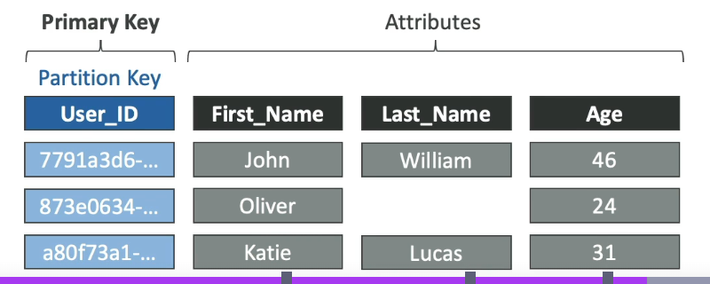
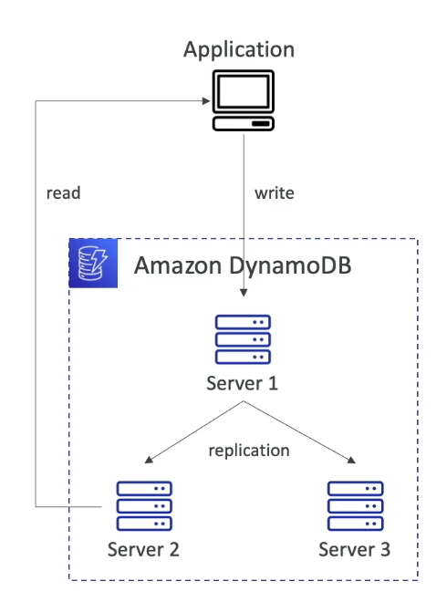
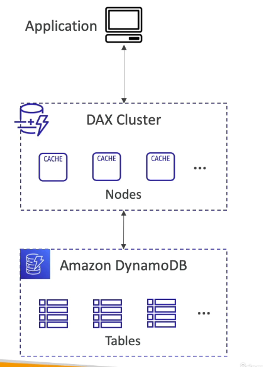
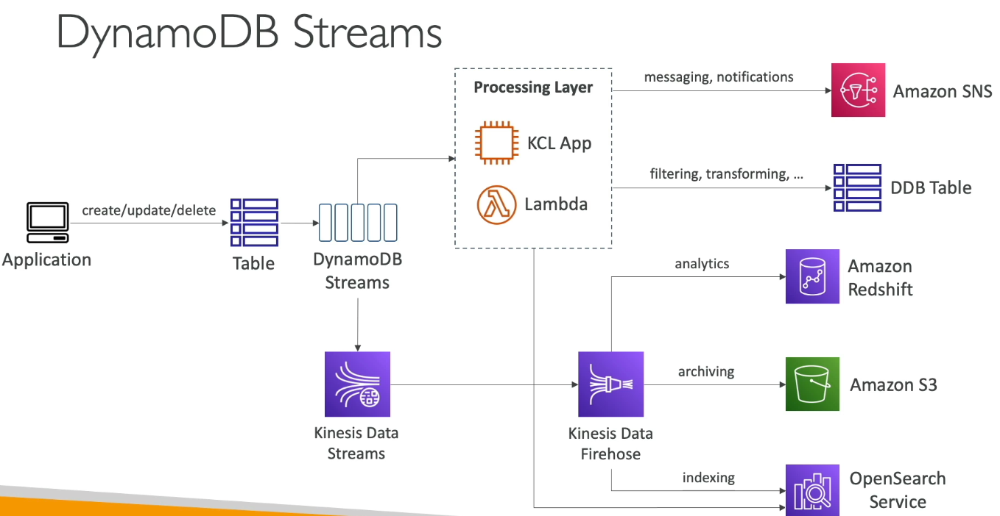

#aws #cloud #database #nosql
# Overview
+  No-SQL database (unstructured or semi-structured data)
+ High performance and auto-scaling for document and key-value data structures
+ Highly available and durable
	+ By automatically distributing data across 3 AZ's in a region. (global tables)
	+ Maintains multiple copies in other AWS regions
+ Encryption at rest and transit
+ Point-in-time-recovery for backup and restore
+ Auto-scales based on usage.
	+ Can configure target utilizations and capacity is auto-provisioned to meet these targets.
	+ No limits on storage amount or table size.
# Basics
+ Has _tables_
+ Each table has a _primary key_
	+ It can be of type: string, number, or binary
	+ __Option 1: Partition key__:
		+ Partition key must be _unique_ for each item.
		+ Partition key must be _diverse_ so that data is distributed.
	+ __Option 2: Partition + Sort Key__:
		+ Combination must. be _unique_ for each item.
		+ Data is grouped by _partition key_. Within a partition, data is ordered by _sort key_.
		.png)
+ Each table can have infinite _items_ (rows)
+ Each item has _attributes_ (columns)
+ Max size of _item_ = 400KB
+ Supported data types:
	+ Scalar: Single, atomic values
		+ String, 
		+ Number
		+ Binary: Raw binary data like compressed data, images, or encrypted info.
		+ Boolean
		+ Null
	+ DocumentTypes:
		+ List - JSON Array eq. Elements can be of different types. 32 levels of nesting.
		+ Map - JSON obj eq. Unordered collection of key-value pairs. Keys are strings, value can be any type.
	+ Set types -  String Set, Binary Set, Number Set
## Item TTL
+ Automatically delete items after an expiry timestamp (Unix Epoch)
	+ Actual deletion happens within a few days of expiration. A deletion process periodically scans for expired items and deletes them.
	+ Expired items can be returned as query/scan result.
+ Expired items are deleted from both [#Local Secondary Index](#Local%20Secondary%20Index) and [#Global Secondary Index](#Global%20Secondary%20Index)
+ Delete operation enters [#DynamoDB Streams](#DynamoDB%20Streams), from where it can be recovered if needed.
# Table classes
## DynamoDB Standard
+ Low cost R/W, High cost of storage
+ Best for :
	+ Frequently accessed data
	+ Applications requiring consistent performance
## DynamoDB Standard-IA
+ Low cost storage, High cost R/W
+ Best for Infrequently accessed data (logs, history, older social media posts).
# R/W Capacity Modes
## Provisioned Mode
+ Specify no of r/w per second & provision capacity (Read capacity units (RCU) & Write capacity units (WCU).)
	+ 1 WCU = 1 write/s for an item up to 1 KB. If item is larger, more WCUs consumed.
		+ Ex: Write 10 items of size 2 KB = $10*\frac{2KB}{1KB} = 20 \space\text{WCUs}$
	+ 1 RCU = 1 [#Strongly Consistency](#Strongly%20Consistency) read / 2 [Eventually consistent](#Eventual%20Consistency) reads per second, for an item up to 4 KB. If larger, more RCUs are consumed.
		+ Ex: 10 strongly consistent reads/s with item size 6 KB = $10 * \frac{8KB}{4KB} = 20\space\text{RCUs}$  (8 KB instead of 6 since we have to round up to nearest multiple of 4KB)
		+ Ex: 16 eventually consistent reads/s with item size 12 KB = $\frac{16}{2}*\frac{12KB}{4KB} = 24 \space\text{RCUs}$
+ Can setup auto-scaling of throughput based on demand.
+ Throughput can be exceeded temporarily using _burst capacity_.
	+ If _burst capacity_ is consumed, receive a ___ProvisionedThroughputExceededException___ 
+ Pay for provisioned r/w units.
## On-Demand mode
+ R/W auto-scales on demand 
+ Pay as you go (more expensive), no provisioning needed.
+ No throttling, unlimited RCUs and WCUs
# Read consistency modes

## Eventual Consistency
 + If we read just after write, it is possible data is stale due to replication lag.
## Strong Consistency
+ If we read just after write, we get correct data.
+ Set ___ConsistentRead___ to __True__ in API calls (___GetItem, BatchGetItem, Query, Scan___)
+ Consumes 2x RCU
# How is data stored? 
DynamoDB uses the ___partition___ key for creating an internal hash function. The output from the hash function determines the partition (physical storage) in DynamoDB where the item will be stored.
	If the primary of a table is the partition key then, no two items are stored in the same partition. 
	Items in a partition are unsorted and can be fetched in any order.
The ___sort___ key sorts items in a partition by the sort key value.
$$\text{No of partitions by capacity} = \frac{RCU_{total}}{3000} + \frac{WCU_{total}}{1000}$$
$$\text{No of partitions by size} = \frac{\text{Total size}}{10\space \text{GB}}$$
$$\text{No of partitions} = ceil(max(\text{No of partitions by capacity}, \text{No of partitions by size}))$$
The WCUs and RCUs are spread evenly across partitions.
# Throttling (only for provisioned mode)
+ If you exceed the provisioned RCUs or WCUs, you get ___ProvisionedThroughputExceededException___.
+ Reasons:
	+ Hot keys: one partition key being read too many times
	+ Hot partitions
	+ Large item size
+ Solutions:
	+ Exponential backoff retries (already in SDK)
	+ Distribute partition keys as evenly as possible
	+ If RCU issue, use DynamoDB Accelerator (DAX)
# Indexes
## Local Secondary Index
+ Maintains an _alternate_ sort key for a given partition key value.
	+ The data in a local secondary index is organized by the same partition key as the base table, but with a different sort key.
	+ Alternate sort key is a single scalar attribute.
	+ Sort key of base table must be in the index as a non-key attribute.
+ Can copy all or a subset of attributes from base table into the index.
+ Can create up to 5 local secondary indexes per table.
+ ___Must be defined at table creation time___.
+ Uses WCUs and RCUs of the base table.
Ex: _ForumName_ is partition key and _Subject_ is sort key of base table.

## Global Secondary Index
+ Maintains an _alternate_ __primary__ key for a table.
	+ Alternate key values __need not be unique__.
	+ Primary key of index must be either a _String, Number or Binary_ attribute.
	+ Key attributes in base table must be projected into the index.
+ Can copy all or a subset of attributes from base table into the index.
+ RCUs and WCUs need to be provisioned separately for this index
	+ ___If writes are throttled on GSI, writes are throttled for base table___.
+ ___Can be added/modified after table creation___.
Ex: _UserId, GameTitle_ is primary key of base table. The index has the key _GameTitle, TopScore_.
# DynamoDB Transactions
+ All-or-nothing operations (insert/update/delete) to multiple items across one or more tables. ([ACID](ACID.md))
+ Transactional Reads and Writes consume 2x WCUs and RCUs i.e. 
	+ 1 Transactional read = 2 RCUs
	+ 1 Transactional write = 2 WCUs
+ Ex:
	+ 3 Transactional writes per second, with item size 5 KB $$3\times2\times\frac{5KB}{1KB} = 30 \space\text{WCUs}$$
	+ 5 Transactional reads per second, with item size 5 KB $$5\times2\times\frac{8KB}{4KB} = 20\space\text{RCUs}$$ (8 KB instead of 5 KB, since we round up to nearest multiple of 4KB).
# API's
+ ___PutItem___
	+ Create a new or replace a old item
	+ Consumes WCUs
+ ___UpdateItem___
	+ Edit an existing item's attributes or add a new item if it doesn't exist
+ ___GetItem___
	+ Fetch single item based on hash (partition key) or hash + range (partition + sort key)
	+ Default: Eventually consistent read. Can set to Strongly consistent read
	+ Use _ProjectExpression_ to fetch a subset of attributes for an item.
+ ___Query___
	+ _KeyConditionExpression_: Partition key value (= operator), sort key value (<, >, <=, >=, = operator). Partition key required.
	+ _FilterExpression_
		+ Filter on non-key attributes after _KeyConditionExpression_ is evaluated.
	+ Returns:
		+ Items up to specified _limit_ in query
		+ Up to 1 MB data
	+ Supports pagination of data.
	+ Can query table, Local Secondary Index, Global Secondary Index
+ ___Scan___
	+ Scans entire table before applying _FilterExpression_ (inefficient)
	+ Consumes a lot of RCU
	+ Returns :
		+ Items up to specified _limit_ in scan
		+ Up to 1 MB of data
	+ Supports pagination of data & _ProjectExpression_ to fetch subset of attributes.
	+ Can speed up by using Parallel Scan
		+ Multiple workers scan different segments of data
		+ Consumes more RCU
+ ___DeleteItem___
	+ Delete a item 
	+ Can also conditionally delete
+ ___DeleteTable___
	+ Delete a table and all of its items
	+ Quicker than calling ___DeleteItem___ on all items

Batch operations reduce latency by performing fewer API calls and are processed in parallel to boost efficiency. If part of a batch fails, retry for failed items only.
+ ___BatchWriteItem___
	+ Up to 25  ___PutItem___ or ___DeleteItem___ operations in one call
	+ Up to 16 MB of data written, 400 KB per item.
	+ Returns ___UnprocessedItems___ error on failure. (exponential backoff retries or add WCUs)
+ ___BatchGetItem___
	+ Returns items from one or more tables
	+ Up to 100 items or 16 MB of data
	+ Returns ___UnprocessedKeys___ error on failure (exponential backoff retries or add RCUs)
	
___Conditional Writes___
+ For ___PutItem, UpdateItem, DeleteItem, BatchWriteItem___.
+ Specify a condition expression to determine which items should be modified:
	+ _attribute_exists_
	+ _attribute_not_exists_
	+ _attribute_type_
	+ _contains_ (for string)
	+ _begins_with_ (for string)
	+ _in_
	+ _between_
	+ _size_ (for string)

>[!note] 
>_FilterExpression_ is only for read queries, while _ConditionExpression_ is for write queries

+ Helps with concurrent access to items.

___Transactional operations__
+ ___TransactGetItems___
	+ one or more ___GetItem___ operations
	+ consumes 2x RCUs
+ ___TransactWriteItems___
	+ one or more ___PutItem, UpdateItem, DeleteItem___ operations
	+ consumes 2x WCUs
# DynamoDB PartiQL
+ SQL compatible query language for DynamoDB
+ Allows select/insert/delete update using SQL on DynamoDB
+ Can run partiQL queries from:
	+ AWS Management console
	+ NoSQL Workbench for DynamoDB
	+ DynamoDB API's
	+ AWS SDK
	+ AWS CLI
# Optimistic Locking
+ A strategy that ensures that an client side item is updated/deleted only if it is the same as in the DynamoDB table.(called a conditional write)
	+ Each item has an attribute that acts as a _Version number_.
	+ Before update/delete server checks if version number is same before doing the operation.
+ Protects items from being overwritten by others.
# DynamoDB Accelerator (DAX)
+ Fully managed, highly available in-memory cache for DynamoDB
+ ms latency for cached reads & queries
+ Solves the "hot key" problem (too many reads)
+ 5 min default TTL
+ Up to 10 nodes in a cluster (can be multi-AZ setup)
## [DAX vs Elasticache](https://repost.aws/questions/QUrKBj_QjSReS1rCWbOTS5YQ/dax-or-elastic-cache-with-dynamodb#:~:text=Guidelines%20for%20Effective%20Usage,2%20years%20ago)
# DynamoDB Streams
+ Ordered stream of item-level modifications in a table.
	+ _KEYS_ONLY_ : Only key attributes of modified item.
	+ _NEW_IMAGE_: entire item after modification.
	+ _OLD_IMAGE_: entire item before modification.
	+ _NEW_AND_OLD_IMAGES_: both the new and old item
+ Records can be sent to:
	+ 
	+ [AWS Lambda](AWS%20Lambda.md)
	+ Read by Kinesis Consumer Library (KCL) apps
+ Data retention: up to 24 hrs.
+ Streams are made of shards, but  AWS provisions them
+ Records are ___not___ retroactively populated in streams.
+ Use cases: 
	+ real-time actions ex: welcome mail
	+ analytics
	+ cross-region replication
