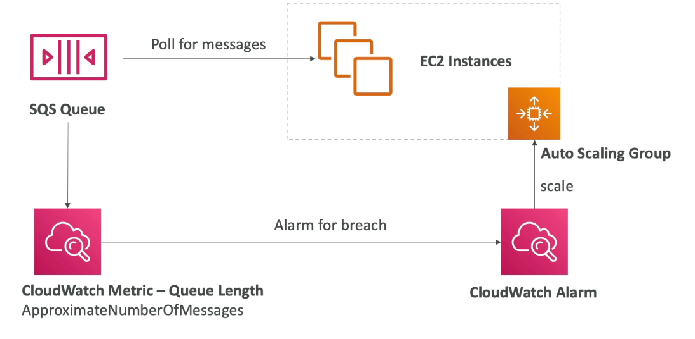
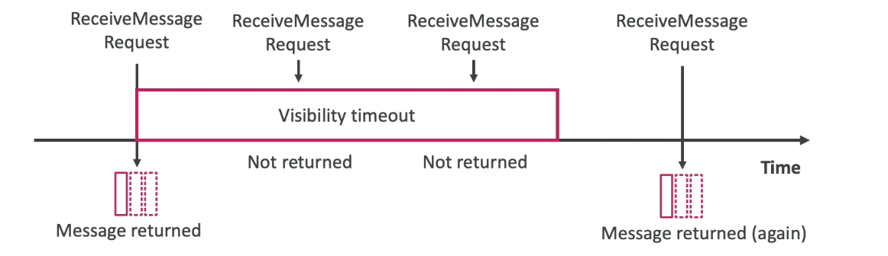
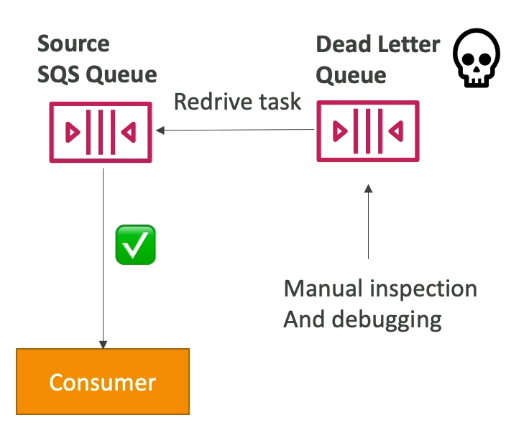
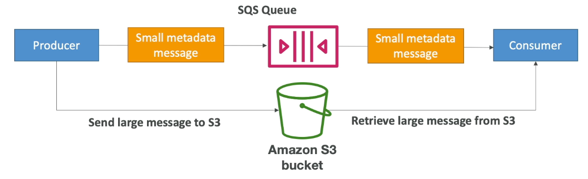

#aws #cloud 
# Prerequisite
[Message Queues](Message%20Queues.md)
# Overview 
+ By default, messages stay in the queue for 4 days. The maximum amount of time, a message can stay in the queue is 14 days.
+ Messages must be < 1024 KB in size. (Can change max message size)
+ Pull queue
+ Two types of queues:
	+ Standard Queue
		+ At least once delivery
		+ Message order not preserved (Best effort ordering)
	+ FIFO Queue
		+ First in first out delivery (Exactly once processing)
		+ Message order is preserved
			+ Ordering by _message group id_ . All messages with same message group id are ordered.
		+ Limited Throughput: 300 msg/s without batching, 3000 msg/s with batching.
		+ Queue name must end with _.fifo_.
+ Unlimited throughput, scale horizontally and add more consumers for processing. (Standard Queue)
+ Unlimited number of messages
# Encryption
+ Encryption in transit through HTTPS/SSL.
+ Encryption at rest through KMS keys (SSE-SQS, SSE-KMS, similar to )
+ Client side encryption/decryption needs to be done by client.
# Security
+ [IAM](IAM.md) policies and SQS access policies (similar to ).
	+ By default, only queue owner can send and receive messages. 
	+ Can specify access for other AWS accounts, IAM users and roles.
# Message Visibility Timeout
+ When queue is waiting for an ACK from consumer, the messages that were sent (max 10 at a time) become invisible to other consumers for the duration of the _message visibility timeout_.
+ If no ACK is received, the messages become visible to other consumers. (here, consumer calling _Delete_ API for processed messages is ACK)
+ If message processing is taking longer than the timeout, a consumer can add time to the _message visibility timeout_ by calling _ChangeMessageVisibility_ API. This prevents processing of duplicate messages.
+ If timeout is too high, reprocessing of message takes longer. But if it is too low, duplicate messages will increase.
+ Default timeout is 30 seconds. Max - 12 hrs.
# Dead Letter Queue
+ Must be the same type as the message queue.
+ Recommended to set longer duration time for messages say 14 days. This is because messages in DLQ are processed at a later time.
+ Redrive to source feature allows us to manually inspect and debug (troubleshoot) failed messages in DLQ. When it is fixed, the messages can be sent back to the source queue or we can specify a different destination queue.
# Delaying messages in queue
+ By default, a message put into a SQS queue is available right away for a consumer to poll.
+ We can set a delay at the __queue level__, so that all messages put in the queue are delayed by the specified period.
+ We can also set a delay at the __message-level__, through the _DelaySeconds_ parameter.
+ Default delay is 0 s. Max 15 min.
## Applications
+ When a consumer fails to process a message, instead of retrying right away, we can put the message into a delay queue, to give the consumer time to recover in case it has failed.
+ Can be used to create intentional delays, to allow different parts of a system to continue their work at their own pace without affecting other parts of the system.
+ Can be used to rate-limit messages so as to not overwhelm the consumers with requests.
# Long polling
+ If SQS queue is empty, and consumer is polling for messages, the consumer can optionally, wait for messages i.e. it performs less API calls when polling. 
+ Long polling is preferred over short polling. Can be set between 1s-20s (20s preferred).
+ Increases efficiency (less API calls) and decreases latency (message received by consumer as soon as it arrives).
+ Can be set at queue level or API level using _ReceiveMessageWaitTimeSeconds_ parameter.
# Sending large messages
+ Max message size in SQS queue is 1024 KB.
+ To send messages > 1024 KB, we can use SQS Extended Client (Java library but you can implement the feature in other languages).
+ The producer stores the large message (ex: video file) on a S3 bucket and pushes a small metadata message onto the queue.
+ The metadata message contains a pointer to the large message in the S3 bucket.
+ When consumer processes the message, it knows to read the larger message in the S3 bucket and do the processing.
# Common SQS API calls
1. _CreateQueue_ : Creates a queue 
	1. _MessageRetentionPeriod_ param to set message retention period (max 14 days, default 4 days)
2. _DeleteQueue_: Delete a queue and all of its contents
3. _PurgeQueue_: Delete all messages in a queue
4. _SendMessage_ : Send a message to the queue
	1. _DelaySeconds_ param to set delay time for a message
5. _ReceiveMessage_: Consumer polls for messages
	1. _MaxNumberOfMessages_: default 1, max 10 messages received at a time.
	2. _ReceiveMessageWaitTimeSeconds_: Enable long polling, between 1s-20s
6. _DeleteMessage_: Consumer deletes a message after processing is complete (ACK).
7. _ChangeMessageVisibility_: Change message timeout

Batch API's for _SendMessage_, _DeleteMessage_, _ChangeMessageVisibility_ to decrease costs
# SQS FIFO -  Deduplication
## Content based deduplication
+ If same message body is present in the queue within a five minute interval, the duplicate message is refused entry into the queue.
+ When a message is sent into the queue, a SHA-256 hash of the message body is created and sent in the metadata. 
+ If the same hash value is seen twice, within a five minute window, the second message is refused entry into the queue.
## Deduplication id (default)
+ A deduplication id is sent by the producer along with the message.
+ If the same id is seen twice within a five minute interval, the second message is refused entry into the queue.