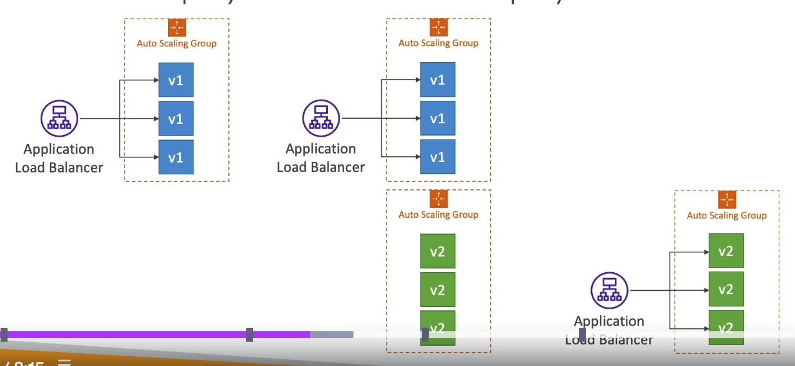
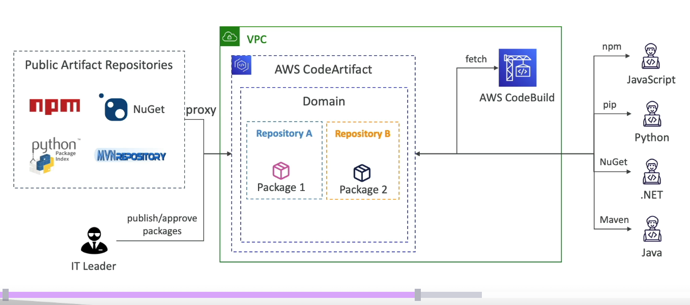

#aws #cloud
# Overview
Note: AWS CodeCommit has been discontinued.
.png)
# AWS CodePipeline
+ **Fully managed continuous delivery service** that automates the steps required to release software.
+ If a stage fails, the pipeline stops.
	+ Can send failed/cancelled pipelines to [](AWS%20CloudWatch.md#Amazon%20EventBridge|EventBridge).
+ If pipeline can't perform an action, ensure the [](IAM.md#Roles|IAM%20service%20role) attached has enough IAM permissions.
## Terminology

__Pipeline__: Overall workflow that defines how software progresses through the release process.
**Stages:** Logical divisions within a pipeline (e.g., Source, Build, Test, Staging, Production) used to isolate environments and control the flow of concurrent changes.
**Artifacts:** Collections of data (e.g., source code, built binaries) that are produced by one action and consumed by another as they move through the pipeline. They are stored in a [](Amazon%20S3.md#General%20Purpose%20Buckets|S3%20bucket). 
+ Artifact data can be encrypted using AWS Managed/Customer Managed Key. 
**Actions:** Specific operations performed on artifacts within a stage, such as pulling code from a repository or running unit tests.
**Transitions:** The "bridge" between stages that allows artifacts to move forward after a stage's actions succeed.
__Triggers__: Events that start your pipeline (ex: WebhookV2 is a trigger type that allows Git tags to be used to start pipelines with third-party source providers such as GitHub).
__Condition__: A set of rules that control when a pipeline execution can enter or exit a stage based on specific criteria.A condition state will be Failed if any of the rules in the condition are failed and Succeeded if all the rules succeed.
+ ___Entry___: Rules checked _before_ an execution enters a stage. If the rules fail, the stage can be blocked or skipped.
+ ___On Success___: Rules checked after a stage's actions complete successfully.
+ ***On Failure***:  Rules checked when a stage fails.
When a condition is not met, the pipeline can be configured to take one of the following actions:
- ***FAIL***: Immediately stops the pipeline execution at that stage.
- ***SKIP***: Skips the stage entirely and proceeds to the next one (available for specific entry conditions).
- ***ROLLBACK***: Reverts the environment to its last successful state (typically used for `onFailure` or `onSuccess` conditions).
- ***RETRY***: Automatically re-attempts the failed action or stage
__Rules__: Conditions use one or more preconfigured _rules_ that run and perform checks that will then engage the configured result for when the condition is not met.
Some common rules are:
- ***Deployment Window***: Restricts deployments to specific days or times using cron expressions.
- ***CloudWatch Alarm***: Checks if a resource is healthy (e.g., fails the stage if an error rate alarm is active).
- ***Lambda Invoke***: Runs a custom Lambda function to perform complex validation, such as security scans or external API checks.
- ***Variable Check***: Compares pipeline output variables against specific values (e.g., checking if a specific branch name is used).
- ***Commands***: Run shell commands.
## Pipeline Execution Modes
___SUPERSEDED___: A more recent execution overtakes an older one. DEFAULT.
___QUEUED___: Executions are processed in order of queueing.
___PARALLEL___: Executions run simultaneously and independently of each other.

## AWS CodeBuild
+ Fully managed build service in the cloud.
+ Can add CodeBuild as a build or test action to the build or test stage of a pipeline in AWS CodePipeline.
	+ Autoscales and processes multiple builds/tests concurrently.
+ Provides preconfigured build environments for the most popular programming languages. 
+ Output logs are stored in [AWS CloudWatch](AWS%20CloudWatch.md) Logs and S3.
+ Use CloudWatch metrics to monitor build statistics
+ Use EventBridge for failed builds and trigger notifications.
+ Use CloudWatch Alarms to notify about failure "thresholds".

## Concepts
**Build Project**: Defines how CodeBuild runs a build, including the source code location, build environment, build commands, and storage for output.
**Build environment**:  A. combination of operating system, programming language runtime, and tools that CodeBuild uses to run a build.
**Buildspec File**: A `buildspec.yml` is a collection of build commands and settings in YAML format that **AWS CodeBuild** uses to run a build.
+ Include the file in your source code root directory or define it when you create the build project.
```yaml
version: 0.2

env:
  variables:
    APP_NAME: "my-python-app"
  parameter-store:
    DB_PASSWORD: "/prod/db/password"

phases:
  install:
    runtime-versions:
      python: 3.12 
    commands:
      - echo Installing dependencies...
      - pip install -r requirements.txt
  pre_build:
    commands:
      - echo Running unit tests...
      - pytest tests/
 build:
    commands:
      - echo Build started on `date`
      - echo Compiling or preparing assets...
      - zip -r deployment_package.zip . -x "*.git*"
  post_build:
    commands:
      - echo Build completed on `date`
artifacts:
  files:
    - deployment_package.zip
  name: $(date +%Y-%m-%d)-build-artifact
```      
+ ___phases___: 
	+  `install`: Install packages or dependencies (e.g., `npm install`) 
	- `pre_build`: Final actions before the main build, such as logging into a Docker registry
	- `build`: The main build commands (e.g., `make` or `python build.py`) 
	- `post_build`: Finishing touches, such as packaging or cleanup.
- ***artifacts*:** Specifies the files and directories produced by the build to be uploaded to S3 (after encryption).
- ***env*:** Defines environment variables, parameter store values, or secrets from AWS Secrets Manager
- ___cache___: Files to cache to S3 for future build speedup (usually dependencies).
**Artifacts**: The output of the build process (like a JAR file or Docker image) is typically uploaded to an **Amazon S3** bucket or a container registry like [](Amazon%20ECS.md#Amazon%20ECR|Amazon%20ECR).
# AWS CodeDeploy
+ Automates application deployments to [Amazon EC2](Amazon%20Elastic%20Compute%20Cloud%20(AWS%20EC2).md) instances, on-premises instances, serverless [Lambda](AWS%20Lambda.md) functions, or [Amazon ECS](Amazon%20ECS.md) services.
+ Automated rollback for failed deployments or trigger CloudWatch alarms.
+ Helps minimize downtime by gradually deploying new version of application.
+ CodeDeploy must have permission to access the service it is deploying on (EC2/Lambda/ECS)
## EC2/ On-premises instances
+ Need to install CodeDeploy Agent on target instances to configure CodeDeploy deployment.
+ EC2 instances must have necessary permissions on S3 to fetch deployment bundles.
+ Supports In place deployment:
	+ __AllAtOnce__: most downtime. All instances running a outdated application version are replaced all together with the new version.
	+ __HalfAtATime__: reduced capacity by 50%. Deploys new version on 50% of the instances first, before replacing on remaining 50%.
	+ __OneAtATime__: slowest, but max availability. Deploys new app version, on one instance at a time.
	+ __Custom__: Define replacement %.
+ Supports blue-green deployment

## Lambda functions
+ Can automate traffic shift between lambda function aliases.
	+ Make X vary over time until X=100%
		+ __Linear__: Grow traffic every N minutes until 100%. 
			+ _LambdaLinear10PercentEvery3Minutes_
			+ _LambdaLinear10PercentEvery10Minutes_
		+ __Canary__: try X% for N minutes then 100%
			+ _LambdaCanary10Percent5Minutes_
			+ _LambdaCanary10Percent30Minutes_
		+ __AllAtOnce__: Immediate traffic shift (X=0)
.png)
## ECS tasks
+ Supports only blue-green deployments
	+ Make X vary over time until X=100%
		+ __Linear__: Grow traffic every N minutes until 100%. 
			+ _ECSLinear10PercentEvery3Minutes_
			+ _LambdaLinear10PercentEvery10Minutes_
		+ __Canary__: try X% for N minutes then 100%
			+ _ECSCanary10Percent5Minutes_
			+ _ECSCanary10Percent30Minutes_
		+ __AllAtOnce__: Immediate traffic shift (X=0)
.png)
# AWS CodeArtifact
+ Secure, scalable and cost-effective artifact management system 
+ Supports various dependency management systems such as pip, gradle, maven, yarn.
+ [#AWS CodeBuild](#AWS%20CodeBuild) can retrieve artifacts directly from CodeArtifact
+ EventBridge integration.png)
# AWS CodeGuru
+ Automated code reviews(CodeGuru Reviewer) and performance recommendations(CodeGuru Profiler)
+ CodeGuru Reviewer:
	+ Identifies critical issues, security vulnerabilities, bugs etc..
	+ Uses ML and automated reasoning
	+ Java and Python support
	+ Integrates with Github, Bitbucket, AWS CodeCommit.
+ CodeGuru Profiler:
	+ Identify and remove code inefficiencies.
	+ Improve app performance (ex: reduce CPU utilization)
	+ Provides heap summary (identify objects using up memory)
	+ Anomaly detection
	+ Support applications running on-premises or on AWS
	+ Minimal overhead