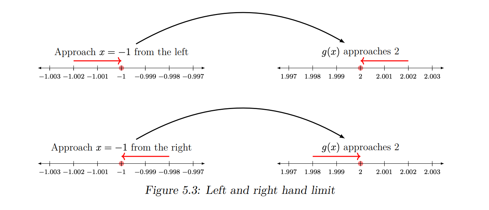

#ml #math #dl 
# Derivatives
$$\frac{dy}{dx} = \text{rate of change}$$
If $y = 2x$ then, $\frac{dy}{dx} = 2$ which is the slope of this function if graphed:

If $y = \frac{1}{4}x^2$ , then $\frac{dy}{dx} = \frac{1}{4}\times 2x = \frac{x}{2}$  

Since, this is a non-linear function, slope varies from point-to-point. 
Slope at $P(6, 9)$  = slope of tangent to the parabola at $P(6,9)$,  $y - 9 = 3(x - 6) \implies 3$

>[!warning] Below are a few scenarios, where a function is not differentiable: 
>1. The function is not defined at a point 
>2. The function does not have a [limit](#Limits) at that point 
>3. The function is not [continuous](#Continuous%20functions) (e.g., has a sudden jump) at a point
## ML Applications
In ML, the error function is a mathematical formula that measures the difference between a model's predicted output and the actual target output. (Think $dy$).
When plotted against the model's weights (Think $dx$), the error function often creates a 3D "error surface".
In simple cases, like linear regression, this surface is **convex** (bowl-shaped), making it easier to find the single lowest point where the error is minimized.

The gradient descent algorithm, as the optimization algorithm, will seek to reach the lowest point on the error surface by following its gradient downhill. This descent is based upon the computation of the gradient, or slope, of the error surface.

Often we need to optimize, more complex functions involving multiple dimensions. Since we are minimizing the function, our goal is to reach a point that obtains as low a value of f(x) as possible that is also characterized by zero rate of change; hence, a global minimum. 

1. In reality, this is harder since the function might have many local minima that are suboptimal and many saddle points surrounded by very flat regions. 

2. Suppose there is a function $y = f(x_1, x_2, x_2, ...x_n)$ which depends on $n$ inputs. To minimize such an error function, we use _partial derivatives_, which is a method to calculate the rate of change of $y$ with respect to changes in each one of the inputs, $x_i$, while holding the remaining inputs constant.
> This means that the gradient descent algorithm may not follow a straight path down the error surface. 
> Rather, each weight will be updated in proportion to the local gradient of the error curve. Hence, one weight may be updated by a larger amount than another, as much as needed for the gradient descent algorithm to reach the function minimum.
# Limits
A limit describes the value a function $f(x)$ approaches as the input $x$ gets closer to a specific point $k$. It is formally written as:
$$\lim_{x \to k} f(x) = L$$
This means that as $x$ nears $k$, the distance between $f(x)$ and $L$ becomes arbitrarily small, regardless of whether $f(x)$ is actually defined at $x = k$.
## Condition for Existence
For a limit to exist at point $k$, the function must approach the same value from both sides:
1. Left-hand limit: $\lim_{x \to k^-} f(x)$ (approaching from values smaller than $k$)
2. Right-hand limit: $\lim_{x \to k^+} f(x)$ (approaching from values larger than $k$)

A limit $L$ exists if and only if:$$\lim_{x \to k^-} f(x) = \lim_{x \to k^+} f(x) = L$$
Let $g(x) = 1 - x$, then $\lim_{x \to{-1}} g(x) = 2$ 

>[!note] Limits exist only for continuous functions

# Continuous functions
A function $f(x)$ is continuous at a point a, if the following three conditions are met:
1. $f(a)$ exists
2. $f(x)$ has a limit as $x$ approaches $a$
3. $\lim_{x\to a}f(x) = f(a)$ 
.png)
>[!example]+
> Given function is undefined at $x = -1$ since the denominator becomes $0$.
>$$g(x) = \frac{1- x^2}{1 + x}$$ 
>i.e it is not a continuous function.
>
>However, we can convert $g(x)$ into a continuous function simply by defining it as follows:
>$$
g(x) = \begin{cases}
 \frac{1 - x^2}{1 + x},& \text{if} x\neq-1 \\
 2, & \text{otherwise}
\end{cases}$$
> 
# Connecting Limits to Derivatives
A **limit** describes the behavior of a function as the input ($x$) gets closer and closer to a specific value ($k$), without necessarily reaching it.

A **derivative** measures the **instantaneous rate of change** of a function at a specific point. It is essentially the "slope" of the curve at that exact moment.

It can also be defined as the **limit of the average rate of change**.
	To find the slope at a single point, you take two points on a curve, calculate the slope between them (the "secant" line), and then use a **limit** to bring those two points infinitely close together until they become one point.
	$$\begin{aligned} m(x) &= 2x + 5 \\ m(x + \Delta x) &= 2(x + \Delta x) + 5 \\ m'(x) &= \lim_{\Delta x \to 0} \frac{m(x + \Delta x) - m(x)}{\Delta x} \\ &= \lim_{\Delta x \to 0} \frac{2x + 2\Delta x + 5 - 2x - 5}{\Delta x} \\ &= \lim_{\Delta x \to 0} \frac{2\Delta x}{\Delta x} \\ &= 2 \end{aligned}$$
	If $\Delta x$ was infinitesimally small, we would replace it with $dx$ 
	.png)
# Differentiation rules
1. Constant multiple rule$$\frac{d(af(x))}{dx} = a\frac{f(x)}{dx}$$
2. Sum rule $$\frac{d(f(x) + g(x))}{dx} = f'(x) + g'(x)$$
3. Power rule $$\frac{d(kx^n)}{dx} = knx^{n-1}$$
4. Product rule $$\frac{d(f(x). g(x))}{dx} = f'(x).g(x) + f(x)g'(x)$$
5. Quotient rule $$\frac{d(\frac{f(x)}{g(x)})}{dx} = \frac{f'(x)g(x) - f(x)g'(x)}{|g(x)|^2},\space\space g(x)\neq0$$
6. Chain rule $$\frac{dh}{dx} = \frac{dh}{du_1}.\frac{du_1}{du_2}\dots\frac{du_n}{dx}$$
>[!example]
>For a function $h = g(f(x)) = \sqrt{x^2 -10}$ 
>Let $u = f(x) = \sqrt{x^2 -10}$
>Now to calculate $\frac{dh}{dx}$, we can also apply the chain rule:
>$$\frac{dh}{dx} = \frac{dh}{du}\frac{du}{dx}$$
>$$\frac{dh}{du} = \frac{1}{2}u^{-\frac{1}{2}} = \frac{1}{2}(x^2 - 10)^{-\frac{1}{2}}$$
>$$\frac{du}{dx} = 2x$$
>$$\frac{dh}{dx} = \frac{1}{2}(x^2 - 10)^{-\frac{1}{2}}. 2x = \frac{x}{\sqrt{x^2 -10}}$$
>
# Multivariate Calculus
## Vector Valued Functions
It is a function with the following two properties: 
1. The domain is a set of real numbers 
2. The range is a set of vectors

Given the unit vectors $\hat{i},\hat{j},\hat{k}$ parallel to the x, y, z-axis respectively, we can write a three dimensional vector-valued function as: $$r(t) = x(t)\mathbf{\hat{i}} + y(t)\mathbf{\hat{j}} + z(t)\mathbf{\hat{k}}$$
 .png)
The derivative of $r(t)$ is given by $r ′ (t)$ computed as: $$r'(t) = x'(t)\mathbf{\hat{i}} + y'(t)\mathbf{\hat{j}} + z'(t)\mathbf{\hat{k}}$$.png)
Being an extension of scalar valued functions, you would encounter them in tasks such as **multi-class classification** and **multi-label** problems. 
**Kernel methods**, an important area of machine learning, can involve computing vector-valued functions, which can be later used in multi-task learning or transfer learning.
## Partial Derivatives
The partial derivative of a function $f(x, y) = x^2 + y$ 
	w.r.t to $x$ is given by $$\frac{\partial{f}}{\partial{x}} =\frac{\partial{(x^2 + y)}}{\partial{x}} =  2x$$
	w.r.t to y is given by $$\frac{\partial{f}}{\partial{y}} =\frac{\partial{(x^2 + y)}}{\partial{y}} =  1$$
i.e. we treat all other variables in the function as _constant_ .

They are useful in the **backpropagation** algorithm to update model weights independently of the others.
### **Chain rule**
For $h = g(s, t) = s^2 + t^3$ , where $s = xy \space\text{and}\space t = 2x − y$ 
$$\frac{\partial h}{\partial x} = \frac{\partial h}{\partial s}.\frac{\partial s}{\partial x} + \frac{\partial h}{\partial t}.\frac{\partial t}{\partial x}$$
$$ = 2s.y + 3t^2.(2) = 2sy + 6t^2$$
On substituting values of $s$ and $t$:
$$=2xy^2 + 24x ^2 − 24xy + 6y^2$$
## Gradient vector
When we find the partial derivatives with respect to all independent variables, we end up with a vector. This vector is called the gradient vector of $f$ denoted by $∇f(x, y)$.
For $f = x^2 + y^2$ : $$∇f(x, y) = \frac{\partial{f}}{\partial{x}}\mathbf{\hat{i}} + \frac{\partial{f}}{\partial{y}}\mathbf{\hat{j}} = 2x\mathbf{\hat{i}} + 2y\mathbf{\hat{j}}$$
From this, we can evaluate the gradient at different points in space.

>[!question]  What does a gradient vector indicate?
The gradient vector is **normal to the tangent line**, and points to the direction of maximum rate of change.
>1. If it points in the +ve direction, it indicates direction of maximum increase.
>2. If it points in the -ve direction, it indicates direction of maximum decrease.

The gradient vector is very important and used frequently in machine learning algorithms. 
In classification and regression problems, we normally define the mean square error function. Following the negative direction of the gradient of this function will lead us to finding the point where this function has a minimum value. 

Similar is the case for functions, where maximizing them leads to achieving maximum accuracy. In this case we’ll follow the direction of the maximum rate of increase of this function or the positive direction of the gradient vector.
## Jacobian Matrix
It collects all first-order partial derivatives of a multivariate function.
Now, consider a function that maps $u$ real inputs, to $v$ real outputs:
$$\mathbf{f} : \mathbb{R}^u \mapsto \mathbb{R}^v$$

Then, for the same input vector, $x$, of length, $u$, the Jacobian is now a $v \times u$, matrix that is defined as follows:
$$\mathbf{J} = \frac{d\mathbf{f}(\mathbf{x})}{d\mathbf{x}} = \begin{bmatrix}
\dfrac{\partial f(\mathbf{x})}{\partial x_1} & \dots & \dfrac{\partial f(\mathbf{x})}{\partial x_u}
\end{bmatrix} = \begin{bmatrix}
\dfrac{\partial f_1(\mathbf{x})}{\partial x_1} & \dots & \dfrac{\partial f_1(\mathbf{x})}{\partial x_u} \\
\vdots & \ddots & \vdots \\
\dfrac{\partial f_v(\mathbf{x})}{\partial x_1} & \dots & \dfrac{\partial f_v(\mathbf{x})}{\partial x_u}
\end{bmatrix}$$
>[!info] The Jacobian Matrix is a "Stack" of Gradients

If you have a function $\mathbf{f}$ that outputs multiple values (a vector), the Jacobian matrix is simply a collection of the gradient vectors of each output component, stacked on top of each other.
For a function $\mathbf{f}(x, y) = \begin{bmatrix} f_1(x, y) \\ f_2(x, y) \end{bmatrix}$, where $f_1, f_2$ are input features:
$$\mathbf{J} = \begin{bmatrix} \nabla f_1 \\ \nabla f_2 \end{bmatrix} = \begin{bmatrix} \frac{\partial f_1}{\partial x} & \frac{\partial f_1}{\partial y} \\ \frac{\partial f_2}{\partial x} & \frac{\partial f_2}{\partial y} \end{bmatrix}$$
>[!question] What information does a Jacobian matrix give us?
>It describes how space is stretched, rotated, or squished near that point.
## Higher Order Derivatives
For a function $f(x, y) = x^2 + 3xy  + 4y^2$ :$$\begin{aligned} \frac{\partial f}{\partial x} &= f_x = 2x + 3y \\ \frac{\partial f}{\partial y} &= f_y = 3x + 8y \end{aligned}$$
The _own_ partial derivatives are the most straightforward to find, since we simply repeat the partial differentiation process, with respect to either x or y, a second time
$$\begin{aligned} \frac{\partial^2 f}{\partial x^2} &= \frac{\partial}{\partial x}(2x + 3y) = f_{xx} = 2 \\ \frac{\partial^2 f}{\partial y^2} &= \frac{\partial}{\partial y}(3x + 8y) = f_{yy} = 8 \end{aligned}$$
The cross partial derivative of the previously found $f_x$ (that is, the partial derivative with respect to $x$ is found by taking the partial derivative of the result with respect to $y$, giving us $f_{xy}$. Similarly, taking the partial derivative of $f_y$ with respect to $x$, gives us $f_{yx}$:
$$\begin{aligned} \frac{\partial^2 f}{\partial x \partial y} &= \frac{\partial}{\partial y}(2x + 3y) = f_{xy} = 3 \\ \frac{\partial^2 f}{\partial y \partial x} &= \frac{\partial}{\partial x}(3x + 8y) = f_{yx} = 3 \end{aligned}$$
## Hessian Matrix
The Hessian matrix is a matrix of second order partial derivatives. Suppose we have a function $f$ of $2$ variables, i.e., $$f : \mathbb{R}^2 \mapsto \mathbb{R}$$
The Hessian of $f$ is given by:
$$H_{f(x, y)} = \begin{bmatrix} \dfrac{\partial^2 f}{\partial x^2} & \dfrac{\partial^2 f}{\partial x \partial y} \\ \dfrac{\partial^2 f}{\partial y \partial x} & \dfrac{\partial^2 f}{\partial y^2} \end{bmatrix} = \begin{bmatrix} f_{xx} & f_{xy} \\ f_{yx} & f_{yy} \end{bmatrix}$$
Its  of function $f$ is given by:
$$\det(H_f) =  \begin{vmatrix} f_{xx} & f_{xy} \\ f_{xy} & f_{yy} \end{vmatrix} = -f^2_{xy}$$
>[!question] What does a Hessian matrix and its determinant signify?
>The Hessian and the corresponding discriminant are used to determine the local extreme points of a function.
>
>For a point $(a, b)$ where the discriminant is $D(a, b)$:
>1. The function $f$ has a ***local minimum*** if $f_{xx}(a, b) > 0$ and the discriminant $D(a, b) > 0$
>2. The function $f$ has a ***local maximum*** if $f_{xx}(a, b) < 0$ and the discriminant $D(a, b) > 0$
>3. The function $f$ has a **saddle point** if $D(a, b) < 0$
>4. We cannot draw any conclusions if $D(a, b)$ = 0
# References
1. Calculus for Machine Learning by Jason Brownlee
2. [The Essence of Calculus](https://www.youtube.com/playlist?list=PLZHQObOWTQDMsr9K-rj53DwVRMYO3t5Yr)
