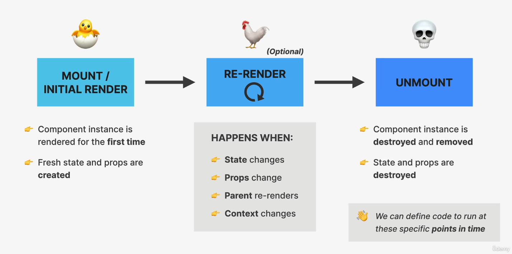

#react 
```table-of-contents
title: Index
style: nestedList # TOC style (nestedList|nestedOrderedList|inlineFirstLevel)
minLevel: 0 # Include headings from the specified level
maxLevel: 0 # Include headings up to the specified level
include: 
exclude: 
includeLinks: true # Make headings clickable
hideWhenEmpty: false # Hide TOC if no headings are found
debugInConsole: false # Print debug info in Obsidian console
```
# Overview
+ React applications are entirely made out of components.
+ Piece of UI that has its own **data, logic** and **appearance** (how it looks and works)


# Defining a component
+ React components are regular JavaScript functions, but **their names must start with a capital letter** or they won’t work!
+ This is because HTML tags are in lowercase, so we must start component names with a capital letter to allow the engine to distinguish between HTML and components.
```jsx
export function Profile() {
  return (
    
  );
}

export default function Gallery() {
  return (
    <section>
      <h1>Amazing scientists</h1>
      <Profile />
      <Profile />
      <Profile />
    </section>
  );
}
```
## Export component
+ `export default` is standard JS syntax.
+ Marks the main function in a file so that you can later import it into other files.
## Define function
+ With `function Profile() { }` you define a JavaScript function with the name `Profile`.
## Return JSX
>[!critical]+
>A component must return a single [JSX](JSX.md) element. If more than one element is returned, JSX won't transpile.
+ Return statements can be written all in one line:
```jsx
return ;
```
Multiline JSX **must** be wrapped in parentheses () or it will be **ignored**.
```jsx
// can wrap jsx in a <div> to return single element
return (
<div>
  <h1>Hedy Lamarr's Todos</h1>
  
  <ul>
    ...
  </ul>
</div>
);

// can wrap jsx in a fragment <Fragment></Fragment> or shorthand <></> to return single element
// Fragments don't leave a trace in the rendered HTML tree.
return (
<>
  <h1>Hedy Lamarr's Todos</h1>
  
  <ul>
    ...
  </ul>
</>
);
```

>[!info]+
> **Why parentheses are required for multiline JSX?**
> JSX looks like HTML, but under the hood it is transformed into plain JavaScript objects. You can’t return two objects from a function without wrapping them into an array. This explains why you also can’t return two JSX tags without wrapping them into another tag or a Fragment.
# Importing and Exporting Components
| Syntax  | Export statement                    | Import statement                      |
|---------|-------------------------------------|---------------------------------------|
| Default | export default function Button() {} | import Button from './Button.js';     |
| Named   | export function Button() {}         | import { Button } from './Button.js'; |
+ A file can have no more than **one default export**, but it can have as **many named exports** as you like.
+ When you write a _default_ import, you can put any name you want after `import`. For example, you could write `import Banana from './Button.js'` instead and it would still provide you with the same default export.
+ In contrast, with named imports, the name has to match on both sides.

# Nesting and Organizing Components
+ Components are regular JavaScript functions, so you can keep multiple components in the same file. 
+ This is convenient when components are relatively small or tightly related to each other.
+ Components can render other components, but **you must never nest their definitions**

```jsx
export default function Gallery() {  
// 🔴 Never define a component inside another component!  
	function Profile() {  
	// ...  
	}  
// ...  
}
```
instead, define every component at the top level:
```jsx
export default function Gallery() {  
// ...  
}  

// ✅ Declare components at the top level  
function Profile() {  
// ...  
}
```
## Why should components not be nested?
+ **Destroys state and causes forced remounts**
	+  Each time `ParentComponent` re-renders, the `ChildComponent` function is recreated with a new memory reference.
	+ React interprets this new function as a completely different component, which causes it to unmount the old `ChildComponent` instance and mount a new one.
	+ This destroys any internal [state](State.md) the child was holding and can trigger unnecessary side effects.
+ **Breaks hooks**: Any hooks inside the nested component, such as `useState` or `useEffect`, will be reinitialized on every parent re-render, leading to bugs and unexpected behavior.
+ **Performance degradation:** Remounting a component is more computationally expensive than simply re-rendering it. Repeatedly doing so when parent updates can lead to poor performance, especially in large applications.
# Types of Component
## Function Component
Functions that take props as an argument and return a React element.
```javascript
export function Welcome(props) {
  return <h1>Hello, {props.name}</h1>;
}

export const Welcome = (props) => {
	return <h1>Hello, {props.name}</h1>
}
```
## Class Component

These are ES6 classes that extend `React.Component` and must have a `render` method returning a React element.
```javascript
class Welcome extends React.Component {
  render() {
    return <h1>Hello, {this.props.name}</h1>;
  }
}

```
# One way data flow
+ Data can be passed **only** from parent to child using [props](Props.md) 
+ This makes applications 
	+ easier to understand and more predictable
	+ easier to debug

# Keeping Components pure
## What is a pure function?
+ A pure function has following characteristics:
	+ ***DOES NOT*** change any objects or variables not in its scope.
	+ Given the same inputs, a pure function always returns the same output.
+ React assumes that **every component is pure**. 
## Side effects
+ Unintended consequences that occur when function is impure.
```jsx
let guest = 0;

function Cup() {
  // Bad: changing a preexisting variable!
  guest = guest + 1;
  return <h2>Tea cup for guest #{guest}</h2>;
}

export default function TeaSet() {
  return (
    <>
      <Cup />
      <Cup />
      <Cup />
    </>
  );
}

// O/P:
Tea cup for guest #2
Tea cup for guest #4
Tea cup for guest #6
```
+ Since it changes a variable not in its own scope, every time `Cup` component is rendered, we get different JSX. For the same input, we get different results.
+ It can be fixed by passing `guest` as a prop.
+ State in a component should also not be mutated directly, like `guest` . Always `set` state.
>[!note]+
>Side effects are allowed if they "happen on the side", and not during rendering.
>For ex: in event handlers, which don't execute during rendering, or the `useEffect` hook which executes after rendering.
>Event handlers preferred for side effects. Use `useEffect` sparingly.

# Controlled vs Uncontrolled Components
| Feature          | Controlled Components                   | Uncontrolled Components                           |
|------------------|-----------------------------------------|---------------------------------------------------|
| State Management | React state manages the input value     | DOM manages the input value                       |
| Data Flow        | React → DOM (via props/state)           | DOM → React (via refs)                            |
| Value Binding    | Input value bound to state (value prop) | Input value uncontrolled by React                 |
| Event Handling   | onChange updates state on every change  | Access value on demand via ref                    |
| Form Validation  | Easy to validate on each keystroke      | Validation done on submit or on demand            |
| Complexity       | More code (state + handlers required)   | Less code, simpler for quick forms                |
| Performance      | More re-renders due to state updates    | Fewer re-renders, potentially better performance  |
| Use Cases        | Complex forms with real-time validation | Simple forms or when instant control isn’t needed |
| Synchronization  | Easy to sync with other UI elements     | Difficult to keep in sync without extra work      |
## Controlled Component
A controlled component is an element whose state is controlled by React itself. This means that the component's state is stored in a React component's state and can only be updated by triggering a state change via React’s setState() method.
### **Features**
- ***State Management:*** Form data is handled by the component's state using React's useState hook or this.state in class components.
- ***Data Flow:*** The input elements' values are set by the state, and any changes are reflected through state updates.
- ***Predictability:*** Since the state is managed by React, the component's behavior is predictable and consistent.
- ***Real-Time Validation:*** Enables immediate validation and formatting of user input.
- ***Single Source of Truth:*** The state serves as the single source of truth for the form data.
## Uncontrolled Component
An uncontrolled componentrefers to a component where the form element's state is not directly controlled by React. Instead, the form element itself maintains its own state, and React only interacts with the element indirectly through references (refs).
### **Features** 
- ***DOM-Managed State:**** Form data is handled by the [DOM](https://www.geeksforgeeks.org/javascript/dom-document-object-model/) itself, not by React state.
- ***Use of Refs:*** Access to form values is achieved using React's useRef() or createRef() to reference DOM elements directly.
- ***No State Management:*** Eliminates the need for state variables and event handlers for each input field.
- ***Simpler Implementation:*** Suitable for simple forms or when integrating with non-React libraries that manipulate the DOM directly.
- ***Less Predictable:*** Since the component's state is not synchronized with React, it can lead to less predictable behavior.
- ***Manual Validation:*** Validation and formatting need to be handled manually, often during form submission.
# Component Lifecycle
