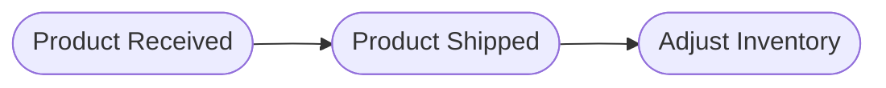
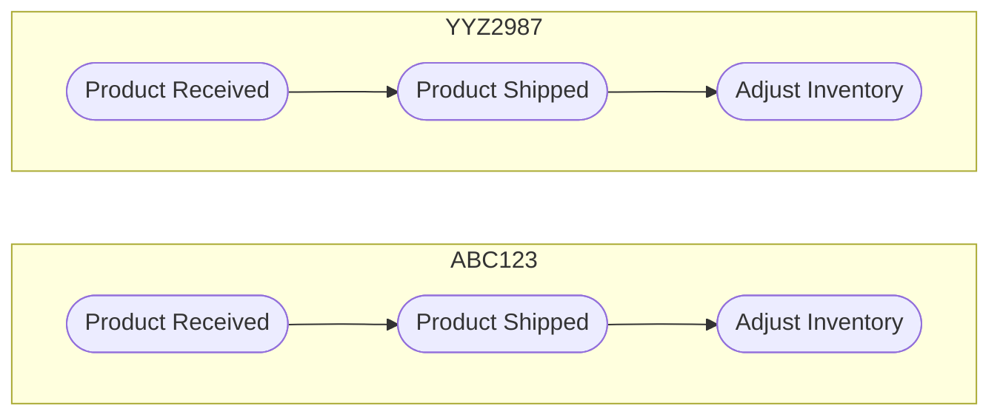

#system-design #hld 

# Why is it needed?

Assume we have a service which tracks when and how much product was received, adds to inventory and balances inventory after product is shipped.
This service naturally has a sequence of __events__ that it depends on:
	_Receive Product_ $\rightarrow$ _Add to Inventory_ $\rightarrow$ _Ship product_ $\rightarrow$ _Adjust Inventory_.

Lets assume we have a table as shown below:

| product_id | quantity | LastReceived | LastShipped |
| ---------- | -------- | ------------ | ----------- |
| ABC123     | 59       | 2024-03-27   | 2024-04-01  |
| YYZ987     | 27       | 2024-02-25   | 2024-03-15  |
| DER576     | 18       | 2024-03-28   | 2024-02-19  |
Each entity in an event-sourced system has its own __event stream__, which is the ordered sequence of events that records every change to that entity.

In the CRUD model, we update the table at every stage (_product received, shipped, inventory adjust_). This poses a few problems:
	1. All previous information is lost
	2. Concurrent writes to same row degrade performance since db uses row-level locking.
	3. If an intermediate update is lost, table will become inconsistent. (ex: some error occurred while trying to update inventory)
# Working
1. **Event Creation**: When a user performs an action (e.g., placing an order), the application creates an event object that describes the action.
2. **Event Storage**: The event is stored in the event store. This store is __append-only__, meaning events can only be added and never modified or deleted. (Ex: Apache Kafka, [[Other AWS Services#Amazon Kinesis Data Streams|AWS Kinesis]])
3. **State Rebuilding**: To determine the current state of an entity (e.g., an order), the application __replays__ all the events related to that entity from the event store.
4. __Projection (Read model)__: We can aggregate the events into views/materialized views for querying.
![[Pasted image 20260429012634.png]]
Since __append-only logs__ cannot be modified or deleted, __the size of the log will keep on growing over time.__
As the number of events grows, __replaying__ the entire event stream to reconstruct the state can become __slow and inefficient__.
## Techniques to manage log storage
### __Rebuilding State using Snapshots__
 Instead of replaying all events from the beginning, the application can load the latest snapshot and then replay only the events that occurred after the snapshot was taken.
 ![[Pasted image 20260429013935.png]]
 ### __Compaction__
 It is highly effective when you only care about the _latest_ value for a specific key. 
 The system periodically crawls the log. If it finds multiple events for the same ID, it keeps the most recent one and deletes the older versions of that same record.
 
 ### __Tiered Storage__
 Keep the last 24–48 hours of events or the most recent "segment" on high-performance disks for immediate processing and move older data to archival storage like [[Amazon S3#Storage Classes|S3 Glacier]].

## TTL
For a tracking system (like GPS pings), you might decide that events older than 90 days have no value and, set a retention policy that automatically drops segments of the log after they reach a certain age.
# When to use Event Sourcing?
## High Auditability
If you need a 100% accurate, __immutable__ log of every change that has ever happened (e.g., banking, healthcare, or legal systems), event sourcing provides an inherent audit trail.
## Complex Business Logic 
In systems where state transitions are complex—like a shopping cart moving from "Created" to "Paid" to "Shipped"—event sourcing allows you to see exactly how and why a state changed.
## Deriving Multiple Views
When you need to project your data into different formats (e.g., a search index, a dashboard, and a relational database) simultaneously, you can replay the event stream to populate these different "read models."
# Problems and Considerations
https://learn.microsoft.com/en-us/azure/architecture/patterns/event-sourcing#problems-and-considerations
# References
https://youtu.be/JTmgi0vO5Ug?list=PLinedj3B30sBlBWRox2V2tg9QJ2zr4M3o