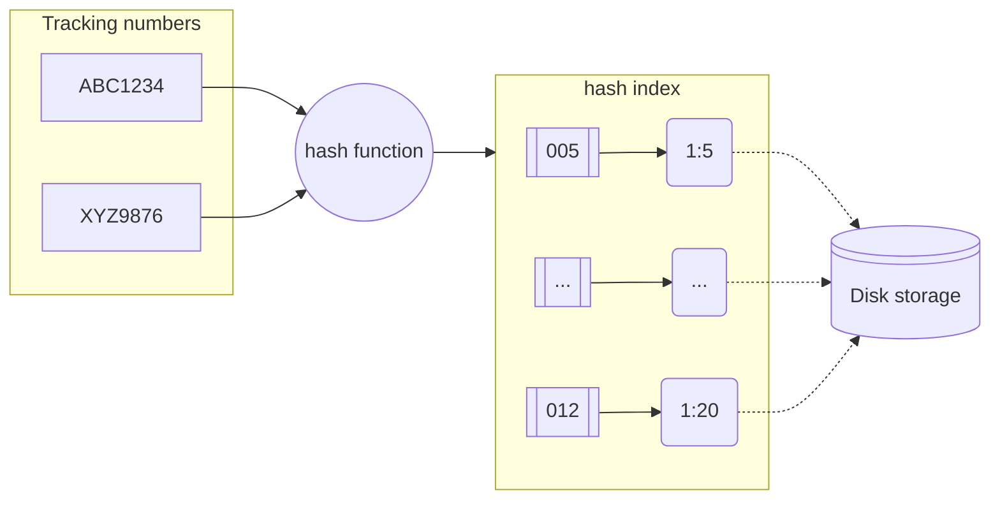

#database #indexing 
# Prerequisite
[[Hash Table]]
# How it works
Suppose you have a `shipments` table with columns such as `shipment_id`, `tracking_number`, `origin`, `destination`, and `status`.
	You frequently search for shipments based on `tracking_number`, so you create a hash index on this column:
```sql
CREATE INDEX idx_tracking_hash ON shipments USING hash (tracking_number);
```

When a write comes for a record, the row is stored to disk as discussed in [[Database Indexes#Overview of how table data is stored|data storage in RDBMS]]. The associated index is also updated. 
	The key `tracking_number` is passed to a hash function.
	The output of the hash function maps to a bucket in the underlying hash table. 
	The bucket stores a pointer to the corresponding file and offset that contains the record.



