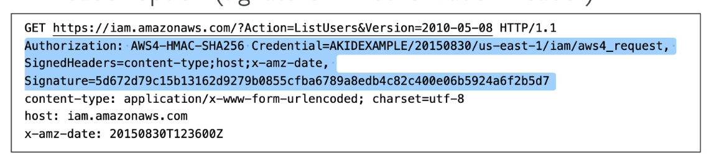

#aws 
```table-of-contents
title: Index
style: nestedList # TOC style (nestedList|nestedOrderedList|inlineFirstLevel)
minLevel: 0 # Include headings from the specified level
maxLevel: 0 # Include headings up to the specified level
include: 
exclude: 
includeLinks: true # Make headings clickable
hideWhenEmpty: false # Hide TOC if no headings are found
debugInConsole: false # Print debug info in Obsidian console
```

**In AWS, everything is an API call**
There are 3 ways to call AWS API's to interact with services:
# AWS Management Console
+ Browser based
+ Visual Navigation
+ Protected using username, password and if activated [](IAM.md#Multi%20Factor%20Authentication%20(MFA)|MFA).
# AWS CLI
+ Manage services through CLI using text-based commands.
+ Can use AWS CloudShell (AWS provided terminal on browser) or own terminal.
+ Use automation scripts
```bash
# list all AZs in current region
aws ec2 describe-availability-zones
```
+ Protected by access keys (under an IAM user), thus only those commands work for which user has permission (Refer [IAM](IAM.md)).
+ Built on the AWS SDK for Python.
>[!note]
>+ If using your own terminal, we first need to run `aws configure` command which prompts you to enter access key id, secret access key and AWS region.
>+ When using AWS CloudShell, it automatically uses the credentials of the currently logged in user and current region in account. i.e. no need to run `aws configure` command.
>+ The CloudShell terminal maintains state i.e if we create some files, refresh page, the files remain.

# AWS SDK
+ Use different programming languages like Python to write automation scripts or interact with AWS services programmatically.
+ Protected by access keys
+ Default region: `us-east-1`
+ Retry mechanism baked into SDK API calls
	+ **Exponential backoff** for 5xx server errors or `ThrottlingException`. (Intermittent error)
		+ Exponential backoff means retry after 1s, then 2s, 4s, 16s and so on after each failure
# Access Keys
>[!note]+
>Access keys are generated through the management console. (User profile -> Security Credentials -> Create Access Key)
>Access key id => username
>Secret access key => password

## Signing AWS API requests
+ All AWS HTTP API calls need to be signed with provided access key id and secret access key id.
	+ CLI and SDK calls are signed for you.
	+ Some requests to S3 do not need to be signed.
+ Signed using _Sigv4_.
	+ Pass signature in _Authorization_ Header
	+ Pass signature in query string: *X-AMZ-Signature*.png)
# MFA with CLI or SDK
+ Can enable [](IAM.md#Multi%20Factor%20Authentication%20(MFA)|virtual%20MFA) **only** for a [](IAM.md#User|IAM%20User) and ***NOT*** the root user.
	+ MFA can be enabled for root user through the console.
	+ virtual MFA that is set up is an AWS resource that can be configured onto a third party authenticator app like Duo.
+ Must create a temporary session first
	+ Run STS `GetSessionToken` API call
```bash
aws sts get-session-token --serial-number arn-of-mfa-device --token-code code-from-token --duration-seconds 3600
```
and the session token received is then used in API calls or CLI commands to AWS:
```json
{
	"Credentials": {
		"SecretAccessKey" : secret-access-key,
		"SessionToken": temporary-session-token,
		"Expiration": expiration-date-time,
		"AccessKeyId": access-key-id
	}
}
```

# AWS Credentials 
## CLI Credentials Chain
1. Command Line options: --region, --output and --profile
2. Environment Variables: AWS_ACCESS_KEY_ID, AWS_SECRET_ACCESS_KEY and AWS_SESSION_TOKEN
3. CLI Credentials file:  ~/.aws/credentials
4. CLI config file: ~/.aws/config
5. Container Credentials - for ECS tasks
6. [](IAM.md#Things%20to%20note|EC2%20Instance%20Profile) credentials
## SDK Credentials Chain
1. System properties: aws.secretKey, aws.accessKeyId
2. Environment Variables: AWS_ACCESS_KEY_ID, AWS_SECRET_ACCESS_KEY and AWS_SESSION_TOKEN
3. Default credential profile file: ~/.aws/credentials
4. ECS container credentials
5. EC2 Instance Profile credentials
## Scenario
+ Application deployed on a EC2 instance uses environment variables with credentials from a IAM user to call S3 API.
+ IAM user has S3FullAccess
+ The application only uses one S3 bucket.
	+ An IAM role and Instance Profile are attached to the EC2 instance.
	+ Role only has permission to access the one S3 bucket.
+ **The application has access to all S3 buckets**. Why?
>Environment variables are prioritized over Instance Profile credentials.
## Best practices
+ Never store credentials in code
	+ Inherit from credentials chain
	+ If working within AWS, use IAM roles.
		+ EC2 Instance Roles for EC2 Instances
		+ ECS Roles for ECS tasks
		+ Lambda Roles for Lambda functions
	+ If working outside AWS, use environment variables/named profiles.
