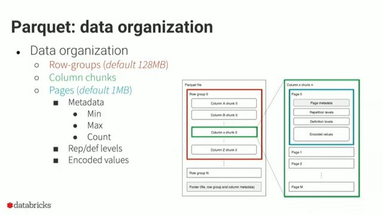
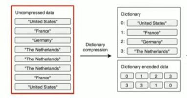
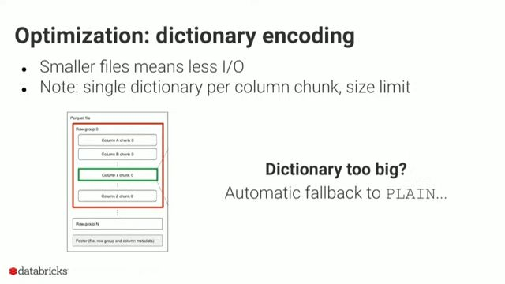
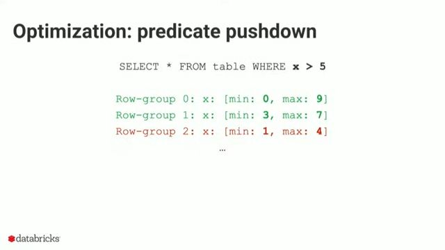
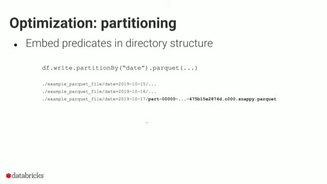

#DE 
# Parquet Data Organization

  [12:32](https://www.youtube.com/watch?v=1j8SdS7s_NY&t=753#t=12:32.89) 
 Each file is partitioned first, into row groups (default size 128 MB) and then subdivided into column chunks. A chunk is further subdivided into pages (default size 1 MB) which store the actual data.
 Each page also stores page level metadata such as min value in the page, max value in the page, count of values in the page etc..
 Each file also stores associated metadata (file, row group level and column level) in the footer.
# Encoding Schemes
## Plain Encoding
For columns where __values vary greatly__ or where __no pattern is detectable__, plain encoding __stores the values as-is__.
Often used for __strings, floating-point numbers, and other complex data types__ that do not benefit from the other encoding techniques.
__Offers no additional compression or size reduction.__
## Dictionary Encoding
For __columns that contain repeated values__. It works by creating a dictionary of unique values and then replacing each value in the column with a reference to the dictionary.
__Highly effective for columns with a limited number of unique values__ (e.g., categorical data, zip codes, or status flags).
 [14:40](https://www.youtube.com/watch?v=1j8SdS7s_NY&t=880#t=14:40.10) 
### __Optimization__
If dictionary size is getting too big, we can try to optimize by:
1. Increasing dictionary size limit `parquet.dictionary.page.size`
2. Decreasing row group size (=> less values per column chunk => less values in dictionary) `parquet.block.size`
  [17:27](https://www.youtube.com/watch?v=1j8SdS7s_NY&t=1047#t=17:27.39) 
## Run Length Encoding (RLE)
For __columns with consecutive repeating values__. It works by storing the value once along with the number of times it repeats, instead of storing the repeated value multiple times.

## Bit Packing
It is an encoding technique that __reduces the number of bits used to store small integers__. Instead of storing each integer as a fixed-size 32-bit or 64-bit value, bit-packing stores each integer in the smallest number of bits necessary to represent it. [^2]
This is particularly useful for __columns that contain small integers__, such as IDs or categorical data __with a limited number of categories.__

```run-python
# Packing values (3 bits for 5, 4 bits for 10, 5 bits for 20, 1 bit for 1)
value1 = 5    # 3 bits (0-7)
value2 = 10   # 4 bits (0-15)
value3 = 20   # 5 bits (0-31)
value4 = 1    # 1 bit (0-1)

# Packing values into 13(3 + 4 +5+ 1) bits
# O/P: 0b1011010101001 => 101(5) 1010(10) 10100(20) 1
packed = (value1 << 10) | (value2 << 6) | (value3 << 1) | value4

# Displaying the packed value (in binary)
print(f"Packed Value (Binary): {bin(packed)}")

# Unpacking the values from the 32-bit integer
unpacked_value1 = (packed >> 10) & 0b111    # Masking the first 3 bits
unpacked_value2 = (packed >> 6) & 0b1111   # Masking the next 4 bits
unpacked_value3 = (packed >> 1) & 0b11111  # Masking the next 5 bits
unpacked_value4 = packed & 0b1             # Masking the last 1 bit

# Displaying unpacked values
print(f"Unpacked Values: {unpacked_value1}, {unpacked_value2}, {unpacked_value3}, {unpacked_value4}")

# Remove 5 from bit packing
packed &= ~(0b111 << 10)
print(f"Packed Value (Binary): {bin(packed)}")
```
## Delta Encoding
It is used to __store differences between consecutive values__ rather than storing the full values themselves. This works well for __columns where values are close together or follow a predictable pattern__, such as timestamps, IDs, or monotonically increasing numbers.

# Compression Techniques
Compression is crucial for managing large datasets. By reducing the size of the data on disk, compression not only **saves storage space** but also **improves query performance** by reducing the amount of data that needs to be read from disk and transferred over networks.
## Snappy
It provides __fast compression and decompression__, making it ideal for __real-time queries and analytics workloads__. However, compared to other techniques, it provides __moderate compression ratio__ i.e. it doesn't reduce file sizes as much as more aggressive compression methods.
## Gzip
It provides a __high compression ratio__ but is __slower to compress and decompress data__.
## Brotli
__Higher compression ratios__ than Gzip and __better decompression speed__, but __slower to compress data__ than Snappy and Gzip.
Ideal for compressing large datasets where both read performance and storage efficiency are important, such as in __data lakes or cloud storage systems__.
## ZStandard
 Provides a very __good balance between compression speed, decompression speed, and file size reduction__.
 It __can be adjusted to favor either speed or compression ratio__ based on specific requirement.
## LZO
Very __fast decompression__, making it suitable for __real-time analytics and streaming data processing__.
__Lower compression ratios__ compared to other algorithms like Gzip or Brotli.
# Predicate pushdown optimizations
Parquet stores row level statistics in the footer which includes min/max in row group.

For a predicate such as `WHERE x > 5` , the row group statistics enable row group skipping as shown below.
Since each row group is about 128 MB, it leads to significant time savings during query fetching.
  [20:55](https://www.youtube.com/watch?v=1j8SdS7s_NY&t=1255#t=20:55.41) 
For equality predicates `WHERE x = 5`, we can further speed up predicate pushdown by enabling dictionary filtering `parquet.filter.dictionary.enabled`.
If the predicate value is not in a row group dictionary we can skip the group.
# Partitioning
Partitioning a dataset on a __low cardinality__ attribute that is often queried can speed up query performance, since we can skip unrelated partitions.
  [25:10](https://www.youtube.com/watch?v=1j8SdS7s_NY&t=1510#t=25:10.01) 
 __Avoid too many small files__ per partition. Each parquet file has an overhead of setting up internal data structures and metadata. If data is distributed across many small files, it reduces query performance.[^1]
	 1. Repartition the dataset using `df.repartition(numPartitions).write.parquet(...)`. This involves shuffling the files so that each partition has an equal number of files.
	 2. Coalesce the dataset using `df.coalesce(numPartitions).write.parquet(...)` ,which results in each partitions, possibly having an unequal number of files.
__Avoid few huge files__ per partition. The footer in a parquet file, will have a lot of metadata (row group, column, file) in the case of a huge file, and the footer is not optimized for fast query performance. This causes very slow query performance.

[^1]: [](Spark%20-%20Introduction.md#Explicit%20Repartitioning)

[^2]: [Bit packing](https://medium.com/data-science/smart-way-of-storing-data-d22dd5077340)
