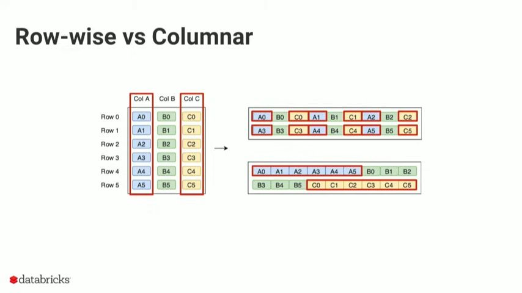
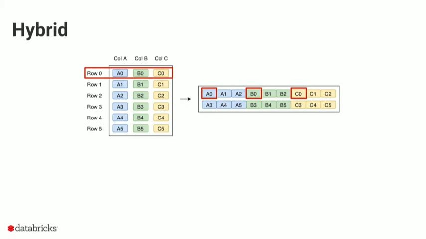

#database #DE 

# Row vs Column vs Hybrid storage formats for  systems?
>[!tldr] Row < Column < Hybrid

 [09:16](https://www.youtube.com/watch?v=1j8SdS7s_NY&t=556#t=09:16.41) 
Data in row-wise format is stored, on disk row by row as seen in top right of the image and data in columnar format is stored on disk, column by column.

OLAP systems frequently query on columns or perform aggregations on columns i.e. column data access needs to be faster.

We know that data access is faster if requested data is stored close to each other i.e sequentially (since sequential data can be read from disk as a block).
Since columnar storage format stores columns sequentially, it naturally makes data access faster.This makes columnar storage more efficient for analytical queries.

However, sometimes **row reconstruction** is necessary when the system needs to retrieve a complete record for a specific subset of columns.
In such cases, columnar storage is inefficient since we must read all the data in all of the columns in the subset to reconstruct a complete record.

>[!info]+ Common scenarios for row reconstruction
>__Reverse ETL__: If we need to feed the data to a ML model or third-party reporting tool, the OLAP system must convert the data into a row-wise format for downstream consumption.
>__Data validation and debugging__: When debugging data pipelines, developers often need to see the full context of a "bad" or outlier record.
>

This problem is solved by the hybrid format which combines the row and column storage formats to deliver the best of both worlds.
 [10:35](https://www.youtube.com/watch?v=1j8SdS7s_NY&t=636#t=10:35.99) 
The data is first divided into large horizontal blocks called **row groups** (typically 128 MB) and then subdivided into **column chunks**. 
This means that for a given column, all of its chunks are at a fixed distance from each other (which makes retrieval faster, no random I/O).
To reconstruct a record for a subset of columns, we can just traverse a fixed block distance depending on positional value of column to retrieve the correct blocks (note that we only read a column chunk as opposed to the entire column).
Ex: Parquet, ORC
[Parquet](Parquet.md)