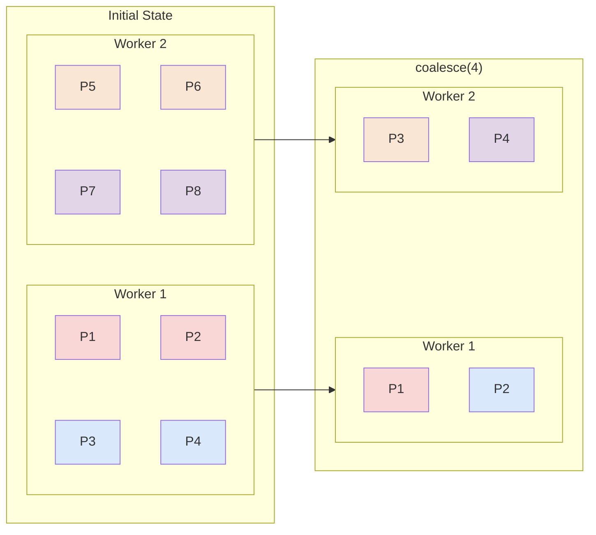

---
tags:
  - "#de"
  - "#spark"
  - "#distributed"
---
# Prerequisite
[Database Partitioning](Database%20Partitioning.md)
[Database Sharding](Database%20Sharding.md)
[Hadoop](Hadoop) 
# What is Apache Spark?
It is an __open source, distributed computing framework__ for big data processing and analytics. [^3]
# Why use Apache Spark?
1. __Speed__ - It processes data up to __100x faster__ than Hadoop MapReduce.
2. __Ease of use__ - It __supports__ APIs in __multiple languages__ (Java, Scala, Python, R)
3. **In-Memory Computing** – Caches intermediate data in **RAM**, instead of disk-based processing for faster computations.
4. **Scalability** – Runs on **clusters of thousands of machines**.
5. **Runs Everywhere** - It will run on Hadoop, Kubernetes, Mesos, Standalone, and even within the Cloud.
6. __Lazy evaluation__ - Apache Spark doesn’t execute your commands immediately. Instead, it creates a DAG and waits until an action operation explicitly triggers computation.
# Spark Ecosystem

## Spark Core
[^6]
It provides core/ foundational capabilities that the other parts of the ecosystem (ex: Spark SQL, Spark Streaming) build on.
+ [I] __Task scheduling & Execution__: Translates code into a DAG of stages, which is then, broken down into tasks and scheduled across the workers.
+ [I] __Memory Management__: Controls how memory is divided between execution (shuffles, joins, aggregations) and storage (caching data).
+ [I] __Fault tolerance__: Tracks the history of transformations used (lineage). If a node fails and data is lost, the lineage can be used to recompute only the missing data.
### Key data abstractions
+ [k] **[RDD](Spark%20-%20RDD.md)**: It represents an immutable, fault-tolerant collection of data elements that are distributed across a cluster and can be processed in parallel.
+ [k] **DAG**: A blueprint of operations and dependencies that spells out exactly how your job will execute.
## Spark SQL
[^4][^5]
It is used for processing **structured** and **semi-structured** data, using standard SQL syntax or the declarative DataFrame API. It is built on top of **Spark Core**.
+ [I] **Integrated data access**
	+ Native support for [Parquet](Parquet.md), ORC, JSON, CSV and Avro
	+ Direct querying of RDBMS via JDBC/ODBC
	+ Supports cross-source joins (ex: Join JSON file in [Amazon S3](Amazon%20S3.md) with a relational table in an RDBMS)
+ [I] **SQL compatibility**: Allows easy integration with SQL based tools (ex: Apache Hive) by supporting SQL and HiveQL queries.
+ [I]  __Query optimization__: *Catalyst* converts queries into optimized physical plans and _Tungsten_ optimizes the actual execution by maximizing CPU and memory efficiency.
### Key data abstractions
+ [k] **DataFrame**: Distributed collections of data organized into named columns.
+ [k] **Dataset**: Extension of DataFrame (only in Scala and Java) that provides compile-time safety and high speed optimizations. 
Both DataFrame and Dataset, are implemented as abstractions over RDDs. 

>[!info] It provides SQLContext (deprecated) and HiveContext (deprecated), now unified into SparkSession
## Structured Streaming
[^7]
>[!info] Spark Streaming is the legacy version

It is a scalable and fault-tolerant stream processing engine built on top of **Spark SQL**.
+ [I] **Unified Batch and Streaming API**: It supports both batch and streaming operations. DataFrames, Datasets and SQL APIs can be used to build data processing pipelines.
+ [I] **Trigger**: It defines when and how frequently the streaming query processes incoming data.  
+ [I] **Micro batching**: Data arriving within a trigger interval is grouped into a _micro-batch_. Each micro-batch triggers a new Spark job.
+ [I] **Event time based processing**: Supports processing based on actual event time (stored in the record itself) rather than the processing time (time Spark takes to process).
+ [I] **Watermarking**: Specify how long the system should hold stale data, to account for late arriving data. 
+ [I] **Output modes**: Defines how data gets written to your sink based on the query.
	+ **Append mode:** Only new rows added since the last trigger are written.
	- **Complete mode:** The entire updated result table is written.
	- **Update mode:** Only rows that were updated or added are written.
+ [I] **Fault tolerance**: By checkpointing data periodically, a failed stream can pick up exactly where it left off, without losing or duplicating records. 
### Key data abstractions
+ [k] **Unbounded Table**: Every new record arriving from the stream is treated as a new row appended to an infinite input table. 
## Mlib
[^8][^9]
It is a scalable, distributed machine learning framework for machine learning training, feature engineering and pipeline orchestration across large datasets.
+ [I] __Integration with Spark Ecosystem__: Integrates with **Spark SQL** and **Structured Streaming**, supporting machine learning pipelines for batch and stream processing.
+ [I] **Algorithms and Feature Engineering**: Supports many ML algorithms (linear regression, logistic regression, decision trees, etc...) and tools for feature extraction (TF-IDF, Word2Vec), transformation and selection.
+ [I] **High level APIs**: Provides APIs for common ML tasks (classification, regression, clustering, collaborative filtering etc...) 
### Key data abstractions
+ [k] **DataFrame**: A dataset is treated as a **Spark SQL** DataFrame.
+ [k] **Transformer**: Applies a rule or mathematical transformation, and appends a new column or set of columns to a DataFrame. (ex: Normalize data, tokenization)
+ [k] **Estimator**: An algorithm that learns from the DataFrame to produce a model (Transformer). 
+ [k] **Evaluator**: An algorithm that measures model performance (ex: Area under ROC, RMSE)
+ [k] **Pipeline**: Represents a ML workflow by chaining multiple **Transformer** , **Estimator** and **Evaluator** objects.
## GraphX
[^10][^11]
It is a distributed graph processing library that unifies graph and data processing.
>[!warning] Available only in Scala

+ [I] **Integration with Spark Ecosystem**: It integrates with other components to enable creation, manipulation and joining of graphs with RDDs.
+ [I] **Performance**: It can efficiently handle graphs with billions of nodes.
+ [I] **Graph algorithm support**: Provides implementation for many graph algorithms like PageRank, SVD++ and connected components.
### Key data abstractions
+ [k] **VertexRDD**: RDD + vertex attributes. Represents a node/vertex in a graph.
+ [k] **EdgeRDD**: RDD + edge attributes. Represents a relationship between 2 vertices.
+ [k] **Graph**:A directed multigraph that attaches user-defined properties (objects) to both vertices and edges. It logically pairs **VertexRDD** and **EdgeRDD**
## SparkR
R package for Apache Spark.
# Spark Architecture

>[!tip]- SparkSession vs SparkContext
>_SparkSession_ is a higher level abstraction sitting on top of _SparkContext_.
>_SparkSession_ unifies APIs for _SQLContext_, _HiveContext_ and _SparkContext_.


## Key components
[^2]
### __Driver__
It is the program or process responsible for __coordinating the execution__ of the Spark application.
When the Driver Program in the Apache Spark architecture executes, it calls the real program of an application and creates a __SparkContext__.
 It includes several other components, including a __DAG Scheduler, Task Scheduler, Backend Scheduler, and Block Manager__, all of which are responsible for translating user-written code into jobs that are actually executed on the cluster.
#### __SparkContext__
It is the entry point for any Spark functionality. It represents the connection to a Spark cluster.
It can be used to create RDDs, accumulators, and broadcast variables. SparkContext also coordinates the execution of tasks.
## Cluster Manager
The Cluster Manager does the task of __allocating and managing resources__ (driver + workers) for the job. 
Spark supports various cluster managers like Apache Mesos, Hadoop YARN, and standalone cluster manager. (This is what makes it _run anywhere_)
## Executors
They are worker processes (JVM) responsible for __executing tasks__ in Spark applications. 
They are launched on worker nodes (physical machine) and communicate with the driver program and cluster manager. Executors run tasks concurrently (__one task = one core__) and store data in memory or disk for caching and intermediate storage.
## Task
A task is the smallest unit of work in Spark, representing a unit of computation that can be performed on a single partition of data i.e. __one task = one partition__. The driver program divides the Spark job into tasks and assigns them to the executor nodes for execution.
# [](Spark%20-%20Transformations.md#Transformations|Transformations)
[^12]
They are operations that transform your existing RDD or DataFrame into a new RDD or DataFrame.
+ [I] **Lazy evaluation**: They don't execute immediately.
+ [*] `map`, `filter`, `groupBy`, `flatMap`, `distinct`, `union`, `join` etc...
# Actions
[^12]
> See [](Spark%20-%20Transformations.md#Transformations%20vs%20Actions|Transformations%20vs%20Actions) for differences.

They trigger the actual computation of the set of transformations defined up until that point, and then it executes immediately.
+ [I] They return the result to the driver, typically a single value or a small collection of data that **can fit in the driver's memory**.
+ [*] `count`, `collect`, `save`, `show`, `take`, `write` etc...
# Lazy Evaluation
Lazy evaluation is a feature in Spark, which holds off on executing transformations until an action is executed.
	For example, you can run a transformation to filter your DataFrame - **df.filter()**.
	But Spark won’t actually filter your DataFrame until you run an action e.g. showing your DataFrame: **df.show()**

This has two main benefits:
+ [p] Instead of running the transformations one by one, if we wait for an action, and execute all the transformations together in a batch, we can figure out a more efficient way to execute them together.
+ [p] We avoid bringing the DataFrame into memory immediately, which can save some cluster capacity.

+ [c] However, if we repeatedly execute the same set of transformations i.e. create the same RDD multiple times, the benefit of lazy evaluation is lost. (reprocessing overhead).
	+ [i] To prevent this, we can persist the RDD to memory using `.cache()` or `.persist()` (See [Spark - Persisting Data](Spark%20-%20Persisting%20Data.md) for more details.)

>[!faq]- How does Spark track what transformations need to be performed in what order? 
>It uses DAG.
# Sample Program
```python
from pyspark.sql import SparkSession

spark = (
    SparkSession.builder
    .appName("FirstPySparkApp")
    .master("local[*]")
    .getOrCreate()
)
spark.stop()
```

**Line 4**: `SparkSession` is an abstraction over `SparkContext` which is the main entry point of the program.
**Line 6**: `.master()` defines where the Spark app runs. Provide a url to connect to a cluster, or _local_ to use current machine.
	_local_: Use 1 core on the current machine.
	_local[N]_: Use N cores of the current machine.
	_local[*]_: Use all cores of the current machine. 
**Line 7**: `getOrCreate()` returns an existing session or creates one.
**Line 9**: `stop()` releases Spark resources.
# Spark vs Hadoop
[^13]

| Feature                 | Apache Hadoop (MapReduce)                                     | Apache Spark                                                          |
| ----------------------- | ------------------------------------------------------------- | --------------------------------------------------------------------- |
| **Processing Speed**    | Slower; writes data to physical disks between operations.     | Up to 100x faster; processes data directly in RAM.                    |
| **Data Architecture**   | Built for batch processing of historical data.                | Built for both real-time streaming and batch workloads.               |
| **Storage & Ecosystem** | Includes its own storage system (Hadoop HDFS).                | Has no native storage; relies on external systems like S3 or HDFS.    |
| **Infrastructure Cost** | Lower upfront cost; runs on cheaper, standard hard drives.    | Higher upfront infrastructure cost due to intensive RAM needs.        |
| **Security**            | Encryption and access control to prevent unauthorized access. | Limited security features. You must ensure the environment is secure. |
# DataFrame and Dataset
DataFrames are **distributed collections of data organized into rows and columns**. It is a higher level abstraction built on top of RDDs. Dataframes are ==optimized using Catalyst and Tungsten== under the hood, which improves performance significantly.

Dataset is also a SparkSQL structure and represents an extension of the DataFrame API. ==It possess best of RDDs - OOP style + type safety and best of Dataframes - structured format + optimization + memory management.==
It is only available for strongly typed languages like Java and Scala.
## When to use
- **Data requires a structure**. DataFrames infer a schema on structured and semi-structured data.
- **Transformations are high-level**. If your data requires high-level processing, columnar functions, and SQL queries, use Datasets and DataFrames.
- **A high degree of type safety is necessary.** Compile-time type-safety takes full advantage of the speed of development and efficiency.
# RDD vs DataFrame vs Dataset
|                                                                                           | **RDD**                                                                                                | **DataFrame**                                          | **Dataset**                                                         |
| ----------------------------------------------------------------------------------------- | ------------------------------------------------------------------------------------------------------ | ------------------------------------------------------ | ------------------------------------------------------------------- |
| **Release version**                                                                       | Spark 1.0                                                                                              | Spark 1.3                                              | Spark 1.6                                                           |
| **Data Representation**                                                                   | Distributed collection of elements.                                                                    | Distributed collection of data organized into columns. | Combination of RDD and DataFrame.                                   |
| **Immutability and [Interoperability](https://phoenixnap.com/glossary/interoperability)** | Immutable partitions that easily transform into DataFrames.                                            | Transforming into a DataFrame loses the original RDD.  | The original RDD regenerates after transformation.                  |
| **Compile-time type safety**                                                              | Available compile-time type safety.                                                                    | No compile-time type safety. Errors detect on runtime. | Available compile-time type safety.                                 |
| **Optimization**                                                                          | No built-in optimization engine. Each RDD is optimized individually.                                   | Query optimization through the Catalyst optimizer.     | Query optimization through the Catalyst optimizer, like DataFrames. |
| **Programming Language Support**                                                          | Java Scala Python R                                                                                    | Java Scala Python R                                    | Java Scala                                                          |
| **Schema Projection**                                                                     | Schemas need to be defined manually.                                                                   | Auto-discovery of file schemas.                        | Auto-discovery of file schemas.                                     |

## Explicit Repartitioning
### `coalesce`
It is a [narrow transform](#Narrow%20transformations) designed to __reduce the partitions__ in your DataFrame __without triggering a full [shuffle](#Data%20shuffling).__
__Key characteristics of coalesce__:
- **One-way operation**: Coalesce can only reduce the number of partitions, not increase them (unless you set shuffle=true, which essentially turns it into repartition).
- [p] **Minimal data movement**: It __attempts__ to combine partitions that are already on the same executor, minimizing network traffic.
	- [*] Data stays on the same nodes as much as possible. It only moves data if a node needs to "hand over" its partition to a neighbor to meet the exact global count of $n$
+ [c] **Potentially uneven distribution**: The resulting partitions may have skewed sizes because data is not reshuffled. 
In the image below, we can see that `coalesce(4)`  reduces no of partitions from 8 to 4 (globally), and it does so by merging partitions on the same node.

When all nodes for merge are not on the same node, it will choose a node to host the new partition and transfer the required partition for the merge to the new partition from its original node (Here `P4` handed over to `Worker 2`).
>[!warning] Coalesce will always do the hand over to the node that is physically closest to it, irrespective of data skew.


>[!faq ]- Why is shuffle a narrow transform even though sometimes shuffle happens?
>A transformation is _narrow_ if each output partition depends on a **specific, known set of input partitions**.
>> In `coalesce(3)` above, output partition `P1` knows it needs `P1, P2, P3` , output partition `P2` knows, it needs `P5, P6, P7` etc..
>
>Actually, `coalesce` does not perform a shuffle, since no shuffle files are written and no hashing is performed. It simply moves partitions from the RAM of one worker node to another.

**Use Cases**
- Reducing output file count before writing to [S3](Amazon%20S3.md), HDFS, or Delta Lake.
```python
df = spark.read.parquet("s3://bucket/transactions/")  
# Suppose df has 200 partitions after reads + filters
print(df.rdd.getNumPartitions())  # 200
df_coalesced = df.coalesce(10)   # merge down to 10  
print(df_coalesced.rdd.getNumPartitions())  # 10
# Now writes only 10 files instead of 200  
df_coalesced.write.parquet("s3://bucket/output/")
```
- Merging the tiny partitions of a filtered DataFrame that shrank drastically after a `.filter()`.
- Preparing a small result set for a single-file CSV export.
>[!failure]- Disadvantages
>+ __Severe Data Skew__: Because it merges existing partitions without a full reshuffle, any original skew remains and can even be magnified. 
>>[!example]- Example
>> Output partition = Sum of all partitions sizes being merged. So if we merge partitions of unequal sizes or unequal no of equal partitions, data will be skewed. 
>> The data skew means that, one worker node may end up handling 90% of the data while others sit idle, leading to a massive bottleneck.
>+ __Drastic Reduction in Parallelism__: - When you add a `coalesce(n)` operation, all operations within that same stage will run with at most $n$ tasks.
>>[!example]- Example
>>Let’s say you had a parallelism of 1000, but you only wanted to write 10 files at the end. You might think you could do:
>>```python
>>load().map(...).filter(...).coalesce(10).save(...)
>>```
>>but Spark's optimizer __Catalyst__ will perform predicate pushdown (optimization) so this gets executed.
>>```python
>>load().coalesce(10).map(...).filter(...).save(...)
>>```
>>which essentially means the entire processing will happen on 10 worker nodes instead of say, the default 200 partitions that we assumed would be used initially.
>+ __OOM Errors__: Aggressively reducing partitions with `coalesce` forces a large amount of data into a small number of executors.
>>[!example]- Example
>>If you use `coalesce(1)` on a 1TB dataset, Spark will attempt to fit all that data onto a single machine's RAM/disk. This frequently causes `Java heap space` or `GC overhead limit exceeded` errors
>+ __Only reduces partitions__: You cannot use `coalesce` to increase the number of partitions unless you explicitly set `shuffle=true`, which effectively makes it identical to `repartition`
>+ **Slow Sequential Writes**: When writing to disk, fewer partitions mean fewer concurrent write tasks.
>>[!example]- Example
>>A single large 10GB file can take significantly longer to write than twenty 500MB files because it's limited to one CPU core's write speed.

>[!success]- Advantages
>- **Minimized Shuffle & Network Overhead:** `coalesce` merges existing partitions together. It prioritizes merging partitions on the same executor to minimize network I/O.
>- **Faster Execution:** Because it avoids writing intermediate _shuffle files_ to disk and reading them back, it is significantly faster than `repartition` for downscaling.
>- **Reduced Resource Usage:** It consumes less CPU and memory because it doesn't perform the complex hashing or sorting required for a standard shuffle.
>- **Optimized Output Files:** It is the standard tool for reducing the number of small files written to a data lake or database.
>- **Maintains Sort Order:** In some scenarios, because it merges adjacent partitions without a full reshuffle, it is better at preserving any existing local sort order than a full `repartition`
### `repartition`
It's a [wide transformation](#Wide%20Transformations) because each output partition may depend on data from all input partitions.[^1]
__Key characteristics of repartition__:
- **Bidirectional operation**: Can both increase and decrease the number of partitions.
- [c] **Full data shuffle**: Triggers a complete redistribution of data across the cluster.
- [p] **Even distribution**: Produces roughly equal-sized partitions, which is optimal for parallel processing.
```python
# Form 1: Repartition by count (round-robin, even distribution)
# If no count provided: Default is `spark.sql.shuffle.partitions`
# Good for: balancing skewed data before heavy computation 
df_balanced = df.repartition(50)  # Creates 50 partitions

# Form 2: Repartition by column (hash-based, groups same keys together)
# Good for: optimising subsequent joins or groupBys on "country"    
df_by_country = df.repartition(50, col("country")) 

# Form 3: Repartition by range (Samples data into `count` ranges)
# Good for: continuous values (it samples the ranges so, output is inconsistent across multiple trials)
df_by_range = df.repartition(50, col("age"))
```

>[!important] Partitions are primarily used to distribute data efficiently across worker nodes rather than for performing aggregations
>Although all records with the same partition key end up in the same partition, but __one partition $\neq$ one partition key__. Multiple partition key records can end up on the same partition.
>This is because internally, `repartition(numPartitions, column)` calls `HashPartitioner` to distribute the data into partitions, which uses the formula `hash(partitionKey) % numPartitions`.
>>[!example]- Example
>>If you have 1,000 unique countries but you repartition to 200, then mathematically, at least some partitions _must_ contain at least 5 different countries

<center>Repartition by column (hash-based distribution)</center>

<center>Repartition by numPartitions (round-robin)</center> 
**Use Cases**
+ __Addressing Data Skew__: If your data is unevenly distributed across existing partitions, `repartition()` can help rebalance it.
+ __Increasing Parallelism__: If you've filtered a huge dataset down to a small fraction, you might only have a few active partitions left. Repartitioning to a higher number allows Spark to utilize more of your cluster’s CPU cores for the next set of transformations.
+ **Optimizing Join Performance:** If you frequently join two large DataFrames on the same key, repartitioning both by that key _once_ and then caching them can prevent Spark from having to re-shuffle them every single time they are joined in subsequent steps.
+ **Randomizing Data for Machine Learning:** Before training a model, you often want to ensure your data is thoroughly shuffled and not ordered by time or ID. A `repartition` acts as a global shuffle that breaks any existing row order.
+ **Preventing Out-of-Memory (OOM) Errors:** If a specific transformation (like a complex aggregation) is failing because a single partition is too large for an executor's memory, repartitioning into a larger number of smaller chunks can keep your job within its memory limits.

>[!failure]- Disadvantages
>+ __High Network I/O__:Since `repartition` redistributes data across the entire cluster, it triggers a **Full Shuffle**.
>+ __Disk Spill__: When Spark shuffles data, It writes the data to local disks on the worker nodes first (**Shuffle Write**) and then the receiving node reads it back (**Shuffle Read**).If your worker nodes don't have enough RAM to hold the shuffle blocks, Spark will "spill" that data to disk.
>+ __Increased CPU Overhead__:Data must be serialized (converted to bytes) to be sent over the wire and then deserialized at the destination. Spark may also calculate a hash for every record to decide which partition it belongs.
>+ __Broken Pipeline__: Spark usually processes data in a _stream_. However, a shuffle acts as a **Barrier**. All _Map_ tasks must finish writing their shuffle files before any _Reduce_ tasks can start reading them.
# Jobs, Stages and Tasks
```python
# --- JOB 1: Simple Action ---
# This triggers the first Job.
# 1 Stage since no transforms are applied.
print(f"Total records: {df.count()}")

# --- JOB 2: Narrow -> Wide -> Action ---
# 1. Narrow Transform: filter (stays in Stage 1)
# 2. Wide Transform: groupBy (triggers Stage 2 / Shuffle)
# 3. Action: collect (triggers the Job)
result = df.filter(df.Salary > 4000).groupBy("Department").agg(F.avg("Salary"))

# This triggers the second Job, which will have 2 Stages
final_output = result.collect()
```

A __job__ refers to a ==sequence of transformations== on data. 
Whenever an action (`count()`, `collect()`, etc..) is called, a job is triggered .i.e. __one action = one job__.
A job is comprised of __one or more stages__.
A job is __divided__ into __multiple stages__ when we have to perform __wide transformations__ which requires shuffling.
==At the end of each job, we get a new [RDD](#RDDs).

A __stage__ refers to a ==sequence of transformations on data which does not involve shuffling==.
Each stage is comprised of __one or more [tasks](#Task)__, and all the tasks within a stage perform the same computation.
<center><b>Representation of Job 2</b></center>


This is a very high level overview of job, stages and tasks. [Reading a DAG](https://dzone.com/articles/reading-spark-dags) looks very different with AQE turned on, and other Spark code optimizations.
# Data shuffling
[Shuffle](https://bitsofchris.com/p/shuffling-in-spark-how-to-balance) occurs when ==data is exchanged between partitions across different nodes,==
 for certain operations that requires redistributing data between partitions:
- **groupBy()** followed by **agg()** — Requires shuffle to move all records of the same category into the same partition.
- **orderBy()** or **sort() —** Forces a full shuffle because Spark needs to globally sort records.
- **Join (**where broadcast is impossible**) —** Spark shuffles data to align matching keys. Always try to use broadcast join where possible to avoid shuffle.
- **repartition(n) —** Full shuffle of data **evenly** across n partitions.
- **repartition(column) —** Full shuffle of data across partitions according to specified column. ^ad2db7
- **partitionBy(column)** (used in window functions) — If data isn’t already partitioned by column, Spark shuffles it.
## How to identify if a shuffle is happening?
The `Exchange` operation in a Spark query plan (`df.explain()`) represents a shuffle
```python
df.join(df_other, “key”).groupBy(“column”).count().explain()

 '''== Physical Plan ==
 *(5) HashAggregate
+- Exchange hashpartitioning(column, 200)'''
```

After running a job, we can check for the following in Spark UI:
+ __Shuffle R/W Size__ : Large sizes (more than your dataset size) often indicate high data movement between nodes.
+ **Disk Spills**: High disk spill indicates that shuffle operations are consuming more memory than available, leading to slower performance because data is written to disk.
+ **Query Plan:** The AQE may have changed the plan shown by df.explain() — you can see the actual steps taken by your job here.
>__Workflow__: Data must be serialised → written to disk (shuffle files) → transferred over the network → deserialised

>[!failure]- Disadvantages
>- **Network Transfer** → Data moves across nodes, causing latency.  
>- **Disk I/O** → Intermediate shuffle files are written and read from disk.
>- **CPU Overhead** → Serialization, deserialization, and data sorting add processing time.
>- __Memory Overhead__ → Memory is consumed for buffering and sorting data. If memory required is larger than available memory, it will spill to disk.
>- __Data skew__: It can result in uneven workload distribution which slows down certain tasks compared to others.

## Minimizing the impact of shuffling
+  **Broadcast Join** — When one side of a join is relatively small, consider broadcasting that dataset across all executors to avoid a shuffle
+ **Coalesce** — Use `coalesce()` instead of repartition() when reducing partitions to avoid full shuffle. Coalesce does not use full shuffle, though pay attention that it can cause data skew.
+ __Repartition__: Use `repartition()` to repartition on join key before large joins, to improve distribution of skewed data or to avoid a global sort. 
	`repartition()` shuffles data but depending on how the partitioned data is used downstream, one repartition, early on, can reduce future shuffle operations.
+ __Caching data__: It can reduce shuffles in cases where, 
	+ DataFrame is used in multiple joins with different tables.
	- Cache intermediate result to use downstream.
+ __Add Executor memory__: Increase `spark.executor.memory` to try and keep more data in memory and avoid disk spilling.
+ **Use Enough Partitions**: For large datasets, increasing the number of shuffle partitions can help with memory pressure.
+ __Turn on AQE__: AQE dynamically adjusts the number of shuffle partitions based on runtime metrics, which helps especially with data skew or uneven data distribution.
# Joins
The first step of a join is to [shuffle](#Data%20shuffling) records from both sides of the join, such that data is partitioned on join key.

>[!important] One partition can store multiple join keys .i.e. one partition $\neq$ one key

See [How are records assigned to partitions during shuffle](#^ad2db7) for the different ways to achieve this. 
## Shuffle Sort Merge Join

## Shuffle Sort Hash Join
## Broadcast Join
# Workflow recap
__Logical Plan__
When you call a method like `sparkContext.textFile("path/to/file")`, Spark does not immediately load the data into RAM. It creates a RDD object that contains:
+ A pointer to the data source
+ Instructions on how to turn that raw data into records (e.g., splitting a text file by newlines).
+ Default block size and number of partitions required based on file metadata and spark config.

Transforms are evaluated lazily, so every time a transform is called, a new RDD is created that points to the previous one. ==This chain of transformations is called the DAG.== 
Some transforms will require repartitioning/shuffling of data. This also becomes part of the DAG. (Default 200 decided by `spark.sql.shuffle.partitions`).
+ __Narrow Transformations__: 
	+ These operations usually **do not change** the number of partitions. The output RDD has the same number of partitions as the parent. (`map()`, `filter()`, `flatMap()`)
	+ There are some exceptions like `union()`, which combines partitions from two RDDs, so the resulting RDD has a partition count equal to the sum of the parents.
+ __Wide Transformations__:
	+ These operations **redistribute** data across the cluster, which almost always results in a new partitioning scheme. (`reduceByKey()`, `groupByKey()`, `join()`, `distinct()`)
	+ Spark uses a **Partitioner** (usually a `HashPartitioner`) to determine which key goes to which task
+ __Explicit Re-partitioning__:
	+ `coalesce(n)`: __Decreases__ the number of partitions without a full shuffle.
	+ `repartition(n)`: Performs a full shuffle to redistribute data evenly across `n` partitions.

__Physical Plan__
When an action is applied, it triggers the execution of the logical plan. However, ==Spark doesn't necessarily follow the logical plan exactly.==  Before it hits the disk, it uses an optimizer (like **Catalyst** for DataFrames) to rearrange the plan "on the fly."
- **Predicate Pushdown:** If you have a `load()` followed by a `filter()`, Spark modifies the plan to push the filter down to the data source so it only reads the necessary rows from disk.
- **Operator Grouping:** It will "collapse" multiple narrow transformations (like three `map()` functions in a row) into a single stage so the data is processed in one pass in-memory.

Then, following this optimized plan (__physical plan__), each worker node is assigned a partition of the data which it reads into memory. At this stage, partitioning happens according to the scheme decided by file metadata and spark config.
- **HDFS/Cloud Storage:** Spark typically creates one partition per data block (defaulting to 128MB).
- **Local Files:** It uses a default value (usually the number of cores on your machine) or a minimum count you specify, e.g., `sc.textFile("path", 10)`.
- **Databases (JDBC):** Partitioning depends on the parameters you set, such as `partitionColumn`, `lowerBound`, and `upperBound`.

Then while following the DAG, the transforms are applied --- new RDDs are created, repartitioning may occur. Finally the action is applied to generate the results.


[^1]:  [The Truth about pyspark's repartition](https://freedium-mirror.cfd/https://python.plainenglish.io/the-truth-about-pysparks-repartition-prepare-to-be-surprised-4dede792f3f4)

[^2]: [Spark Architecture](https://medium.com/@amitjoshi7/spark-architecture-a-deep-dive-2480ef45f0be)

[^3]: [Apache Spark Full Course]([https://www.youtube.com/watch?v=FNJze2Ea780](https://youtu.be/FNJze2Ea780?t=2016))

[^4]: https://medium.com/@piyushpathak27081998/a-comprehensive-guide-to-spark-sql-simplifying-data-processing-and-analysis-adcc6852359c

[^5]: https://medium.com/@ghoshsiddharth25/spark-interview-series-catalyst-optimizer-and-tungsten-engine-c94cfc8cb41d

[^6]: https://luminousmen.com/post/spark-core-concepts-explained/

[^7]: https://medium.com/data-science-collective/understanding-apache-spark-structured-streaming-for-real-time-data-processing-5fea352009c5

[^8]: https://medium.com/@harshgajjar7110/apache-sparks-mllib-a-comprehensive-guide-to-its-key-features-and-benefits-29638ece5d2

[^9]: https://www.youtube.com/watch?v=DBxcua0Vmvk&t=4s

[^10]: https://medium.com/@parthjaju/apache-spark-graphx-introduction-to-graph-data-analysis-dfe01cbbb20c

[^11]: https://www.puppygraph.com/blog/graphx#graphx-architecture-explained

[^12]: https://rajanand.org/spark/spark-transformations-vs-actions

[^13]: https://aws.amazon.com/compare/the-difference-between-hadoop-vs-spark/
