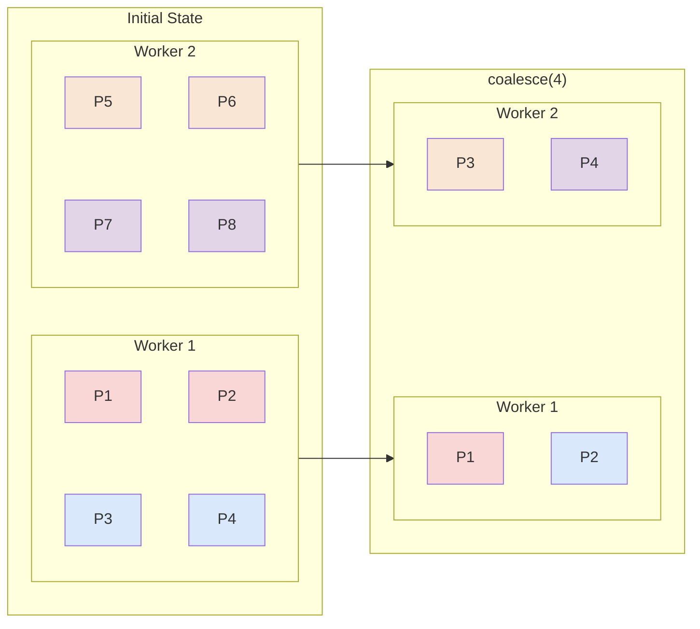

---
tags:
  - "#de"
  - spark
  - distributed
---
# What is a partition?
A partition is a logical chunk of a large dataset that is distributed across different nodes in a cluster.
# Why do we use partitions?
[^1]
We divide data into partitions, so that they can be processed simultaneously. Theoretically, the more partitions you have, the more [](Spark%20-%20Job,%20Stage%20and%20Task.md#Task|tasks) that can run in parallel, leading to faster processing times. (__one partition = one task__).
## Considerations
[^2][^3]
A few large partitions can cause:
+ [c] __Idle cores__: Remember __one core = one task = one_partition__! Thus, if number of partitions << number of cores, it leads to underutilization.
+ [c] __Memory errors__: Large chunks of data per partition can cause out-of-memory (OOM) errors and disk spilling.
+ [c] **Data Skew:** Heavy imbalance in few partitions drastically slows down specific tasks. 

Many small partitions can cause:
- [c] **Scheduling Overhead:** Managing thousands of tiny tasks takes more time than actual data processing.
- [c] **Slow Reads/Writes:** Creates an excessive number of tiny output files, wasting storage system resources.
- [c] **Network Clutter:** Small tasks increase unnecessary metadata communication across nodes
# Input Partitions
[^4][^2]
They are created when Spark reads in data from various sources (CSV, JSON, Parquet, HDFS, etc...). 
The number of partitions created depends on a multitude of factors: 
+ [i] File size & format
+ [i] Number of cores in the cluster
+ [i] Compression
+ [i] Configuration thresholds (ex: `spark.sql.files.maxPartitionBytes` , `spark.files.openCostInBytes`) 

+ [*] When reading in a directory containing multiple files, it applies `spark.files.openCostInBytes` as a _weight penalty_ to each file, which prevents too many small files from being packed into one partition. If too many files are packed into a single partition, it strains the driver with massive metadata overhead and slows down execution of tasks. [^5]
+ [*] If a file is unsplittable (ex: multiline JSON), it will be loaded into a single partition, which can lead to OOM errors, if the executor does not have enough memory.
# Shuffle Partitions
[^4][^2]
Irrespective of the number of partitions, we had before a [](Spark%20-%20Transformations.md#Wide%20Transformations|wide%20transformation), after the shuffle happens, we ___ALWAYS___ get, the number of partitions specified by `spark.sql.shuffle.partitions` (__Default__: 200).

>[!faq] Why should we tune `spark.sql.shuffle.partitions` ?
>+ __Small data__: Spreading a small amount of data (say, a few MB) across 200 partitions, could create microscopic tasks, with each partition getting as few as ten rows. This leads to severe underutilization of memory and CPU.
>+ __Large data__: Spreading a large amount of data (say, a few GB) across 200 partitions, can lead to OOM error or slow disk spills.
# Output Partitions
[^2][^4][^5]
__One partition = one file__.
+ [*] __Too many output partitions__: Generates 1000s of small files, adding greater metadata and scheduling overhead.
+ [*] __Too few output partitions__: Large partitions can cause OOM errors and disk spillage. It also slows down processing since, a few executors are doing all the processing while many cores sit idle.

>See [Spark - Partitioning vs Clustering vs Bucketing](Spark%20-%20Partitioning%20vs%20Clustering%20vs%20Bucketing) for more details on how different techniques affect the number of output partitions.
# Partitioning schemes
>[!WARNING] This section talks about ways in which in-memory data is partitioned, not to be confused with [partitioning output files](Spark%20-%20Partitioning%20vs%20Clustering%20vs%20Bucketing).
## Hash Partitioning
[^1][^6]
Partitions based on value of one or more columns. 
+ [*] All rows with the same __hash__ value are guaranteed to be in the same partition.
```
partitionId = hash(key) % numPartitions
```
+ [!] __Hash collisions__: Multiple column values can have the same hash value, so multiple distinct cardinal values can exist in the same partition. This will happen if the $\text{number of cardinal values} \gt \text{number of partitions}$ 
+ [c] Conversely, if  the $\text{number of cardinal values} \lt \text{number of partitions}$  , we will end up with some empty partitions.
+ [c]  If some column values have disproportionately higher data than others, some partitions can end up have imbalanced sizes (data skew). This can lead to slow or failing tasks.
## Round Robin Partitioning
[^6]
Distributes rows evenly across partitions, in a round-robin manner i.e. ($1^{\text{st}}$ row to partition 0, $2^{\text{nd}}$ to partition 1, and so on).
+ [p] Evenly distributes data i.e. no data skew (most cases)
	+ [!] If $\text{N} \le 2 \times \text{numPartitions}$ , where $N$ = total records, then using round-robin partitioning can generate empty or uneven partitions. 
## Range Partitioning
[^1][^6]
Partitions data based on keys (column(s) value) ranges. 
+ [*] All keys are sorted within a partition and contains a set of contiguous keys. (Ex: Partition 1 holds customer ids 1-1000, Partition 2 holds ids 1001-2000 etc..)   
+ [c] If a particular key appears more disproportionately than others, some partitions can have imbalanced sizes (data skew). This can lead to slow or failing tasks.
+ [c] If you range partition a column with only 5 unique values into 1,000 partitions, at most 5 partitions will contain data while 995 will be empty. 
## Custom Partitioning
[^1][^7]
We can apply custom partitioning method to both [RDDs](Spark%20-%20RDD.md) and DataFrames.
+ __RDD__: `partitionBy()`
+ __DataFrame__: `repartition()`
# Explicit Partitioning
[^8]
## `.repartition()`
[^9]
It's a [wide transformation](<Spark - Transformations#Wide Transformations>) because each output partition may depend on data from all input partitions.[^1]
__Key characteristics of repartition__:
- [k] **Bidirectional operation**: Can both increase and decrease the number of partitions.
- [c] **Full data shuffle**: Triggers a complete redistribution of data across the cluster.
- [p] **Even distribution**: Produces roughly equal-sized partitions, which is optimal for parallel processing.
```python
# Form 1: Repartition by count (RoundRobinPartitioner, even distribution)
# If no count provided: Default is `spark.sql.shuffle.partitions`
# Good for: balancing skewed data before heavy computation 
df_balanced = df.repartition(50)  # Creates 50 partitions

# Form 2: Repartition by column (HashPartitioner, groups same keys together)
# Good for: optimising subsequent joins or groupBys on "country"    
df_by_country = df.repartition(50, col("country")) 

# Form 3: Repartition by range (RangePartitioner, Samples data into `count` ranges)
# Good for: continuous values (it samples the ranges so, output is inconsistent across multiple trials)
df_by_range = df.repartition(50, col("age"))
```

<center>Repartition by column (hash-based distribution)</center>

<center>Repartition by numPartitions (round-robin)</center> 
### Use Cases
+ __Addressing Data Skew__: If your data is unevenly distributed across existing partitions, `repartition()` can help rebalance it.
+ __Increasing Parallelism__: If you've filtered a huge dataset down to a small fraction, you might only have a few active partitions left. Repartitioning to a higher number allows Spark to utilize more of your cluster’s CPU cores for the next set of transformations.
+ **Optimizing Join Performance:** If you frequently join two large DataFrames on the same key, repartitioning both by that key _once_ and then caching them can prevent Spark from having to re-shuffle them every single time they are joined in subsequent steps.
+ **Preventing Out-of-Memory (OOM) Errors:** If a specific transformation (like a complex aggregation) is failing because a single partition is too large for an executor's memory, repartitioning into a larger number of smaller chunks can keep your job within its memory limits. 

>[!failure]- Disadvantages
>+ __High Network I/O__:Since `repartition` redistributes data across the entire cluster, it triggers a **Full Shuffle**.
>+ __Increased CPU Overhead__:Data must be serialized (converted to bytes) to be sent over the wire and then deserialized at the destination. Spark may also calculate a hash for every record to decide which partition it belongs.
>+ __Longer execution time__: Spark usually processes data in a _stream_. However, a shuffle acts as a **Barrier**. All _Map_ tasks must finish writing their shuffle files before any _Reduce_ tasks can start reading them.

## `.coalesce()` 
It is a [narrow transform](<Spark - Transformations#Narrow Transformations>)  designed to __reduce the partitions__ in your DataFrame __without triggering a full shuffle.__
__Key characteristics of coalesce__:
- [k] **One-way operation**: Coalesce can only reduce the number of partitions, not increase them (unless you set shuffle=true, which essentially turns it into repartition).
- [p] **Minimal data movement**: It __attempts__ to combine partitions that are already on the same executor, minimizing network traffic.
	- [*] Data stays on the same nodes as much as possible. It only moves data if a node needs to "hand over" its partition to a neighbor to meet the exact global count of $n$
+ [c] **Potentially uneven distribution**: The resulting partitions may have skewed sizes because data is not reshuffled. 
In the image below, we can see that `coalesce(4)`  reduces no of partitions from 8 to 4 (globally), and it does so by merging partitions on the same node.


When all nodes for merge are not on the same node, it will choose a node to host the new partition and transfer the required partition for the merge to the new partition from its original node (Here `P4` handed over to `Worker 2`).
>[!warning] Coalesce will always do the hand over to the node that is physically closest to it, irrespective of data skew.


>[!faq ]- Why is `.coalesce()` a narrow transform even though there is transfer of data between executors?
>Actually, `coalesce` does not perform a shuffle, since no shuffle files are written and no hashing is performed. It simply moves partitions from the RAM of one worker node to another.

### Use Cases
- Reducing output file count before writing to [S3](Amazon%20S3.md), HDFS, or Delta Lake.
```python
df = spark.read.parquet("s3://bucket/transactions/")  
# Suppose df has 200 partitions after reads + filters
print(df.rdd.getNumPartitions())  # 200
df_coalesced = df.coalesce(10)   # merge down to 10  
print(df_coalesced.rdd.getNumPartitions())  # 10
# Now writes only 10 files instead of 200  
df_coalesced.write.parquet("s3://bucket/output/")
```
- Merging the tiny partitions of a filtered DataFrame that shrank drastically after a `.filter()`.
- Preparing a small result set for a single-file CSV export.
>[!failure]- Disadvantages
>+ __Severe Data Skew__: Because it merges existing partitions without a full reshuffle, any original skew remains and can even be magnified. 
>>[!example]- Example
>> Output partition = Sum of all partitions sizes being merged. So if we merge partitions of unequal sizes or unequal no of equal partitions, data will be skewed. 
>> The data skew means that, one worker node may end up handling 90% of the data while others sit idle, leading to a massive bottleneck.
>+ __Drastic Reduction in Parallelism__: - When you add a `coalesce(n)` operation, all operations within that same stage will run with at most $n$ tasks.
>>[!example]- Example
>>Let’s say you had a parallelism of 1000, but you only wanted to write 10 files at the end. You might think you could do:
>>```python
>>load().map(...).filter(...).coalesce(10).save(...)
>>```
>>but Spark's optimizer __Catalyst__ will perform predicate pushdown (optimization) so this gets executed.
>>```python
>>load().coalesce(10).map(...).filter(...).save(...)
>>```
>>which essentially means the entire processing will happen with 10 tasks instead of say, the default 200 tasks that we assumed would be used initially.
>+ __OOM Errors__: Aggressively reducing partitions with `coalesce` forces a large amount of data into a small number of executors.
>>[!example]- Example
>>If you use `coalesce(1)` on a 1TB dataset, Spark will attempt to fit all that data onto a single machine's RAM/disk, leading to OOM errors or disk spillage.
>+ __Only reduces partitions__: You cannot use `coalesce` to increase the number of partitions unless you explicitly set `shuffle=true`, which effectively makes it identical to `repartition`
>+ **Slow Sequential Writes**: When writing to disk, fewer partitions mean fewer concurrent write tasks.
>>[!example]- Example
>>A single large 10 GB file can take significantly longer to write than twenty 500MB files because it's limited to one CPU core's write speed.

>[!success]- Advantages
>- **Minimized Shuffle & Network Overhead:** `coalesce` merges existing partitions together. It prioritizes merging partitions on the same executor to minimize network I/O.
>- **Faster Execution:** Because it avoids writing intermediate _shuffle files_ to disk and reading them back, it is significantly faster than `repartition` for downscaling.
>- **Reduced Resource Usage:** It consumes less CPU and memory because it doesn't perform the complex hashing or sorting required for a standard shuffle.
>- **Optimized Output Files:** It is the standard tool for reducing the number of small files written to a data lake or database.
>- **Maintains Sort Order:** In some scenarios, because it merges adjacent partitions without a full reshuffle, it is better at preserving any existing local sort order than a full `repartition`
# AQE 
# Partition Tuning

[^1]: https://dataengineerinterview.substack.com/p/a-deep-dive-into-apache-spark-partitioning 

[^2]: https://blog.devgenius.io/spark-partitioning-da6dba06949f

[^3]: https://thedataforge.medium.com/spark-partitions-explained-why-partitioning-matters-for-performance-857ac2799c47

[^4]: https://luminousmen.com/post/spark-partitions/

[^5]: https://oindrila-chakraborty88.medium.com/reading-of-files-in-spark-from-file-based-source-system-for-both-batch-and-stream-dc32c7c21635

[^6]: https://github.com/tekumara/notes/blob/main/spark-partitions.md

[^7]: https://gist.github.com/chiqui-m/824bd3078a2918f99a636ea6303cbabf

[^8]: https://medium.com/@omkarspatil2611/understanding-repartition-and-coalesce-in-apache-spark-41e9238da256

[^9]: https://www.linkedin.com/pulse/in-depth-exploration-data-repartitioning-strategies-spark-nandikolla/
