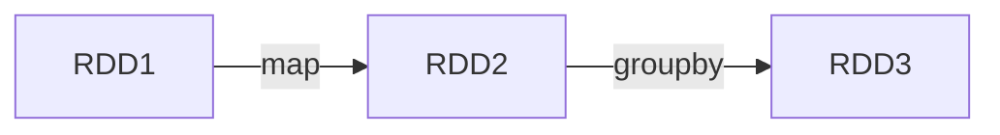

---
tags:
  - "#spark"
  - "#de"
  - "#distributed"
---
# Why should we persist RDDs?
[^1][^2]
Suppose we have a lineage graph as shown below:

If we want to perform an [](Spark%20-%20Introduction.md#Actions|action) or a [transformation](Spark%20-%20Transformations.md) on _RDD3_ multiple times, then _RDD3_ will be recomputed every time. We will repeatedly perform the costly `groupBy()` operation.
When an RDD is persisted, each node stores any partitions of it, that it computes in memory, and reuses it for future transformations or actions.
# Storage Levels

| Storage Level                                 | Meaning                                                                                                                                                                                                                              |
| --------------------------------------------- | ------------------------------------------------------------------------------------------------------------------------------------------------------------------------------------------------------------------------------------ |
| **DISK_ONLY**                                 | Stores partitions on disk                                                                                                                                                                                                            |
| **MEMORY_AND_DISK**                           | Stores partitions on disk and in memory. If not enough memory, spill to disk (i.e. some partitions are not cached in memory but read directly from disk)                                                                             |
| **MEMORY_ONLY**                               | Stores partitions in memory only. If not enough memory, some partitions will be recomputed on the fly.                                                                                                                               |
| **MEMORY_ONLY_SER**                           | Store as serialized object .  More space efficient, but takes longer to read than **MEMORY_ONLY**                                                                                                                                    |
| **MEMORY_AND_DISK_SER**                       | Store serialized object to memory and disk. If not enough memory, spill to disk (i.e. some partitions are not cached in memory but read directly from disk). More space efficient, but takes longer to read than **MEMORY_AND_DISK** |
| **DISK_ONLY_2**, **MEMORY_AND_DISK_2**, etc.. | Same as above, but replicate each partition on two nodes.                                                                                                                                                                            |
# `RDD.cache()` vs `RDD.persist()`

Both methods are used to persist RDDs/DataFrames/Datasets to memory.
Both `.cache()` and `.persist()` internally translate to a `.persist()` call.
The only difference is that, `.persist()` allows us to specify a [storage level](#Storage%20Levels), while `.cache()` does not.

+ [i] **For [RDDs](Spark%20-%20RDD.md)**: `.cache()` and `.persist()` defaults to **MEMORY_ONLY**.
+ [i] **For DataFrame/Dataset**: `.cache()` and `.persist()` default to **MEMORY_AND_DISK**.
 
 **Notes** [^3]
+ [!] Both methods are evaluated lazily, and preserve lineage.
+ [!] When `.persist()` writes to disk, it is **temporary**, and is deleted when the Spark program stops running.
+ [i] Data saved to _disk_ , is saved locally on the worker machine's filesystem. [^4]
# Removing data
Spark automatically monitors cache usage on each node and drops out old data partitions in a **least-recently-used (LRU)** fashion.
If you would like to manually remove an RDD instead of waiting for it to fall out of the cache, use the `RDD.unpersist()` method.
# Checkpointing
[^3][^5] 
>[!warning] This section talks about checkpointing related to batch processing!

It is the process of saving a RDD/DataFrame to distributed storage like HDFS, [S3](Amazon%20S3.md)  **permanently**, so that future operations read directly from disk.
+ [i] It requires specifying a directory before calling `.checkpoint()` on a RDD/DataFrame.
```python
spark.sparkContext.setCheckpointDir("\path\to\checkpoint\dir")
emp_df = spark.read.csv("\path\to\emp\emp.csv", schema=emp_schema)
... some operations on emp_df ...
emp_df.checkpoint()
```

>[!faq] Why use `.checkpoint()` over `.persist()`?
>+ [I] **Lineage Explosion**: In recursive, machine learning, or graph processing jobs, the lineage keeps growing, leading to `OutOfMemory`  or `StackOverflow` errors when trying to recompute a lost partition. `.checkpoint()` truncates the lineage, and the _checkpoint directory_ is treated as the new starting point.
>
>+ [I] **Permanent Storage:** Checkpointed data persists even after the Spark application shuts down. Persisted data vanishes when the session ends. 
>+ [I] **Absolute Reliability:** If a node crashes, a checkpointed dataset can be recovered directly from storage. With `.persist()`, if data is lost from memory and the original data source has changed or is unavailable, the job fails.

## Process
[^3]
Every time we checkpoint an RDD, we actually **compute it twice**: 
+ once during the action that triggered the checkpointing in the first place
+ once while we checkpoint (we iterate through an RDD's partitions and write them to disk).
i.e. checkpoint operation triggers a new job which writes the RDD to disk, so the RDD is recomputed.
## Eager vs Lazy Checkpoint
[^6]
>[!tip] Default: Eager Checkpoint

**Eager checkpoint**: Triggered immediately. (Blocking operation)

**Lazy checkpoint**: It marks the RDD for checkpointing, while the actual operation is triggered after the job is completed.
## Local vs Reliable Checkpoint
[^6]
>[!tip] Default: Reliable Checkpoint

**Local Checkpoint**: Stores data on executor's local disk. This makes it **fault-intolerant**. If the executor node fails or is removed due to dynamic cluster allocation, checkpoint data is permanently lost.  Use `.localCheckpoint()` for local checkpointing.

**Reliable Checkpoint**: Stores data on distributed storage like HDFS, S3, which inherently provides fault-tolerant storage.
	
[^1]: https://spark.apache.org/docs/latest/rdd-programming-guide.html#rdd-persistence

[^2]: https://medium.com/@sarfarazhussain211/understanding-persistence-in-apache-spark-736a2e21218c

[^3]: https://medium.com/@badwaik.ojas/persist-cache-and-checkpoint-in-apache-spark-ae71783ce3dd

[^4]: https://stackoverflow.com/questions/48430366/where-is-my-sparkdf-persistdisk-only-data-stored

[^5]: https://medium.com/@rudymnard/memory-management-cache-checkpoint-4b092121ecc6

[^6]: https://www.waitingforcode.com/apache-spark-sql/spark-sql-checkpoints/read#local_checkpoint
